Read in [English](./The_Lost_Names_of_Stars)

# Los nombres perdidos de las estrellas

La mayoría de las estrellas conocidas hoy en día tienen un nombre en alguno de los muchos catálogos de cuerpos celestes, como HD 8890, HR 424, SAO 308, HIP 11767 o TYC 4628-237-1. Nombres, sin duda, muy poco románticos para una pareja enamorada en una noche de verano. Sin embargo, muchas de ellas, las más brillantes, tienen otros «nombres más naturales» más fáciles de recordar. Todos los nombres citados anteriormente se refieren a la misma estrella, una estrella muy relevante para los astrofotógrafos, principalmente aquellos (casi todos) con una montura ecuatorial. Esta estrella en particular fue bautizada, desde la Edad Media, como «stella polaris» debido a que se utilizaba comúnmente para señalar el polo norte terrestre. La conocemos como Polaris. Mucho más fácil de recordar. 

Sin embargo, hay otras estrellas relevantes que eran muy conocidas en la antigüedad, como esta

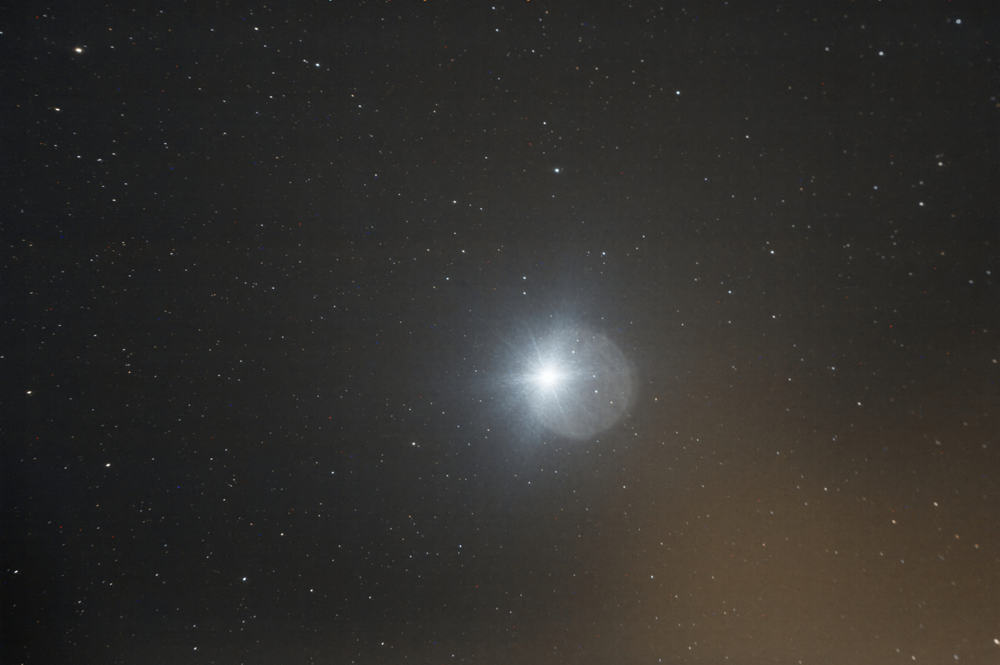

Fue bautizada, ya en el año 3000 a. C., como [Sopdet](https://en.wikipedia.org/wiki/Sopdet) por los egipcios, [𒀯𒆕𒋛𒁲(KAK.SI.SÁ)](https://xing.fmi. uni-jena.de/mediawiki/index.php/KAK.SI. SA2) para los sumerios en Babilonia, o [Tishtrya](https://www.iranicaonline.org/articles/tistrya-2/) para los persas, o Σείριος (Seirios) para los griegos o [Sirio](./Sirius_Star.md) en la astronomía moderna, la estrella más brillante del cielo. 

Aunque estas dos estrellas tienen nombres griegos o latinos, muchas de estas estrellas antiguas tienen nombres árabes, como el poético nombre dado a la hermosa [Vega](./Vega_Star.md), conocida como «Wega» o «Waqi»: النّسر الْواقع (an-nasr al-wāqi'), literalmente, «el águila que cae del cielo». Debido a las malas traducciones a lo largo de la historia, algunas de ellas nos han llegado como malas transcripciones de las originales.

## Estrellas con nombres arcaicos

Estas son algunas de las estrellas más conocidas del cielo septentrional, utilizadas por los astrofotógrafos como migas de pan celestiales que señalan el camino invisible entre nuestros objetivos nocturnos.

|Estrella|Fuente| Traducción |
|:-- |:--          | :-- |
| |a |a |
|[Albireo](./Albireo_Double_Star.md)|Poco claro |- |
|[Aldebarán](./Aldebaran_Star.md)|Árabe: ad-Dabarān اَلدَّبَرَان|El seguidor (de las Pléyades) |
| | [Persa](https://archive.org/details/starnamesandthe00allegoog/page/20/mode/2up): Tascheter| El tercero, de los cuatro, guardián de los cielos|
|[Altair](./Altair_Star.md)|Árabe: (an-Nisr) uṭ-Ṭāʼir النَّسْر الطَّائِر|El águila voladora |
|[Antares](./Antares_Star.md)|Griego: Ἀντάρης | El rival del dios Ares (planeta Marte) |
||[Persa](https://archive.org/details/starnamesandthe00allegoog/page/20/mode/2up):    Satevis | El cuarto de los cuatro guardianes del cielo|
|[Arcturus](./Arcturus_Star.md)|Griego: Ἀρκτοῦρος (Arktouros) | El guardián del oso (en relación con la Osa Mayor), de hecho forma parte de Bootes: el pastor|
||Sumero: Šu-pa | El Guardián del Oso |
||[Persa](https://www.iranicaonline.org/articles/haftorang/?highlight=haftorang): Haftorang| El oso, ya que a veces se consideraba una prolongación de la Osa Mayor|
||Árabe: Haris-el-sema, de حارس السماء | El guardián de los cielos |
|[Betelgeuse](./Betelgeuse_Star.md)|Árabe: yad ul-Jawzā' يد الجوزاء     | La mano del poderoso Al-Jawza (Orión) |
|[Capella](./Capella_Star.md)|Latín: Capella | Una pequeña cabra|
| | [Sumerio](https://en.wikipedia.org/wiki/Capella#:~:text=Capella%20is%20thought%20to%20be,directly%20overhead%20over%20Monte%20Alb%C3%A1n.): MUL.GAM | La cabra |
|[Deneb](./Deneb_Star.md)|[Árabe](https://en.wikipedia.org/wiki/List_of_Arabic_star_names): ذنب الدجاجة     Dhanab ud-Dajājah| La cola de la gallina/águila |
|[Fomalhaut](./Fomalhaut_Star.md)|[Árabe](https://en.wikipedia.org/wiki/List_of_Arabic_star_names) فم الحوت     Fum al-Ḥūt     | Boca de la ballena |
| |[Persa](https://www.iranicaonline.org/articles/tistrya-2/):Satavāesa | El otro observador del sur, junto con Tishtrya (Sirio)|
|[Procyon](./Procyon_Star)|[Griego](https://en.wikipedia.org/wiki/Procyon#:~:text=El%20nombre%20Procyon%20proviene%20de,estandarizar%20los%20nombres%20propios%20de%20las%20estrellas.): προκύων Prokyon | Antes del perro (Canis Maior) |
|[Regulus](./Regulus_Star.md)|[Latín](https://en.wikipedia.org/wiki/Regulus):  |El príncipe |
| |[Babilonia](https://theplanets.org/stars/regulus-star/#:~:text=En%20el%20MUL.,regulus%2Djpg/1136%C3%97639): LUGAL | El pecho del León|
| |[Persa](https://en.wikipedia.org/wiki/Royal_stars):Venant | la tercera de las cuatro estrellas reales, la vigilante del norte|
|[Rigel](./Rigel_Star.md)|[Árabe](https://en.wikipedia.org/wiki/List_of_Arabic_star_names): رَجْلَ الجَبَّار	 Rijl ul-Jabbār | El pie/pierna izquierda del gigante (Orión) en [las Tablas Alfonsinas](https://en.wikipedia.org/wiki/Rigel#Etymology_and_cultural_significance) de Rijl del [Libro de las estrellas fijas](https://en.wikipedia.org/wiki/Rigel#Etymology_and_cultural_significance) |
|[Sadr](./Sadr_Star.md)|[Árabe:](https://en.wikipedia.org/wiki/List_of_Arabic_star_names): الصدر aṣ-Ṣadr |el pecho (de la gallina) |
| | [Español](https://archive.org/details/starnamesandthe00allegoog/page/20/mode/2up) Sehedir | Después de Sadr |
|[Sirio](./Sirius_Star.md)|[Griego](https://en.wikipedia.org/wiki/Sirius): Σείριος Seirios  | Brillante/Ardiente |
| |[Egipcio](https://en.wikipedia.org/wiki/Sopdet): Sopdet | Predice la temporada anual de inundaciones del río Nilo|
| | [Sumerio](https://xing.fmi.uni-jena.de/mediawiki/index.php/KAK.SI.SA2): 𒀯𒆕𒋛𒁲(KAK.SI.SÁ) | La punta de la flecha|
| |[Persa](https://www.iranicaonline.org/articles/tistrya-2/): Tishtrya | La flecha|
| |[Escandinavo](https://www.facebook.com/ecsukhanplanetarium/posts/in-norse-mythology-sirius-is-called-lokabrenna-literally-meaning-burning-done-by/1376264451058311/): LOKABRENNA | La antorcha/fuego del dios Loki|
|[Spica](./Spica_Star.md)|[Latín](https://en.wikipedia.org/wiki/Spica) Spica virginis| La espiga de la Virgen  |
| | [Árabe](https://en.wikipedia.org/wiki/List_of_Arabic_star_names): السنبلة     as-Sunbulah|  El tallo|
| |[Sumerio](https://en.wikipedia.org/wiki/Spica): 𒀊𒉆 Ser-u | El surco de la semilla|
|[Vega](./Vega_Star.md)|[Árabe](https://en.wikipedia.org/wiki/List_of_Arabic_star_names): النسر الواقع an-Nisr ul-Wāqiʿ|el águila que cae|
| |[Español](https://archive.org/details/starnamesandthe00allegoog/page/20/mode/2up)Vega |Traducción de Waqi del Libro de las estrellas fijas|

## El largo viaje desde Babilonia, Persia, Grecia, Al-Ándalus hasta Europa

Los nombres de las estrellas y otros cuerpos celestes se remontan a varios miles de años antes de Cristo, casi simultáneamente en dos civilizaciones como la maya y la babilónica, aunque solo la última, en Mesopotamia (actual Irak), tuvo influencia en Ptolomeo, con su [Almagesto](https://en.wikipedia.org/wiki/Almagest), y luego en Europa (tras varios siglos) y posteriormente en la astronomía moderna.

Los sumerios (2000 a. C.) estudiaban los cielos nocturnos no como una visión del universo, ni siquiera para orientarse, sino para predecir el futuro, como presagios, por el bien de las familias que gobernaban su reino. Simplemente como superstición o como un evento programado que predecía la llegada de las estaciones. 

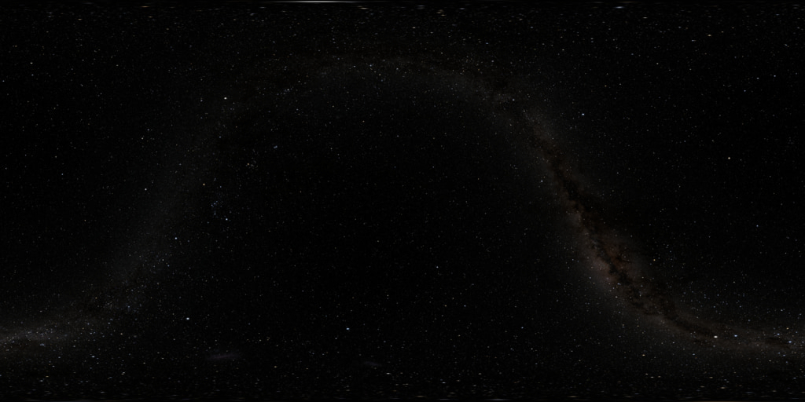

Una de estas primeras observaciones es la trayectoria seguida por el sol, la luna y otros cuerpos como Venus o Júpiter en la tabla [Enuma Anu Enlil (𒌓𒀭𒈾𒀭𒂗𒆤𒇲)](https://en.wikipedia.org/wiki/Enuma_Anu_Enlil), «La trayectoria del dios Enlil (dios de los vientos y las tormentas)». 

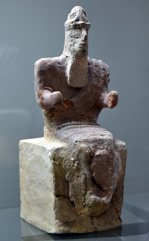 Enlil (Júpiter)

La fuerza de Enlil se asociaba a las observaciones de Júpiter, como la luz más poderosa del cielo nocturno, que seguía el mismo camino que el Sol. El dios babilónico Enlil fue adoptado como Baal por los fenicios, que le dedicaron una montaña (Baal Zephon) y un templo para su culto cerca de Beirut (Líbano). Esta montaña aparece mencionada en el Libro del Éxodo de la Biblia: «Entonces el Señor habló a Moisés, diciendo: «Di a los hijos de Israel que den media vuelta y acampen delante de Pi-hahiroth, entre Migdol y el mar; acamparéis delante de Baal-zephon, frente a él, junto al mar»». Éxodo:14-4 Hoy en día, este mismo lugar, conocido como Baalbek, ([lit. ciudad de Baal](https:// archive.org/stream/historybaalbek00alou/historybaalbek00alou_djvu.txt)) alberga los restos de un templo romano dedicado a... por supuesto, un [templo dedicado a Júpiter](https://en.wikipedia.org/wiki/Temple_of_Jupiter_(Baalbek)).

De hecho, los babilonios ya sabían que su dios Sin, asociado a la Luna, también seguía ese mismo camino.

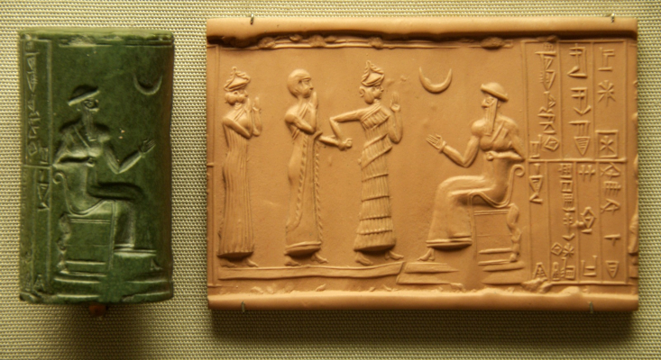 Sin (La Luna)

O la [Tabla de Ammisaduqa] (https://en.wikipedia.org/wiki/Venus_tablet_of_Ammisaduqa) que describe el registro astronómico completo de las posiciones de Venus, lo cual, curiosamente, ocurre en fechas similares, con el mismo objetivo (Venus) justo al otro lado de la Tierra, en América Central durante la [civilización maya](./PaleoAstronomy.md).  El dios babilónico asociado con Venus era el jefe de todos los dioses, Ishtar. La siguiente talla muestra a Ishtar (izquierda) con Sin (centro) y Shamash (derecha), el dios asociado con el Sol.
 
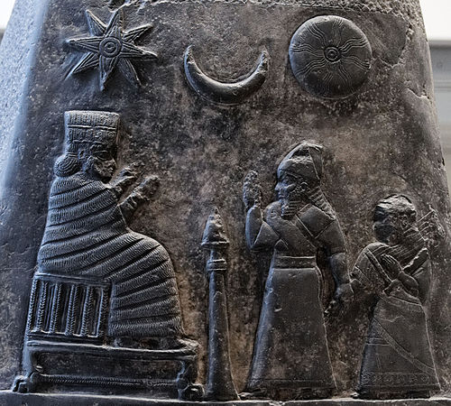 Isthar (Venus), Sin y Shamash (el Sol)
 
En resumen, esta trayectoria celeste no es otra cosa que la [eclíptica](https://en.wikipedia.org/wiki/Ecliptic).

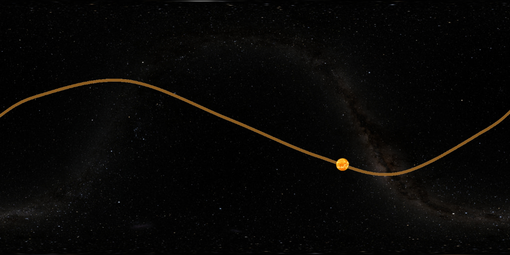 La eclíptica
 
De hecho, los babilonios utilizaban un sistema conocido como «Las 36 estrellas», una división del cielo completo en 36 áreas, cada una de 10º de tamaño, de ahí su nombre como «Los decanos» (https://en.wikipedia.org/wiki/Decan).

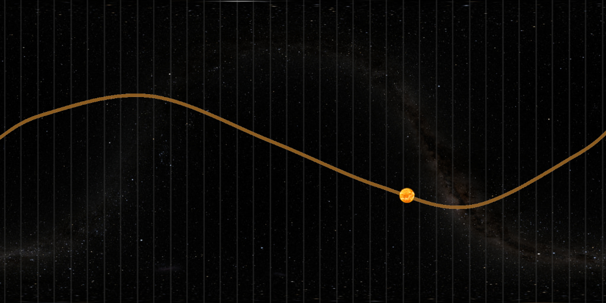 Los decanos

Otra tabla sumeria, escrita en cuneiforme, el [Mul.Apin (𒀯𒀳)](https://en.wikipedia.org/wiki/MUL.APIN) también describía las órbitas de los demás planetas conocidos: Mercurio, Venus, Marte, Júpiter y Saturno. Con el fin de reconocer los patrones de las estrellas a lo largo de la eclíptica, estas 36 regiones se agruparon en 12 cúmulos de estrellas, asignándoles formas y misiones supuestas para que fueran más fáciles de recordar y reconocer. Estos son los 12 signos del zodíaco que representan la trayectoria de Enlil (Júpiter) a lo largo del cielo.

 Las 12 casas de Enlil: el zodíaco

Y, en los siglos siguientes, se añadieron muchas más regiones con supuestas formas: el nacimiento de nuestras constelaciones actuales.

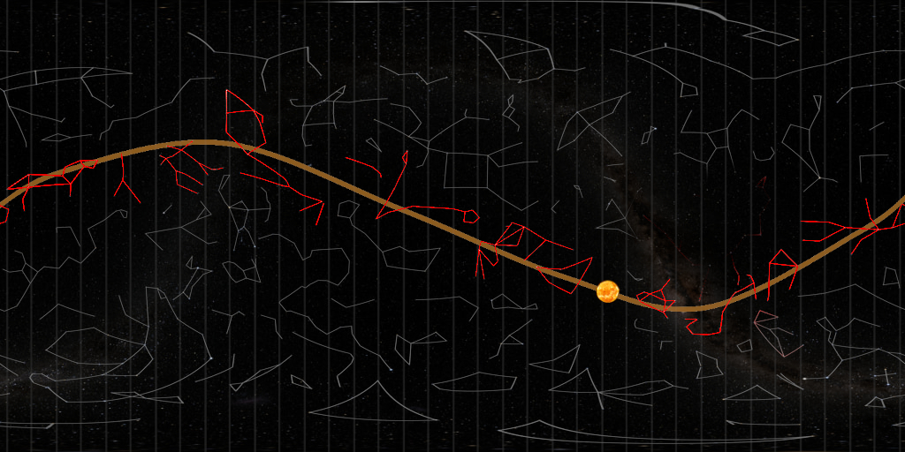 Todas las constelaciones conocidas

Estos tratados deben considerarse con mucho cuidado, ya que, aunque datan de hace varios miles de años, muestran la primera sistematización de los cielos, con un profundo conocimiento de la diferencia entre estrellas y planetas, precursor de los posteriores mapas y tablas estelares, con una enorme influencia en los estudios posteriores sobre astronomía.  De hecho, el conocimiento babilónico sobre la posición y el movimiento de los cuerpos celestes fue adoptado por el imperio persa cuando el rey persa Ciro el Grande conquistó Babilonia (siglo VI a. C.). 

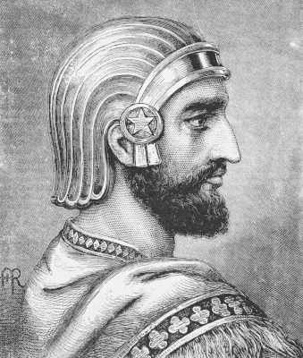 Ciro II

Los persas combinaron y enriquecieron ese conocimiento con la [cosmología zoroástrica persa](https://en.wikipedia.org/wiki/Zoroastrian_cosmology)  y utilizaron cuatro de estas estrellas para señalar los cuatro puntos cardinales durante sus viajes nocturnos por el desierto. Estas [cuatro estrellas reales](./PaleoAstronomy.md), o los cuartos Vigilantes del Cielo, eran conocidas como [Haftorang](https://www.iranicaonline.org/articles/haftorang/?highlight=haftorang) ([Arcturus](./Arcturus_Star.md), aunque la falta de anotaciones precisas hace que esta estrella se asigne muy a menudo a Fomalhaut. Sin embargo, después de leer muchos libros y referencias cruzadas, he descubierto que Haftorang se relaciona con el norte, pero Fomalhaut es una estrella del sur. Es más, el nombre Haftorang se traduce como «el observador del oso» (https://www.iranicaonline.org/articles/haftorang/?highlight=haftorang). Si tenemos en cuenta que Arcturus está geométricamente situado como una prolongación recta de la Osa Mayor y, por lo tanto, se considera «algo» alrededor de la Osa, me parece más creíble que Haftorang se refiera a Arcturus), Venant ([Regulus](./Regulus_Star.md)), Satevis ([Antares](./Antares_Star.md)) y Tascheter ([Aldebaran](./Aldebaran_Star.md)) 

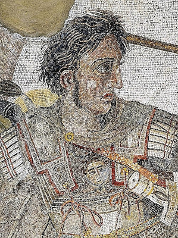 Alejandro Magno

Después, cuando Alejandro Magno conquistó el Imperio persa (siglo IV a. C.), este conocimiento sobre los cuerpos celestes llegó al mundo helénico y fue objeto de estudio en la Biblioteca de Alejandría, 

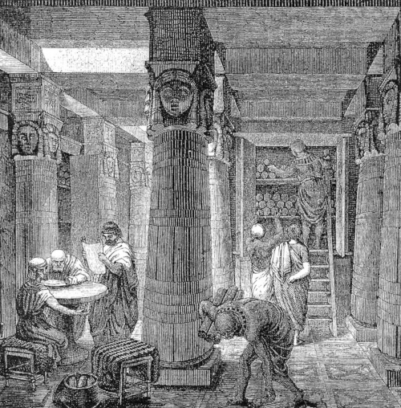 La Biblioteca de Alejandría

Allí, [Hiparco](https://en.wikipedia.org/wiki/Hipparchus) (siglo II a. C.) y sus colaboradores combinaron los avances del conocimiento griego sobre geometría con el conocimiento astronómico de Babilonia y Persia, produciendo modelos cuantitativamente precisos del movimiento del Sol y la Luna y muchos libros sobre este tema que influyeron en gran medida en [Ptolomeo](https://en.wikipedia.org/wiki/Ptolemy) y su [Almagesto](https://en.wikipedia.org/wiki/Almagest) en el siglo II d. C. Todo este conocimiento se perdió tras la destrucción de Alejandría y no volvería a aparecer hasta, al menos, el siglo IX de nuestra era, cuando el floreciente mundo islámico experimentó un auge en las artes, la ciencia y la astronomía y se recuperaron, tradujeron y estudiaron muchos libros antiguos, entre ellos, El Almagesto. Solo se recuperaron algunas copias del Almagesto y una de ellas llegó al astrónomo persa [Abd al-Rahman al-Sufi](https://en.wikipedia.org/wiki/Abd_al-Rahman_al-Sufi) (Azophi), que vivió en el siglo IX en la hermosa ciudad persa de [Shiraz](https://en.wikipedia.org/wiki/Shiraz) y tradujo los antiguos conocimientos helénicos perdidos de Ptolomeo, mezclándolos con las extensas tradiciones astronómicas árabes, basadas en las constelaciones. Escribió el famoso [Libro de las estrellas fijas](https://en.wikipedia.org/wiki/The_Book_of_Fixed_Stars) كتاب صور الكواكب kitāb suwar al-kawākib, una recopilación actualizada de todos los conocimientos sobre astronomía

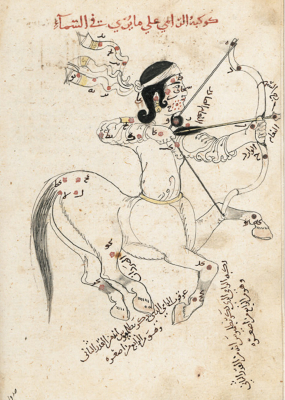
La constelación de Sagitario tal y como aparece en el libro de las estrellas fijas.

Al Sufi recopiló las 1022 estrellas encontradas por Ptolomeo y les dio nombres árabes (como [Deneb](./Deneb_Star.md) o [Rigel](./Rigel_Star.md), la mayoría de los cuales han llegado hasta nuestros días, tras un largo viaje desde Persia hasta Al Ándalus. De hecho, durante los siglos X y XI se podían encontrar fácilmente muchas copias del Libro de las estrellas fijas y otras traducciones del Almagesto, que eran esenciales en el centro intelectual más avanzado del mundo en aquella época: el califato de Córdoba, donde todos estos conocimientos se estudiaron y mejoraron aún más. La calculadora astronómica analógica conocida como [astrolabio](https://en.wikipedia.org/wiki/Astrolabe) fue un fruto destacado de todo este esfuerzo.

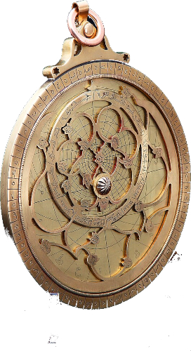 El astrolabio

Durante ese periodo, los eruditos islámicos trabajaron en antiguos diseños de Hiparco y Ptolomeo, hoy perdidos, añadieron sus conocimientos angulares y produjeron el diseño que ha llegado hasta nosotros. El primer astrolabio metálico conocido se construyó en el siglo XI en Portugal. Además, los conocimientos del libro de las estrellas fijas llegaron al famoso astrónomo y matemático [Al-Zarqali](https://en.wikipedia.org/wiki/Al-Zarqali), que vivía en Toledo, cuando esta ciudad aún formaba parte de Al-Ándalus. Allí, Al-Zarqali escribió las [Tablas Toledanas](https://en.wikipedia.org/wiki/Toledan_Tables) como un nuevo compendio de conocimientos astronómicos que tuvo una vida muy corta, ya que poco después, la ciudad fue reconquistada por los Reyes Católicos de España en 1080.

 Reyes Católicos de España

Bajo el dominio de los monarcas cristianos, Toledo se convirtió en un moderno centro de traductores de todo el conocimiento heredado del mundo islámico de Al Ándalus. Encontraron las Tablas Toledanas, corrigieron sus numerosos errores, las reescribieron en español y latín, y produjeron las recién renovadas y ampliadas [Tablas Alfonsinas](https://en.wikipedia.org/wiki/Alfonsine_tables), que llevan el nombre del rey español Alfonso X. Las primeras copias conocidas de las Tablas Alfonsinas datan de 1483 y 1492 y, a través del vasto Imperio español de aquellos días, las Tablas Alfonsinas se convirtieron en el tratado de astronomía más famoso y preciso de todo el Renacimiento europeo. De hecho, una copia de la segunda edición llegó a manos de un joven matemático y astrónomo llamado [Nicolás Copérnico](https://en.wikipedia.org/wiki/Nicolaus_Copernicus).

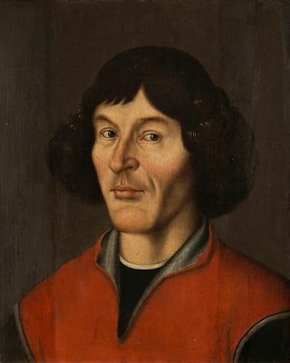 Nicolás Copérnico

Basándose en muchos libros antiguos y, principalmente, en la segunda edición de las Tablas Alfonsinas, Copérnico escribió la obra maestra absoluta de la astronomía moderna: [De revolutionibus orbium coelestium](https://en.wikipedia.org/wiki/De_revolutionibus_orbium_coelestium), un modelo muy moderno y científico del universo que, a partir de entonces, abandonó el modelo geocéntrico de Hiparco y Ptolomeo en favor de un nuevo modelo heliocéntrico. Esta chispa encendió un gran fuego que nos llega a través de un viaje moderno por Galileo, Tycho Brahe, Keppler, Newton y Einstein. Los modelos de Newton y Einstein son nuestros modelos actuales, el newtoniano es 100 % válido para mundos pequeños y lentos, pero no se aplica bien a mundos grandes y más rápidos (cercanos a la velocidad de la luz) y el de Einstein es justo lo contrario, 100 % válido en mundos grandes y más rápidos, pero falla en mundos pequeños y más lentos. Y aquí termina nuestro viaje, desde los antiguos reinos entre los ríos Tigris y Éufrates, miles de años antes de Cristo, hasta nuestros días.

| | |
| :----:| :---: |
|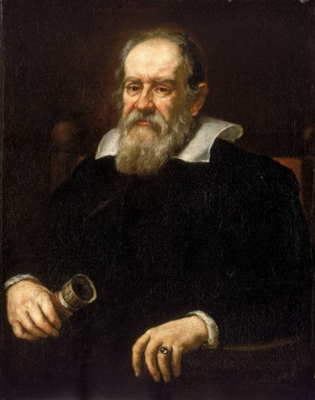 ||
| Galileo Galilei | Tycho Brahe |
|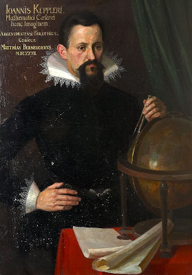|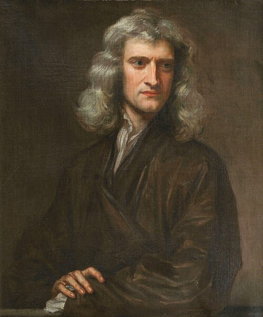|
| Joannes Keppler | Isaac Newton |
|| |
|Albert Einstein | |

