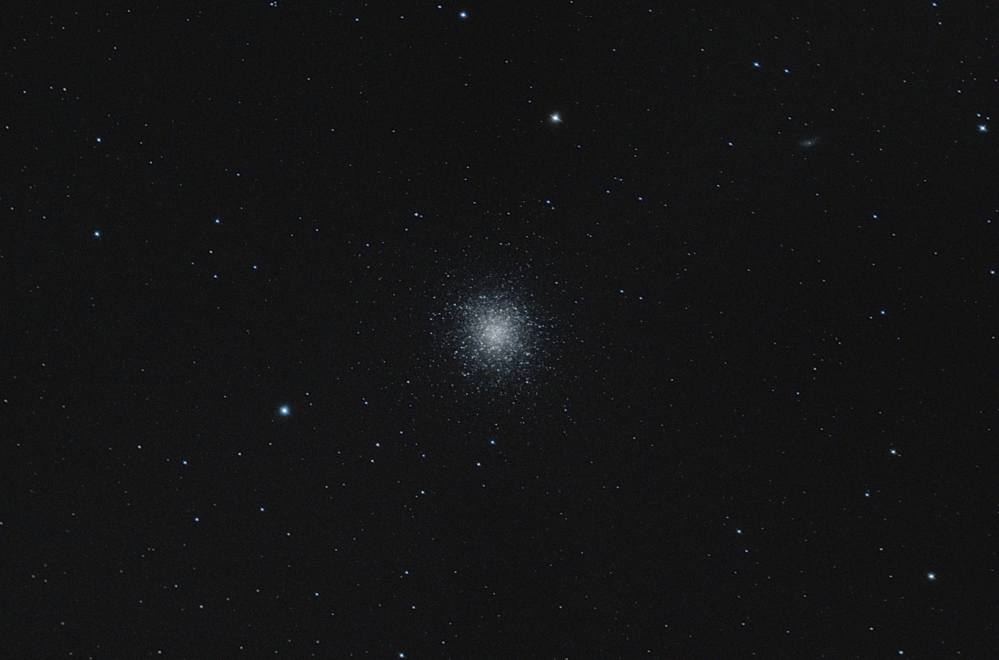
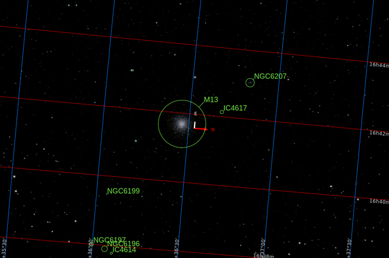
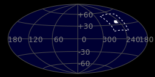
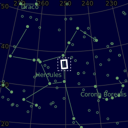
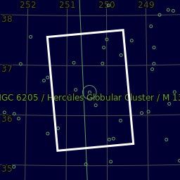
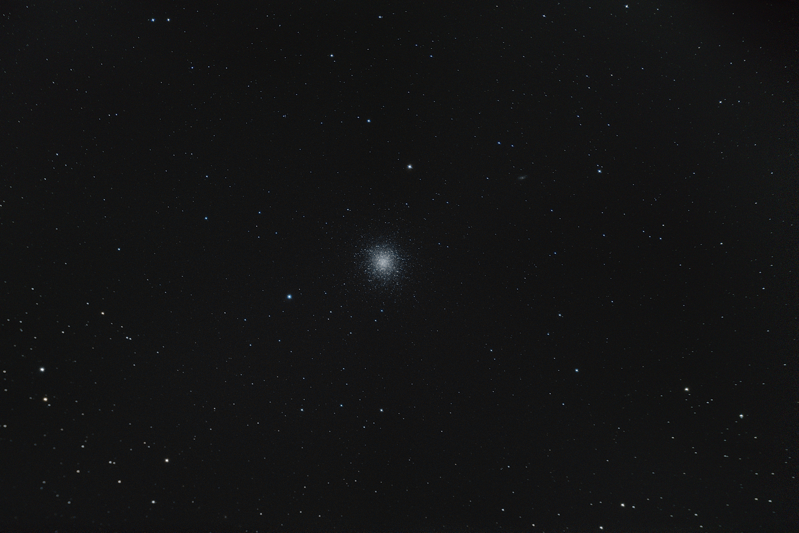

#  M13 Hercules Globular Cluster

Messier 13, or M13 (also designated NGC 6205 and sometimes called the Great Globular Cluster in Hercules, the Hercules Globular Cluster, or the Great Hercules Cluster), is a globular cluster of several hundred thousand stars in the constellation of Hercules.

[ Read more](https://en.wikipedia.org/wiki/Messier_13)
## Plate solving 

| Globe | Close | Very close |
| ----- | ----- | ----- |
| | | |

## Gallery
 

 

 

