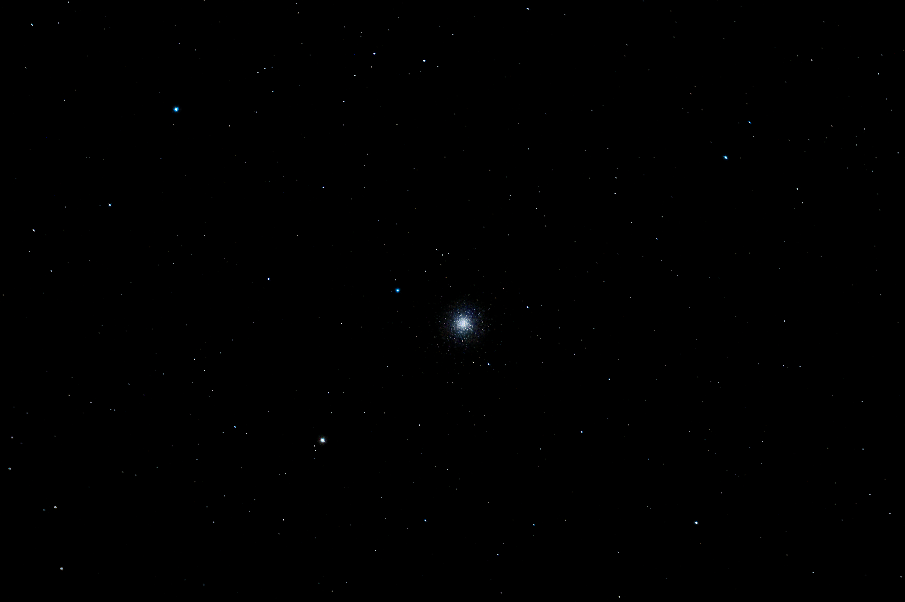

#  M3 Globular Cluster

It was discovered on May 3, 1764,[10] and was the first Messier object to be discovered by Charles Messier himself. Messier originally mistook the object for a nebula without stars. This mistake was corrected after the stars were resolved by William Herschel around 1784.[11] Since then, it has become one of the best-studied globular clusters. Identification of the cluster's unusually large variable star population was begun in 1913 by American astronomer Solon Irving Bailey and new variable members continue to be identified up through 2004.[12]

[ Read more](https://en.wikipedia.org/wiki/Messier_3)
## Plate solving 

| Globe | Close | Very close |
| ----- | ----- | ----- |
| | | |

## Gallery
 

 

