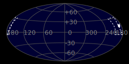
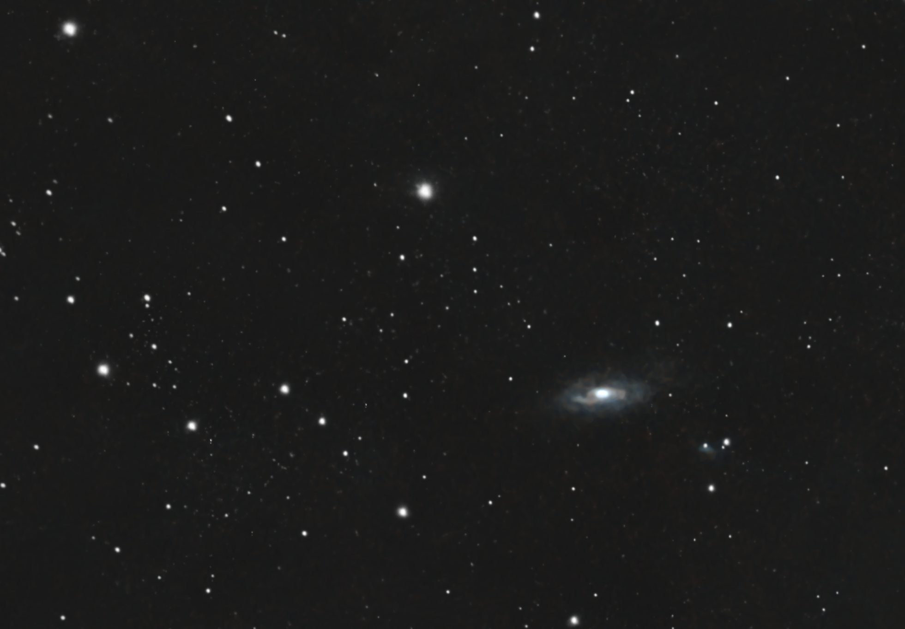

#  M90 Galaxy

Messier 90 (also known as M90 and NGC 4569) is an intermediate spiral galaxy exhibiting a weak inner ring structure about 60 million light-years away[a] in the constellation Virgo. It was discovered by Charles Messier in 1781.[4] Messier 90 is a member of the Virgo Cluster,[5] being one of its largest and brightest spiral galaxies, with an absolute magnitude of around −22 (brighter than the Andromeda Galaxy).[6] The galaxy is found about 1.5° from the central subgroup of Messier 87.[7] Due to the galaxy's interaction with the intracluster medium in its cluster, the galaxy has lost much of its interstellar medium. As a result of this process, which is referred to as ram-pressure stripping, the medium and star formation regions appear severely truncated compared to similar galaxies outside the Virgo Cluster[8] and there are even H II regions outside the galactic plane,[8] as well as long (up to 80,000-parsec—that is, 260,000-light-year) tails of ionized gas that has been stripped away.[9]

[ Read more](https://en.wikipedia.org/wiki/Messier_90)
## Plate solving 

| Globe | Close | Very close |
| ----- | ----- | ----- |
| | | |

## Gallery
 

 

