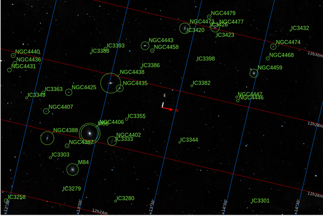
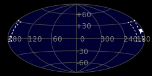
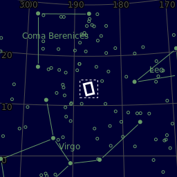
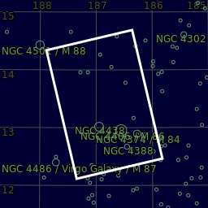

#  Markarian Chain

Markarian's Chain is a stretch of galaxies that forms part of the Virgo Cluster. When viewed from Earth, the galaxies lie along a smoothly curved line. Charles Messier first discovered two of the galaxies, M84 and M86, in 1781. The other galaxies seen in the chain were discovered by William Herschel[1] and are now known primarily by their catalog numbers in John Louis Emil Dreyer's New General Catalogue, published in 1888.[2] It was ultimately named after the Armenian astrophysicist, Benjamin Markarian, who discovered their common motion in the early 1960s.[3] Member galaxies include M84 (NGC 4374), M86 (NGC 4406), NGC 4477, NGC 4473, NGC 4461, NGC 4458, NGC 4438 and NGC 4435. It is located at RA 12h 27m and Dec +13° 10′. The bright members of the chain are visible through small telescopes. Larger telescopes can be used to view the fainter galaxies .[2] Near the center there appear the pair of interacting galaxies NGC 4438 and NGC 4435, about 50 million light-years away, known to some as Markarian's Eyes. At least seven galaxies in the chain appear to move coherently, although others appear to be superposed by chance.[4] Six of the points on the chain can be marked by galaxies. The other two points are pairs of galaxies

[ Read more](https://en.wikipedia.org/wiki/Markarian                           _Chain)
## Plate solving 

| Globe | Close | Very close |
| ----- | ----- | ----- |
| | | |

## Gallery
 

 

 

