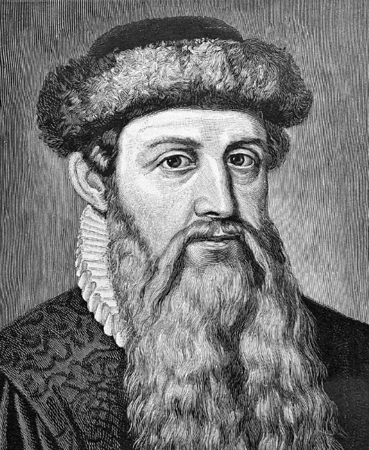

Leer en [español](./Espejito_Espejito.md)

# Mirror, mirror on the wall

In astrophotography we take very much care and time looking fron the Earth to other points of the sky like Polaris, Andromeda Galaxy, or the M13 Hercules Star cluster. We also put much effort in understanding the information that come to us from there, in the form of radio waves, visible light, infrarred emissions, X-Rays or whatever. All these items of information come to us at the speed of light in this exact moment. However, since they came from objects at different distances from Earth, tough they reach us at the same time, they were emmitted at different moments in time. Taking these distances into account, let us make the inverse exercise. Imagine that ther is "some form of life" located at these same spots and that it is looking towards us, towards the Earth, at this exact time. Right now. What possibly could they be seeing from us?

Let us take this image as a reference. A young couple in their forties walking, maybe going to, or perhaps coming from, their respective jobs. All of us, unfortunately know the headlines of the newspapers these days. so no need to reproduce them now.	

Let us play.	

## Someone living around [Vega](Vega_Star.md) 25 light-years away from us

They would see more or less the same picture

But the headlines will tell, all around the world, that the European Union has forged their own currency, the Euro and it is now active across the EU.

## Someone who lived in [Soul Nebula](./Soul_Nebula.md) about 200 light years away

Although this form of life is looking at us right now, exactly now, they are so far that they don't see us, but as we were 200 years ago

And the headlines will tell about a new invention, named by some as the "rail road", with uncertain future, as most of the new inventions ever.

This would make the lifeform to smile, or whatever it is for them, thinking how simple is our technology. Fail!

## Someone who lived in [Pleiades](./Pleiades_Cluster.md) about 400 light years away

They are also looking at us exactly now, right now, but they are so far that the just see how we were 400 years ago.

Well, so far, two forms of life, perhaps in the form of a lizard, or with no visible form, look at us right now, and they see different things to each other, and furthermore, different to what we really are. What a mess, isn't it?

If there were some news-whatever, they would see in Spain a painter in Seville, still very young, who painted "Old woman frying eggs" and many forsought a properous future for him. It was Diego de Velazquez.

## Someone who lived in Cassiopeia about 550 light years away

If some life form had lived around the star gamma-Cassiopeia, in the middle of the [Ghost Nebula](./Ghost_Nebula.md) and looked at us with some kind of artifact able to capture visible light, it would see the same couple, but living somewhere between the Gothic or early Renaissance.

Back in the Earth, the most relevant news observed by this Cassiopeian life form would tell that a young German man named Johannes Gensfleisch zur Laden zum Gutenberg presented an invention.

He claimed that his invention would be able to reproduce several copies of the Bible, indistinguisable from the original, in less that half of the time that the fastest copier monk would have copied just once. This simple remote invention would allow the spread of science and knwoledge all around the world, just the Earth indeed, at a speed never seen before and fostered an exponential growth of scientific discoveries everywhere.

## Someone who lived around the beautiful star [Rigel](./Rigel_Star.md)

Again, let us play the role of a dominant species in some planet around Rigel, a blue giant in the Orion's constellation,  more or less 900 light years away. In this case, Rigelian species will look at us and see a middle-ages scene like this.

And all the information that could possibly reach them, the only things they could tell about us, as of today, is that the current Spanish region of Andalusia, was named Al Andalus, a muslim kingdom lasting 400 years expanded also by three quarters of the whole Spain, was living a flourishing period of science, art and war that will be later be adopted by the Christian world during the Renaissance period.

All this right within the limits our own Milky Way Galaxy. But, from the earth, we can also see many other galaxies and places in the night sky at the same time. How could it be?

## Someone who lived around the beautiful cluster [M13](./M13_Hercules_Globular_Cluster.md) in Hercules

This region is located just a tiny distance of 22,000 light years or Earth. From there, a Herculian marine life form, in the shape and size of a calamari, looking at the earth right now would see a planet in the Neolithic Period, with a very simple technology and an almost inexistent mnetal industry.

Perhaps, these intelligent squids, could think that they could invade the Earth and dominate this weak species, just to land in the earth and discover that we eat them all, either fried or grilled with a garnment of garlic and parsley. Frightening.

And finally, oyr last stop will reach our closest galaxy.

## A form of life in the very very close [Andromeda](Andromeda_Galaxy.md) galaxy

All of the life forms of this galaxy, located only 2.7 lightyears from earth, have just recieved, right now, this picture from their EAT, their Extra-Andromedian Telescope, and all of the Andromedian scientists will eagerly rush to annouce that they were right, they found life in a remote, sleepy, planet orbiting around a meaningless, tiny star. 

However they found a prehistoric and wild, form of life, and most of the Andromedian Scientific Leaders firmly believe that this species is too little developed and that, as of today, they are not expected to be concerned with the universe, and that, at most, they consider that their star is actually a form of God with many superpowers. After a very thorough meeting of the Andromedian Scientific Council, they sadly conclude that they don't expect that even in the coming 1000 years this terrestrial form of life will be able to observe and understand the basic laws of the universe. Really furstrating, isn't it?

