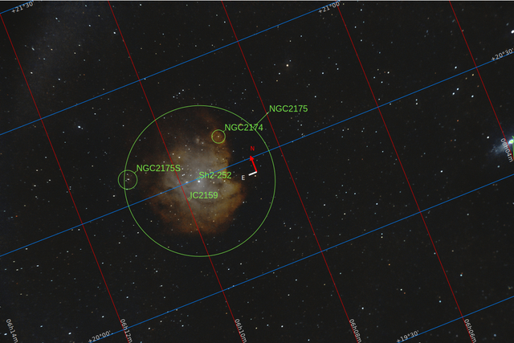
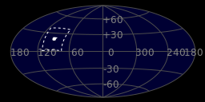
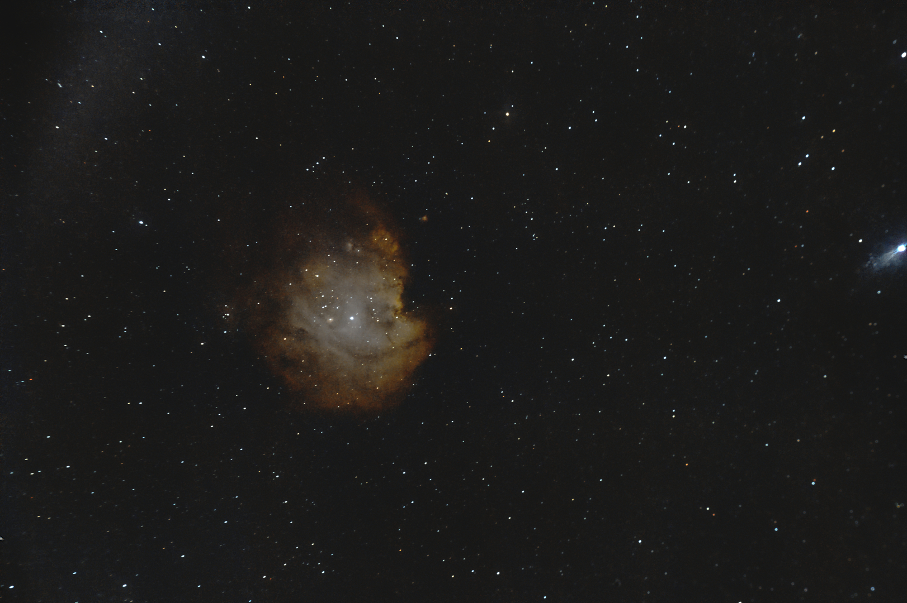

#  Monkey Head Nebula

NGC 2174 (also known as Monkey Head Nebula) is an H II[1] emission nebula located in the constellation Orion and is associated with the open star cluster NGC 2175.[1] It was discovered on 6 February 1877 by French astronomer Édouard Stephan.[2] It is thought to be located about 6,400 light-years away from Earth. The nebula may have formed through hierarchical collapse.[3] There is some equivocation in the use of the identifiers NGC 2174 and NGC 2175. These may apply to the entire nebula, to its brightest knot, or to the star cluster it includes. Burnham's Celestial Handbook lists the entire nebula as 2174/2175 and does not mention the star cluster.[4] The NGC Project (working from the original descriptive notes) assigns NGC 2174 to the prominent knot at J2000 06h 09m 23.7s, +20° 39′ 34″ and NGC 2175 to the entire nebula, and by extension to the star cluster.[5] SIMBAD uses NGC 2174 for the nebula and NGC 2175 for the star cluster.[1] [6] Glowing gas and dark dust do not survive well in the Monkey Head Nebula. Young stars near the center of the nebula generate stellar winds and high energy radiation that causes the nebula's material to shift into complex shapes.[7] The nebula is primarily composed of hydrogen which glows at infrared wavelengths due to the radiation.[8]

[ Read more](https://en.wikipedia.org/wiki/NGC_2174)
## Plate solving 

| Globe | Close | Very close |
| ----- | ----- | ----- |
| | | |

## Gallery
 

 

 

