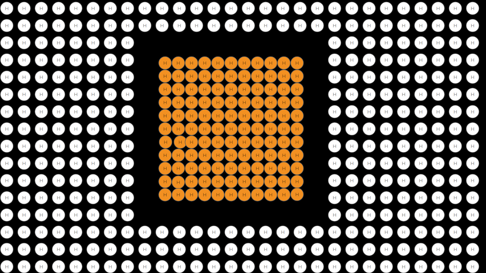
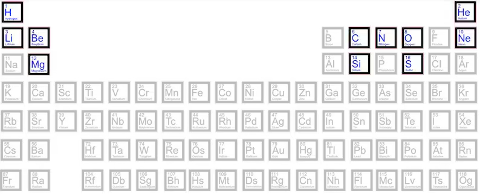

[Read in English](./The_Death_of_Stars.md)

## El fin de una «pequeña estrella»

El núcleo de la estrella continúa fusionando elementos y aumentando la temperatura.
Pero las estrellas pequeñas no tienen suficiente energía para aumentar la temperatura de forma permanente y quemar estos átomos de carbono (C), más oxígeno (O) y, finalmente, más nitrógeno (N), por lo que la estrella comienza a acumular estas «cenizas» en su núcleo.

Entonces, cuando nuestra «pequeña estrella» se queda sin combustible (H + He), colapsa y se convierte en una enana blanca, explota y expulsa los elementos restantes a la nube circundante.

Y esto sucede una y otra vez, enriqueciendo la nube circundante con nuevas nubes de elementos completamente nuevos.

Con el tiempo, estos nuevos átomos pueden ser golpeados por partículas de alta energía procedentes de su propia estrella o de otras estrellas cercanas, y se transforman en litio (Li) y berilio (Be), que no forman parte del proceso de nucleosíntesis, sino que son un efecto secundario del mismo.

## El fin de una «estrella grande»

Dependiendo de la masa de la nube molecular madre, también pueden formarse estrellas más grandes, al colapsar mayores cantidades de hidrógeno.

añadiendo cada vez más materia al núcleo, aumentando la temperatura y produciendo el mismo proceso de fusión que en las «estrellas pequeñas» vistas anteriormente.

	

Las estrellas continúan «quemando» hidrógeno, helio, carbono, nitrógeno y oxígeno y, debido a su gran masa y potencia, también producen elementos más pesados, principalmente neón (Ne),  magnesio (Mg), silicio (Si) y azufre (S), pero también aluminio (Al) 

y la estrella se convierte en una [estrella gigante roja](https://en.wikipedia.org/wiki/Red_giant)

Este proceso continúa hasta que produce elementos de hierro (Fe). Hasta ahora, el proceso de fusión es exotérmico y genera cada vez más energía. Sin embargo, la fusión de los elementos de hierro (Fe) se convierte en una reacción endotérmica, que requiere la adición de más energía, y esto no sucederá.

Por lo tanto, aunque estas grandes estrellas producen grandes cantidades de hierro y elementos pesados, no pueden seguir quemándolos y comienzan a acumularlos en el núcleo. Por lo tanto, terminan agotando los elementos combustibles y, al igual que las estrellas pequeñas, estas grandes estrellas también explotan, pero de una manera diferente, en uno de los eventos energéticos más intensos conocidos en el universo.

Esta explosión se conoce como *supernova* y produce oro (Au) y uranio (U), además de una onda de choque que alcanza todos estos elementos y los transforma en sodio (Na), boro (B), fósforo (P) y cloro (Cl). El antiguo núcleo de la estrella colapsa y se convierte en lo que se conoce como agujero negro.

Esta onda de choque también alcanza toda la nube molecular y produce nuevos colapsos gravitacionales y el nacimiento de nuevas estrellas en un proceso sin fin que produce los elementos restantes presentes en la naturaleza. Este ciclo de creación, muerte y recreación de estrellas se conoce como «guardería estelar».

## Las cenizas tras las explosiones de las estrellas

Tanto las estrellas pequeñas como las grandes terminan su vida empapando toda la nube circundante con elementos nuevos, tanto ligeros como pesados. Con el paso del tiempo, estos elementos también colapsarán en forma de planetas, como sabemos que ocurre en nuestro propio sistema solar.

Fuente [Wikipedia](https://en.wikipedia.org/wiki/Internal_structure_of_Earth#Core) 

Así pues, nuestro pequeño planeta, este [pálido punto azul](https://en.wikipedia.org/wiki/Pale_Blue_Dot) con su núcleo fundido de níquel (Ni) y hierro (Fe), es el resultado de una secuencia incontable de supernovas, mezcladas en una proporción única de elementos, colapsadas en una esfera de materia, niveladas por la gravedad y parcialmente enfriadas, solo en su corteza. Con más de mil siglos por delante, estos elementos simples comenzaron a combinarse en moléculas cada vez más complejas como estas

|Adenina| Timina | Guanina  | Citosina |
| :----: | :----: | :----: | :----: |
| | | | |

y terminan formando una molécula muy, muy compleja, conocida como ADN, con una característica distintiva única: puede replicarse a sí misma y producir una copia exacta de sí misma.

Fuente [Wikipedia](https://en.wikipedia.org/wiki/DNA

Incluso los elementos más pesados, como el hierro (Fe), pudieron combinarse en algunas moléculas especiales como esta,

(fuente de la imagen [Wikipedia](https://en.wikipedia.org/wiki/Hemoglobin))

una molécula cuyos elementos constituyentes, hidrógeno (H), carbono (C), oxígeno (O) y nitrógeno (N), hace miles de millones de años fueron transformados por las numerosas estrellas antiguas que se sucedieron, y más aún, en cuyo corazón se encuentra un átomo del pesado hierro (Fe). Esta molécula se conoce como hemoglobina, se encuentra dentro de nuestros glóbulos rojos y nos permite respirar oxígeno, especialmente gracias a su núcleo de hierro (Fe), que hace mucho, mucho tiempo, se produjo en una remota estrella roja gigante (como [Betelgeuse](Betelgeuse_Star.md)), tan roja como nuestros glóbulos rojos.	Como dijo Carl Sagan en su libro Cosmos, «nosotros, la especie humana, somos lo que los simples elementos de hidrógeno pueden producir con el paso de 15 800 millones de años».

Traducción realizada con la versión gratuita del traductor DeepL.com
