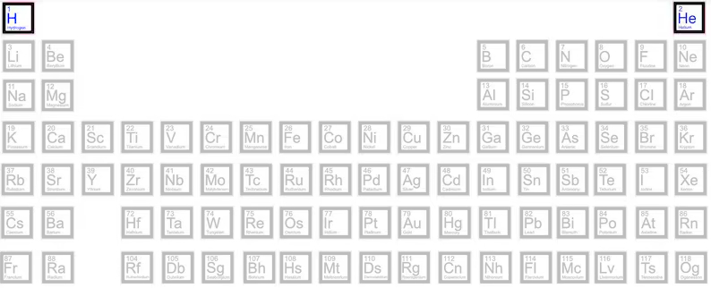

[Read in English](./The_Birth_of_Stars.md)

# Acerca de las estrellas

Las estrellas siempre han desempeñado un papel romántico para la humanidad, entre amantes, aquellos que tienen sueños, un escenario estrellado y tranquilo que abraza todo tipo de creaciones artísticas durante la noche... lo que se te ocurra. Y eso parece ser todo. Incluso para los astrofotógrafos aficionados, los objetivos más importantes son las nebulosas coloridas, las galaxias gigantes, pero no las estrellas individuales. Además, hay muchos programas informáticos, basados en complejos modelos matemáticos o en el bombo publicitario de los algoritmos «basados en IA», que «eliminan» las estrellas de las imágenes para centrarse en los rizos de colores de una nebulosa, como [Starnet](https://www.starnetastro.com/), del que yo, en particular, soy un gran usuario y que ocupa una parte necesaria de mi flujo de trabajo habitual para posprocesar mis capturas.

Sin embargo, las estrellas lo son *todo* en nuestro universo, cada átomo conocido en la naturaleza se ha forjado en una estrella, de una forma u otra. Son las madres de toda la materia. El carbono, el oxígeno, el nitrógeno e incluso los átomos de oro fueron producidos por las estrellas, expulsados al espacio vacío que las rodea y, con el lento paso de miles de siglos, se unieron para formar nuestros planetas y otras estrellas.

## El comienzo

Todo comienza dentro de una nube de moléculas de hidrógeno (véase [Relativity_II.md](./Relativity_II.md)) 

que vagan por el espacio formando enormes nubes de moléculas con una especie de estructura filamentosa.

De todos los elementos químicos conocidos, solo existe el hidrógeno (H). Y hoy en día, el hidrógeno sigue siendo el 75 % de la materia visible.

## Colapso de las nubes moleculares

Luego, en un proceso de colapso gravitacional (véase [Relativity_II.md](./Relativity_II.md)), estos átomos se acercan cada vez más, 

se mueven cada vez más rápido, 

se calientan cada vez más y forman un núcleo supercaliente dentro de la nube molecular. Supercaliente significa, en realidad, decenas de millones de grados Kelvin.

## El nacimiento de una nueva estrella

En este núcleo supercaliente, estos átomos comienzan a chocar entre sí en un proceso conocido como fusión, en el que los átomos de hidrógeno colisionan y se recombinan en átomos de helio en una reacción exotérmica que produce una gran cantidad de partículas de alta energía (protones y núcleos atómicos), luz y calor, transformando el núcleo supercaliente en una estrella bebé.

Por lo tanto, gracias a la reacción de fusión que se produce dentro de una estrella, ahora tenemos átomos de hidrógeno (H) y helio (He) en la nube molecular.

Debido a las altas temperaturas y a las fuerzas gravitacionales, con la llegada de nuevos milenios, estos átomos de hidrógeno y helio continúan chocando entre sí 

formando carbono (C ), nitrógeno (N) y oxígeno (O) en un proceso conocido como nucleosíntesis.

A partir de ahora, la evolución de la estrella dependerá de su masa, en este caso, por simplicidad, se denominarán «estrellas pequeñas» y «estrellas grandes».

[Continuará](./Muerte_de_Estrellas.md)

Traducción realizada con la versión gratuita del traductor DeepL.com
