Leer en [Español](./Nebulosas.md)

# The nebulae

The astrophotography stage and influencers seem to be in a race on getting more and more accurate and colorful pictures of nebulae and showcasing more and more expensive rigs with really cutting edge technologies and software. This is nice, but only if you go for the astonishing, colorful, supersharp picture, instead of going for the nebula itself. Even many of them are proud to compete with the images framed by the Hubble telescope. What is the point of all this? 

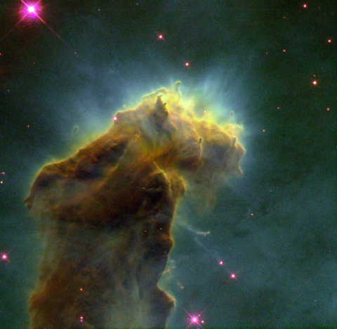 Image Source [Wikipedia](https://en.wikipedia.org/wiki/Pillars_of_Creation)
	
I have to confess that getting nice pictures is really, really rewarding, but it is even more rewarding trying to understand these phenomena and how the universe ends up exhibiting those beautiful corners of the night sky. I am going to try to sketch just a little bit of the knowledge discovered by science.

## Glow

Many things in the universe emit or reflect electromagnetic radiation at different wavelengths

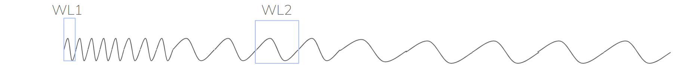

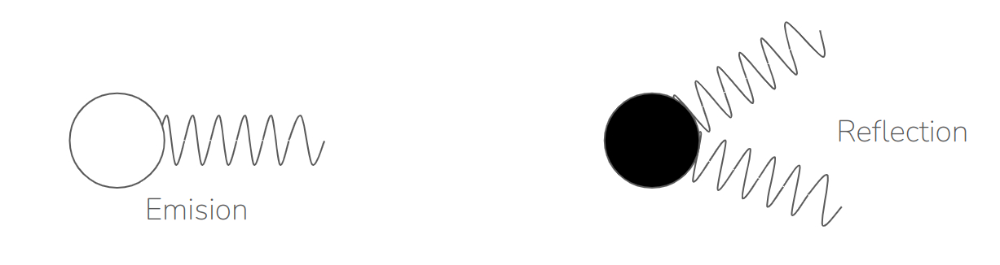

When the wavelength of this radiation oscillates within a certain range, “our eyes detect it”, what could be translated as “we see it”. 

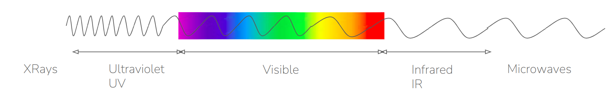

For example, radiation with a wavelength between 380 and 450 nm, we see it as “purple”. On the other extreme, radiation with a wavelength between 620 and 750nm we see it as “red”. And these extremes, and all the radiation in between is known as the visible range, that is, what we are able to see. Radiation shorter than purple is also known as “ultraviolet” and even X-Rays and radiation longer than red is known as “infrared”. Both of them are invisible to our eyes.

So, any object that emit or reflect radiation within the visible range is “visible” to our eyes. They “glow”. Two are the most important sources of glow when looking up above.

### Thermic radiation

When the molecules reach a certain temperature they naturally emit a radiation, which is usually between red and infrared. This is why we see something hot as red. For instance, the light emitted by a candle mainly comes from the combustion of the wax, and the different colours observed correspond to diferent temperatures

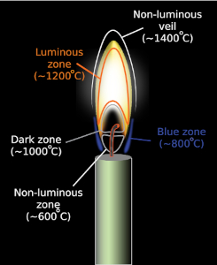 Image source [Wikipedia](https://en.wikipedia.org/wiki/Candle)

Another well known example of thermic radiation are those old light bulbs. Inside the vacuum chamber, there is a wire of tungsten which is heated to 2000-3000º K and, at this temperature it emits radiation in the form of visible light and some heat. 

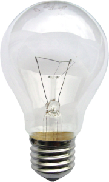 Image source [Wikipedia](https://en.wikipedia.org/wiki/Electric_light)

### Ionization radiation

When the molecules of a gas receive a certain amount of energy, which depends on the molecule, its electrons might jump out to more energetic levels or even abandon the atom. This is called [ionization](https://en.wikipedia.org/wiki/Ionization)

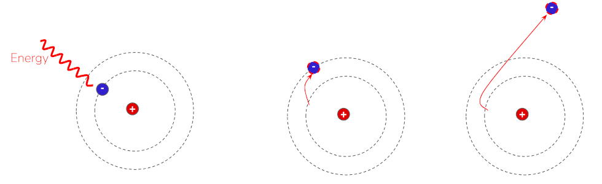 

A ionized molecule is not stable, so it later recombines again with the lost electron and this electron, as it goes back from more energetic levels into lower energetic levels, it emits a photon, an elementary particle of light.

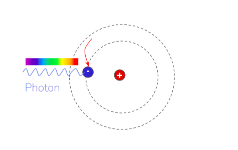 

Another common example of this source of light are fluorescent lamps. 

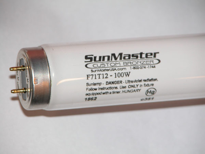 

The lamp is filled with mercury vapor and is coated with phosporus. The electricity through the lamp makes the mercury to emit energetic ultraviolet radiation which excite the phosphorus molecules producing a jump of the electrons and a further recombination that emits these photons.  

## What is a Nebula?

The short answer is that nebulae are clouds of gas that glow, within the space between stars. So, if we aim a telescope at these regions we would see a patch of colours, curls of shadows and movement captured in a beautiful picture. 

### Why do nebulae glow?

These regions are very dense clouds of gas and dust, bearing in mind that they are even less dense than any of the vacuums produced by mankind on earth. This means about 104 molecules in every cubic centimeter. These clouds are also very cold, like 10-20º K. They don’t glow by themselves, but by means of the interaction with stars nearby, they do glow, but for different reasons.

### Reflection nebulae

This is the simplest form of glowing. These molecular clouds, which sourrounds stars, glow because they simply reflect the light coming from stars in the neighborhood. Examples are [Running Man Nebula](./Running_Man_Nebula.md) or [Orion Nebula](./Orion_Nebula.md)

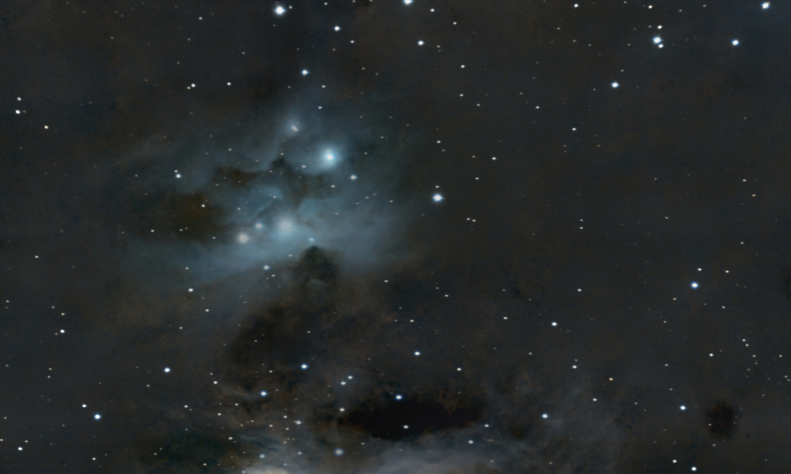

### Dark nebulae

These are cold clouds of gas and stellar dust that cast other glowing regions and produce a sort of shadow that hides the light behind. Examples are the [Horse Head Nebula](Horse_Head_Nebula.md)
 or the [Flame Nebula](./Flame_Nebula.md)
 

An special case of dark nebulae are Bok Globules, a cloud of molecular Hydrogen, diferent Carbon oxydes and Helium like in the [Pacman Nebula](./Pacman_Nebula.md)

or the [Rosette Nebula](./Rosette_Nebula.md)

### Emision nebulae

These are, perhaps the most known nebulae. They emit their own light because the molecular cloud is ionized due to several other causes.

#### Star nurseries

When a [new star is born](./The_Birth_of_Stars.md) it produces very strong ultraviolet radiation which ionizes the cloud of gas around the star, making it to glow. Like the [Lagoon Nebula](./Lagoon_Nebula.md) or the [Rosette Nebula](./Rosette_Nebula.md). These regions also contain many more baby stars which, all together, produce a huge ionization in the molecular cloud around them. These are known as **HII regions** and contain even hundreds of baby stars. Since most of the sourrounding gas happens to be Hydrogen, then the photons have a very accurate wavelength of 656.3 nm., This is known as **H-alpha** radiation and it is the most common radiation of the known nebulae and gives them the typical reddish color.

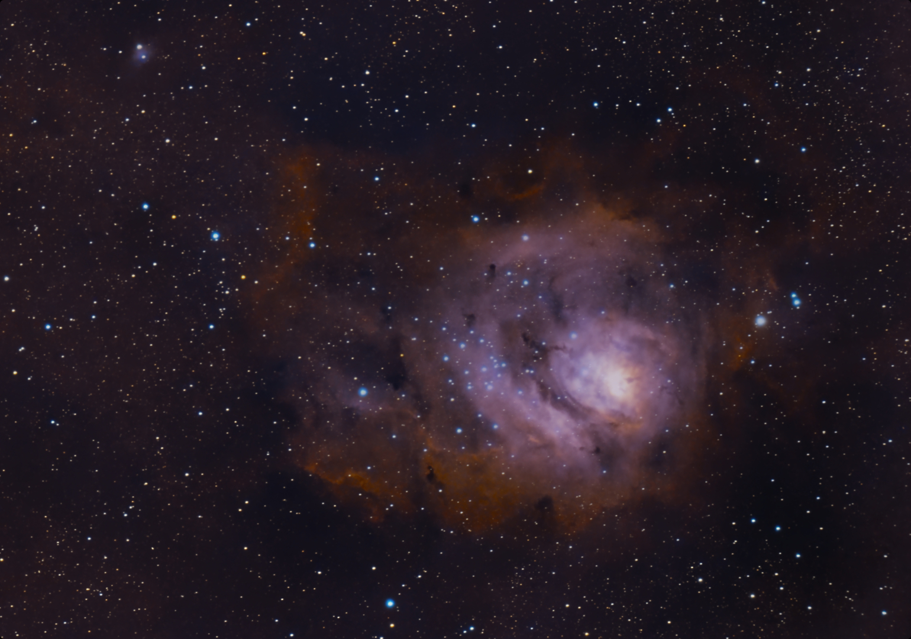

#### Supernova remnants

When a [giant star dies](./Stories/The_Death_of_Stars.md) it produces a supernova, a huge explosion which wipes out the surrounding gas cloud and produces both thermal and inonized glowing in a giant shock wave like in the [Veil Nebula](./Veil_Nebula.md)

#### Planetary nebulae

When a [small star dies](./Stories/The_Death_of_Stars.md) it produces a dwarf star and an ejection ring of ionized material, gas rich in metals, Oxygen, Nytrogen and Sulfur, producing many different wavelengths. This is the case of [Dumbell Nebula](./Dumbell_Nebula.md) or the [Helix Nebula](./Helix_Nebula.md)

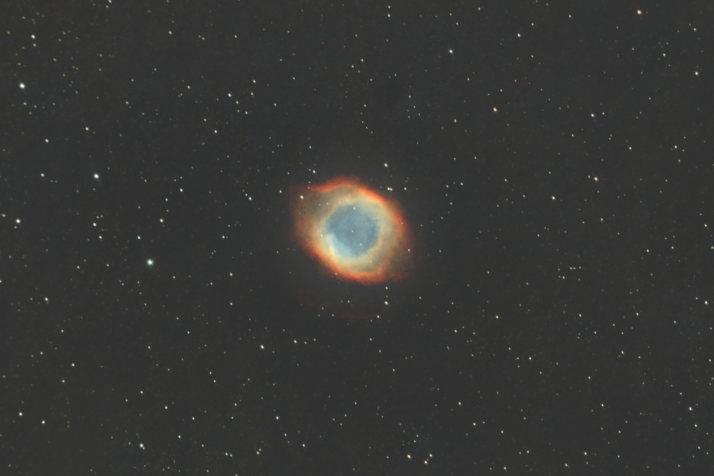

Of course, they have nothing to do with planets, but at the early years of astronomy observation, their rounded shape made them appear like planets.

