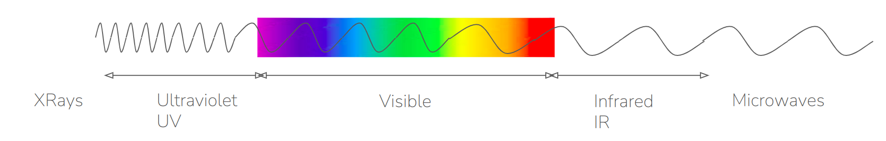
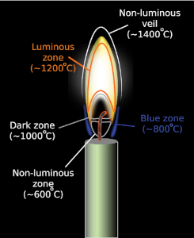
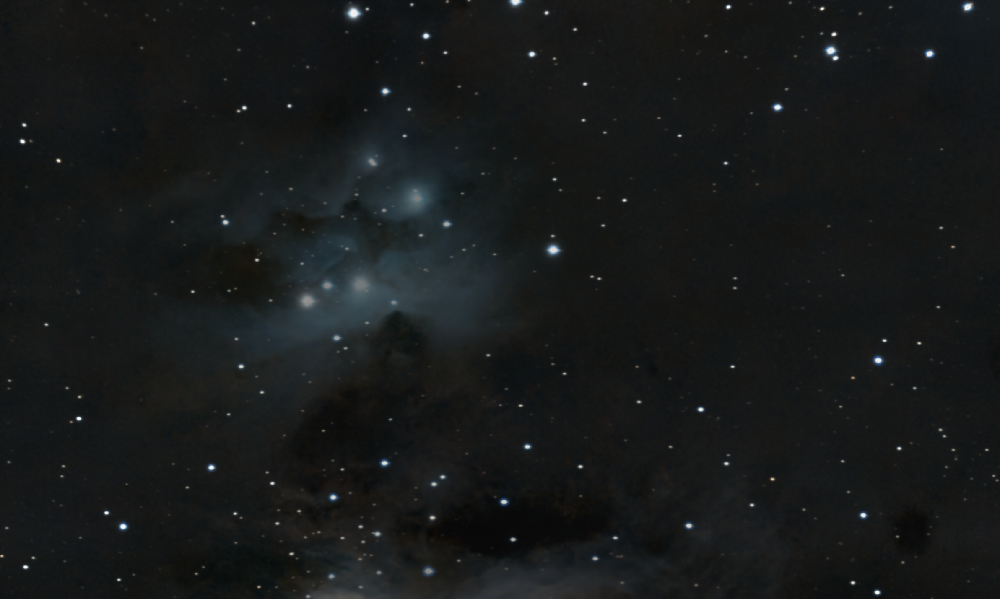
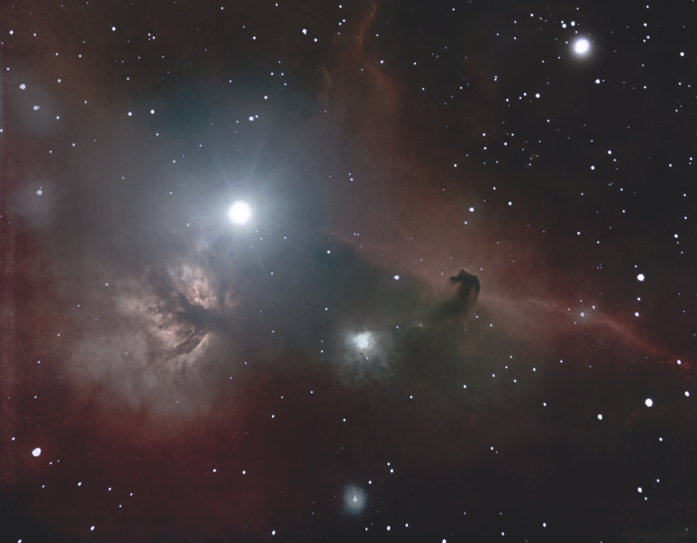
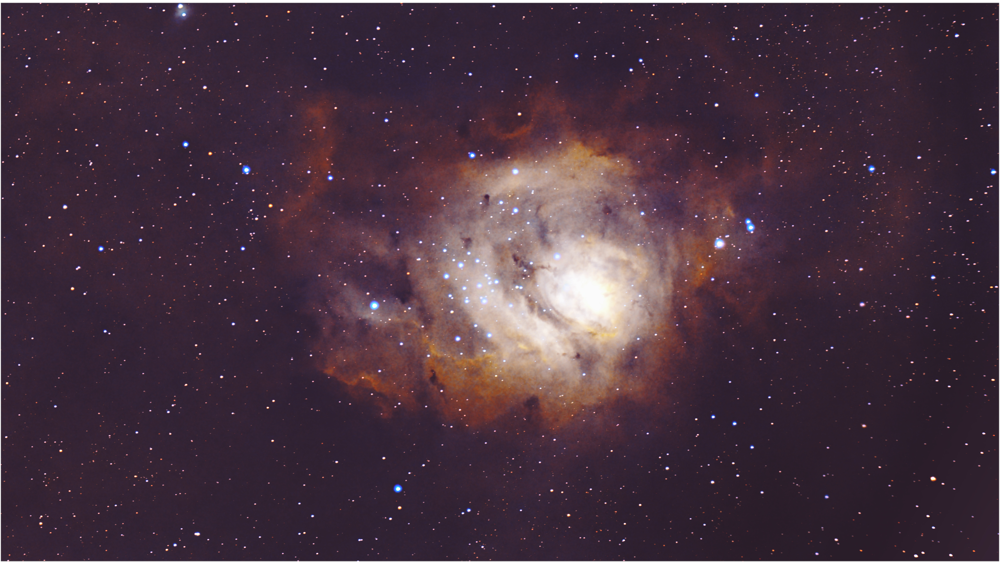
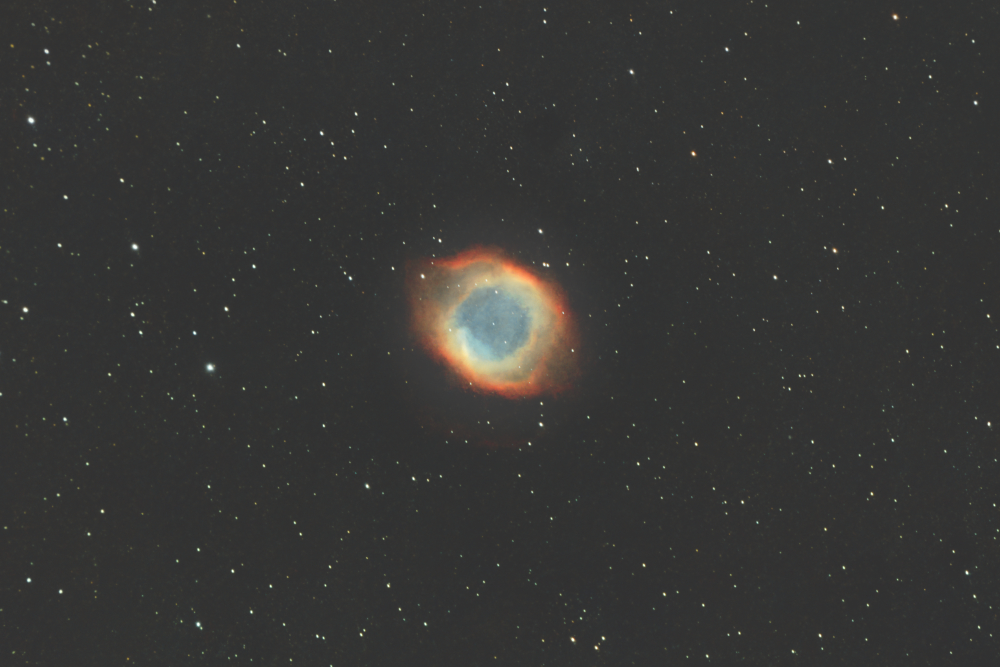

Read in [English](./Nebulae.md)

# Las nebulosas

El mundo de la astrofotografía y los influencers parecen estar compitiendo por obtener imágenes cada vez más precisas y coloridas de las nebulosas y por mostrar equipos cada vez más caros con tecnologías y software realmente punteros. Esto está muy bien, pero solo si lo que se busca es una imagen asombrosa, colorida y súper nítida, en lugar de la nebulosa en sí. Incluso muchos de ellos se enorgullecen de competir con las imágenes captadas por el telescopio Hubble. ¿Qué sentido tiene todo esto? 

 Fuente de la imagen [Wikipedia](https://en.wikipedia.org/wiki/Pillars_of_Creation)
	
Debo confesar que obtener buenas imágenes es muy gratificante, pero aún más gratificante es tratar de comprender estos fenómenos y cómo el universo acaba mostrando esos hermosos rincones del cielo nocturno. Voy a intentar esbozar un poco del conocimiento descubierto por la ciencia.

## Resplandor

Muchas cosas en el universo emiten o reflejan radiación electromagnética en diferentes longitudes de onda.

Cuando la longitud de onda de esta radiación oscila dentro de un cierto rango, «nuestros ojos la detectan», lo que podría traducirse como «la vemos». 

Por ejemplo, la radiación con una longitud de onda entre 380 y 450 nm la vemos como «púrpura». En el otro extremo, la radiación con una longitud de onda entre 620 y 750 nm la vemos como «roja». Estos extremos, y toda la radiación entre ellos, se conocen como el rango visible, es decir, lo que somos capaces de ver. La radiación más corta que el púrpura también se conoce como «ultravioleta» e incluso los rayos X, y la radiación más larga que el rojo se conoce como «infrarroja». Ambas son invisibles para nuestros ojos.

Por lo tanto, cualquier objeto que emita o refleje radiación dentro del rango visible es «visible» para nuestros ojos. «Brillan». Hay dos fuentes de brillo más importantes cuando miramos hacia arriba.

### Radiación térmica

Cuando las moléculas alcanzan una determinada temperatura, emiten de forma natural una radiación, que suele estar entre el rojo y el infrarrojo. Por eso vemos algo caliente como rojo. Por ejemplo, la luz que emite una vela proviene principalmente de la combustión de la cera, y los diferentes colores que se observan corresponden a diferentes temperaturas.

 Fuente de la imagen [Wikipedia](https://en.wikipedia.org/wiki/Candle)

Otro ejemplo muy conocido de radiación térmica son las antiguas bombillas. Dentro de la cámara de vacío hay un filamento de tungsteno que se calienta a 2000-3000 ºK y, a esta temperatura, emite radiación en forma de luz visible y algo de calor. 

 Fuente de la imagen [Wikipedia](https://en.wikipedia.org/wiki/Electric_light)

### Radiación de ionización

Cuando las moléculas de un gas reciben una cierta cantidad de energía, que depende de la molécula, sus electrones pueden saltar a niveles más energéticos o incluso abandonar el átomo. Esto se denomina [ionización](https://en.wikipedia.org/wiki/Ionization)

 

Una molécula ionizada no es estable, por lo que más tarde se recombina de nuevo con el electrón perdido y este electrón, al volver de niveles más energéticos a niveles menos energéticos, emite un fotón, una partícula elemental de luz.

 

Otro ejemplo común de esta fuente de luz son las lámparas fluorescentes. 

 

La lámpara está llena de vapor de mercurio y recubierta de fósforo. La electricidad que atraviesa la lámpara hace que el mercurio emita radiación ultravioleta energética que excita las moléculas de fósforo, lo que produce un salto de los electrones y una recombinación posterior que emite estos fotones.

## ¿Qué es una nebulosa?

La respuesta corta es que las nebulosas son nubes de gas que brillan en el espacio entre las estrellas. Por lo tanto, si apuntamos un telescopio hacia estas regiones, veríamos una mancha de colores, rizos de sombras y movimiento capturados en una hermosa imagen. 

### ¿Por qué brillan las nebulosas?

Estas regiones son nubes muy densas de gas y polvo, teniendo en cuenta que son incluso menos densas que cualquiera de los vacíos producidos por el ser humano en la Tierra. Esto significa unas 104 moléculas por cada centímetro cúbico. Estas nubes también son muy frías, entre 10 y 20 ºK. No brillan por sí mismas, sino que lo hacen por la interacción con las estrellas cercanas, pero por diferentes motivos.

### Nebulosas de reflexión

Esta es la forma más simple de brillo. Estas nubes moleculares, que rodean a las estrellas, brillan porque simplemente reflejan la luz que proviene de las estrellas vecinas. Algunos ejemplos son la [Nebulosa del Corredor](./Running_Man_Nebula.md) o la [Nebulosa de Orión](./Orion_Nebula.md)

### Nebulosas oscuras

Son nubes frías de gas y polvo estelar que proyectan otras regiones brillantes y producen una especie de sombra que oculta la luz que hay detrás. Algunos ejemplos son la [Nebulosa Cabeza de Caballo](Horse_Head_Nebula.md)
 o la [Nebulosa Llama](./Flame_Nebula.md)
 

Un caso especial de nebulosas oscuras son los glóbulos de Bok, una nube de hidrógeno molecular, diferentes óxidos de carbono y helio, como en la [Nebulosa Pacman](./Pacman_Nebula.md)

o la [Nebulosa Roseta](./Rosette_Nebula.md)

### Nebulosas de emisión

Estas son, quizás, las nebulosas más conocidas. Emiten su propia luz porque la nube molecular se ioniza debido a varias otras causas.

#### Cunas estelares

Cuando [nace una nueva estrella](./The_Birth_of_Stars.md), produce una radiación ultravioleta muy fuerte que ioniza la nube de gas que la rodea, haciendo que brille. Como la [Nebulosa Laguna](./Lagoon_Nebula.md) o la [Nebulosa Roseta](./Rosette_Nebula.md). Estas regiones también contienen muchas más estrellas bebés que, en conjunto, producen una enorme ionización en la nube molecular que las rodea. Se conocen como **regiones HII** y contienen incluso cientos de estrellas bebés. Dado que la mayor parte del gas circundante es hidrógeno, los fotones tienen una longitud de onda muy precisa de 656,3 nm. Esto se conoce como radiación **H-alfa** y es la radiación más común de las nebulosas conocidas, lo que les da su típico color rojizo.

#### Restos de supernovas

Cuando una [estrella gigante muere](./Stories/The_Death_of_Stars.md), produce una supernova, una enorme explosión que arrasa la nube de gas circundante y produce un brillo térmico e ionizado en una gigantesca onda de choque, como en la [Nebulosa del Velo](./Veil_Nebula.md)

#### Nebulosas planetarias

Cuando una [pequeña estrella muere](./Stories/The_Death_of_Stars.md), produce una estrella enana y un anillo de eyección de material ionizado, gas rico en metales, oxígeno, nitrógeno y azufre, que produce muchas longitudes de onda diferentes. Este es el caso de la [Nebulosa Dumbell](./Dumbell_Nebula.md) o la [Nebulosa Helix](./Helix_Nebula.md)

Por supuesto, no tienen nada que ver con los planetas, pero en los primeros años de la observación astronómica, su forma redondeada hacía que parecieran planetas.

Traducción realizada con la versión gratuita del traductor DeepL.com
