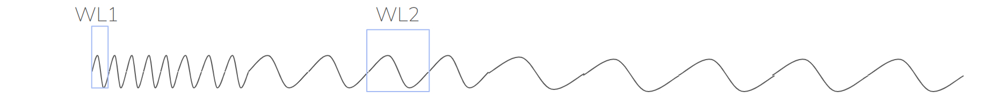
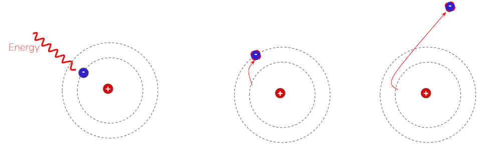
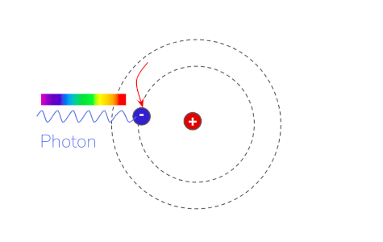

Leer en [Español](./Nebulosas.md)

# Las nebulosas

El mundo de la astrofotografía y sus influencers parecen estar inmersos en una carrera por obtener imágenes cada vez más precisas y coloridas de las nebulosas y por mostrar equipos cada vez más caros con tecnologías y software realmente punteros. Esto está muy bien, pero solo si lo que se busca es una imagen asombrosa, colorida y súper nítida, en lugar de la nebulosa en sí. Incluso muchos de ellos se enorgullecen de competir con las imágenes captadas por el telescopio Hubble. ¿Qué sentido tiene todo esto? 

 Fuente de la imagen [Wikipedia](https://en.wikipedia.org/wiki/Pillars_of_Creation)
	
Tengo que confesar que obtener buenas imágenes es realmente muy gratificante, pero lo es aún más intentar comprender estos fenómenos y cómo el universo acaba mostrando esos hermosos rincones del cielo nocturno. Voy a intentar esbozar un poco los conocimientos descubiertos por la ciencia.

## Resplandor

Muchas cosas en el universo emiten o reflejan radiación electromagnética en diferentes longitudes de onda.

Cuando la longitud de onda de esta radiación oscila dentro de un cierto rango, «nuestros ojos la detectan», lo que podría traducirse como «la vemos». 

Por ejemplo, la radiación con una longitud de onda entre 380 y 450 nm la vemos como «morada». En el otro extremo, la radiación con una longitud de onda entre 620 y 750 nm la vemos como «roja». Estos extremos, y toda la radiación entre ellos, se conocen como el rango visible, es decir, lo que somos capaces de ver. La radiación más corta que el púrpura también se conoce como «ultravioleta» e incluso los rayos X y la radiación más larga que el rojo se conocen como «infrarrojos». Ambos son invisibles para nuestros ojos.

Por lo tanto, cualquier objeto que emita o refleje radiación dentro del rango visible es «visible» para nuestros ojos. «Brillan». Hay dos fuentes de brillo más importantes cuando miramos hacia arriba.

### Radiación térmica

Cuando las moléculas alcanzan una determinada temperatura, emiten de forma natural una radiación, que suele estar entre el rojo y el infrarrojo. Por eso vemos algo caliente como rojo. Por ejemplo, la luz que emite una vela proviene principalmente de la combustión de la cera, y los diferentes colores que se observan corresponden a diferentes temperaturas.

 Fuente de la imagen [Wikipedia](https://en.wikipedia.org/wiki/Candle)

Otro ejemplo muy conocido de radiación térmica son las antiguas bombillas. Dentro de la cámara de vacío hay un filamento de tungsteno que se calienta a 2000-3000 ºK y, a esta temperatura, emite radiación en forma de luz visible y algo de calor. 

 Fuente de la imagen [Wikipedia](https://en.wikipedia.org/wiki/Electric_light)

### Radiación de ionización

Cuando las moléculas de un gas reciben una cierta cantidad de energía, que depende de la molécula, sus electrones pueden saltar a niveles más energéticos o incluso abandonar el átomo. Esto se denomina [ionización](https://en.wikipedia.org/wiki/Ionization)

 

Una molécula ionizada no es estable, por lo que más tarde se recombina de nuevo con el electrón perdido y este electrón, al volver de niveles más energéticos a niveles menos energéticos, emite un fotón, una partícula elemental de luz.

 

Otro ejemplo común de esta fuente de luz son las lámparas fluorescentes. 

 

La lámpara está llena de vapor de mercurio y recubierta de fósforo. La electricidad que atraviesa la lámpara hace que el mercurio emita radiación ultravioleta energética que excita las moléculas de fósforo, lo que produce un salto de los electrones y una nueva recombinación que emite estos fotones.  

## ¿Qué es una nebulosa?

La respuesta breve es que las nebulosas son nubes de gas que brillan en el espacio entre las estrellas. Por lo tanto, si apuntamos un telescopio hacia estas regiones, veríamos una mancha de colores, rizos de sombras y movimiento capturados en una hermosa imagen. 

### ¿Por qué brillan las nebulosas?

Estas regiones son nubes muy densas de gas y polvo, teniendo en cuenta que son incluso menos densas que cualquiera de los vacíos producidos por el ser humano en la Tierra. Esto significa que hay unas 104 moléculas en cada centímetro cúbico. Estas nubes también son muy frías, entre 10 y 20 ºK. No brillan por sí mismas, sino por la interacción con las estrellas cercanas, pero por diferentes razones y diferentes tipos de interacción con las estrellas de los alrededores.

* Nebulosas que producen luz o **nebulosas de emisión**
    * [Nidos estelares](./Nidos_Estelares.md). Son lugares donde muchas estrellas recién nacidas producen alta energía que ioniza la nube que las rodea
    * [Nebulosas Wolf-Rayet](./Nebulosas_Wolf_Rayet.md). Estas nebulosidades son producidas por una sola estrella increíblemente energética, que esculpe la nube  que la rodea.
    * [Nebulosas planetarias](./Nebulosas_Planetarias.md). Son el resultado de la implosión de una estrella pequeña
    * [Restos de supernova](./Supernovas.md). Son el resultado de la  explosión de estrellas grandes
* Nebulosas que bloquean la luz
    * [Nebulosas oscuras](./Nebulosas_Oscuras.md). Son densas nubes de polvo que no permiten que la luz las atraviese
* Nebulosas que no producen luz
    * [Nebulosas de reflexión](./Nebulosas_Reflexion.md). Son nubes de polvo y gas que, aunque no están ionizadas, simplemente reflejan la luz de las estrellas.

Traducción realizada con la versión gratuita del traductor DeepL.com