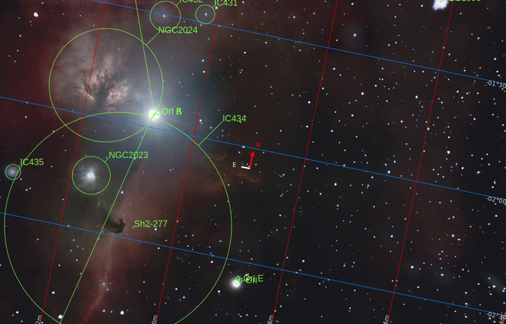

# Nebulosas oscuras

Son nubes moleculares frías de gas y polvo estelar tan densas que proyectan otras regiones brillantes y producen una especie de sombra que oculta la luz que hay detrás. Estas nubes suelen estar compuestas por muchas moléculas orgánicas basadas en el carbono. De hecho, estas estructuras oscuras son muy conocidas por ser el andamiaje desordenado del brazo de la Vía Láctea visible durante las noches de verano en el hemisferio norte.
 

[Nebulosa Cabeza de Caballo](./Horse_Head_Nebula.md)

Es una de las imágenes más populares de nuestro universo, situada en la constelación de Orión, justo al sur de su cinturón, en una región muy activa y compleja.

Al igual que ocurre con los [Pilares de la Creación](https://en.wikipedia.org/wiki/Pillars_of_Creation), estas nubes oscuras esconden muchas estrellas jóvenes en proceso de formación.

[Nebulosa Cabeza de Pez](./Fish_Head_Nebula.md)

Esta nebulosa, situada en la constelación de Casiopea, esconde una potente incubadora estelar, invisible tras las sombras, pero la ionización de su fuerte viento estelar es claramente visible como un estallido de luz que sale de la oscuridad.

Un caso especial de nebulosas oscuras son los glóbulos de Bok, una nube de hidrógeno molecular, diferentes óxidos de carbono y helio, como en la [Nebulosa Pacman](./Pacman_Nebula.md)

o la [Nebulosa Roseta](./Rosette_Nebula.md).

