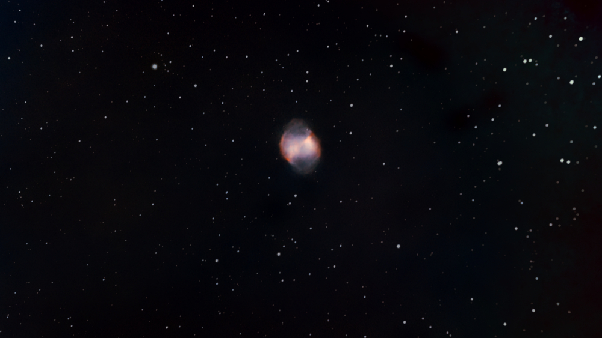
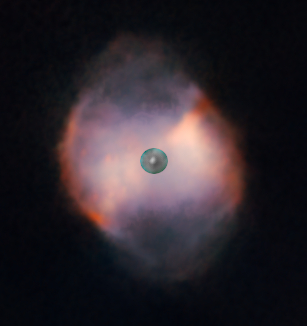
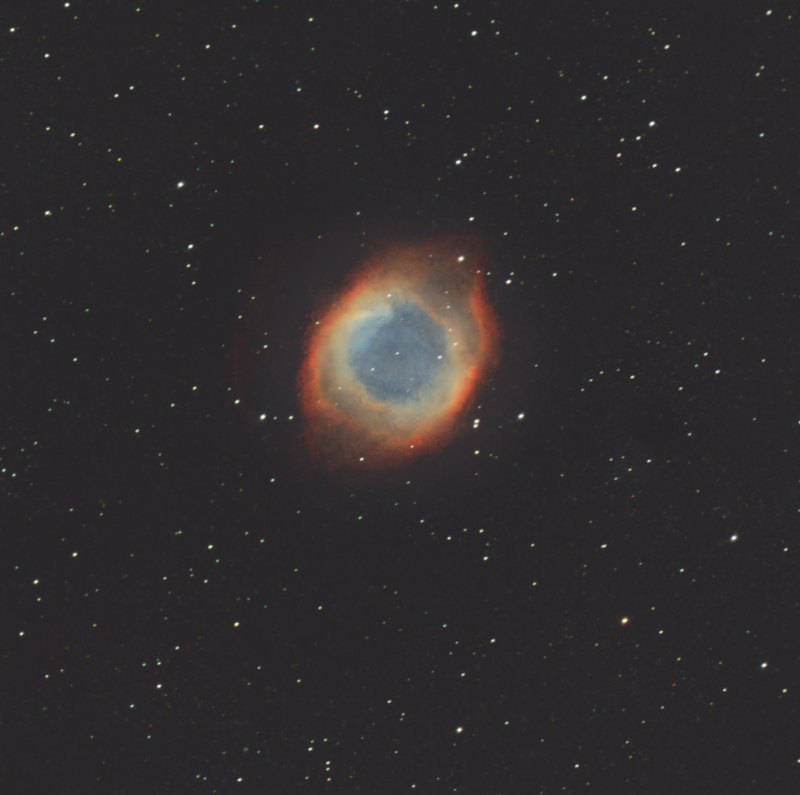

(Read in [English](./Planetary_Nebulae.md))

## Nebulosas planetarias

Cuando una [pequeña estrella muere](./Stories/The_Death_of_Stars.md), con una masa entre 1 y 8 veces la de nuestro sol, produce una estrella enana y un anillo de eyección de material ionizado, gas rico en metales, oxígeno, nitrógeno y azufre, que produce muchas longitudes de onda diferentes. Este es el caso de la [Nebulosa Dumbell](./Dumbell_Nebula.md) o la [Nebulosa Helix](./Helix_Nebula.md).

Por supuesto, no tienen nada que ver con los planetas, pero en los primeros años de la observación astronómica, su forma redondeada hacía que parecieran planetas. Aunque hoy en día las observaciones de estos cuerpos son mucho más precisas y se sabe que no son planetas, se ha mantenido su denominación original.

Estas nebulosas son muy pequeñas, de alrededor de 1 año luz de diámetro, son un fenómeno muy breve, de decenas de miles de años, y las estrellas enanas en el centro de estas nebulosas son muy calientes, entre 16 000 ºK y 25 000 ºK en su superficie.

La primera nebulosa planetaria fue descubierta  a mediados del siglo XVIII y fue la [Nebulosa Dumbbell](./Dumbbell_Nebula.md)

,

 cuya estrella enana central es claramente visible

En mi modesta opinión, estas nebulosas son de gran belleza y muy coloridas, y producen algunas de las imágenes más bellas y enigmáticas del cielo, como la [Nebulosa Helix](./Helix_Nebula.md)

la [Nebulosa Crescent](./Crescent_Nebula.md)

o la [Nebulosa Bubble](./Bubble_Nebula.md)

Traducción realizada con la versión gratuita del traductor DeepL.com