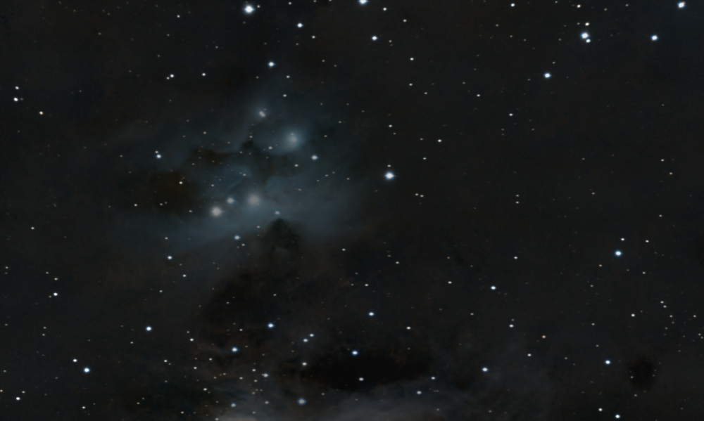
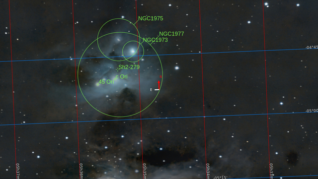
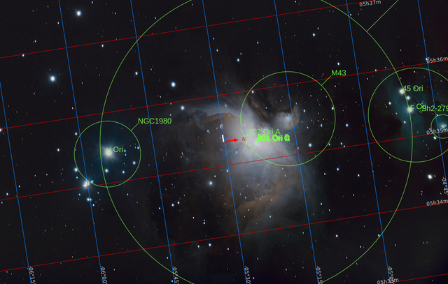

# Nebulosas de reflexión

Esta es la forma más simple de luminiscencia. Estas nubes moleculares, que rodean a las estrellas, brillan porque simplemente reflejan la luz procedente de las estrellas vecinas.

[Nebulosa Cabeza de Bruja](./Witch_Head_Nebula.md)

Es una nube extremadamente tenue situada al suroeste de la constelación de Orión, que está iluminada por la estrella gigante [Rigel](./Rigel_Star.md)

[Nebulosa del Hombre Corriendo](./Running_Man_Nebula.md)

Es uno de mis rincones favoritos del cielo nocturno y protagoniza mi propia historia [Acerca del caos](./About_Chaos.md)

