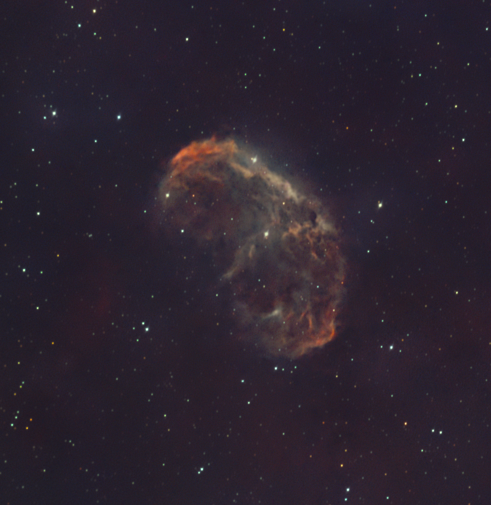
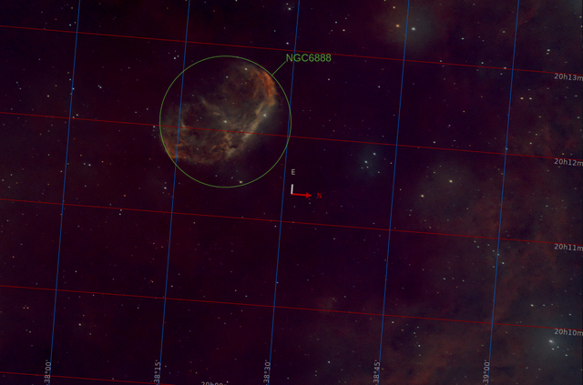
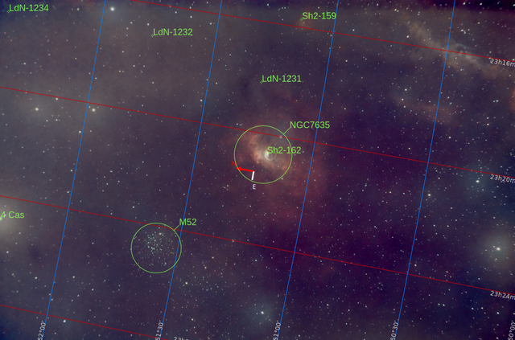
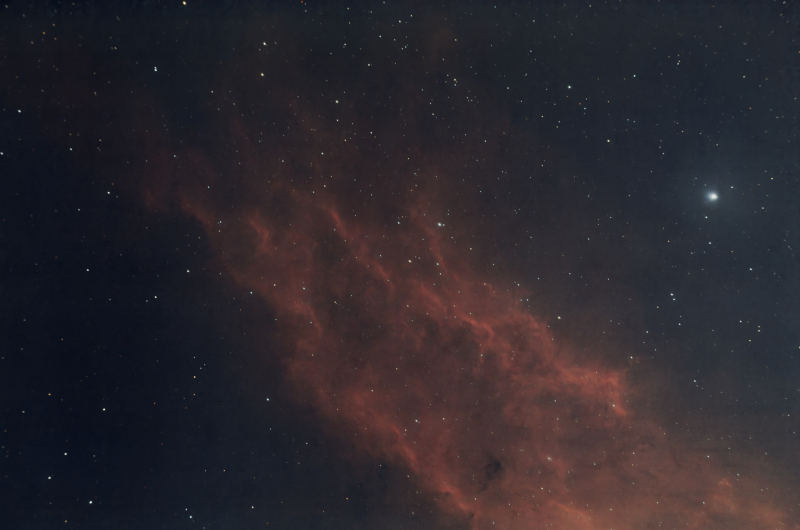

# Nebulosas Wolf-Rayet

Los [NNidos estelares](./Nidos_Estelares.md) son complejas nubes de gas y polvo en las que se encuentran **muchas** estrellas jóvenes, pero muy calientes. Sin embargo, estas nebulosas Wolf-Rayet han sido esculpidas por una **única** estrella increíblemente potente cuyo fuerte viento estelar literalmente sopla la materia  que la rodea. Debido al poder extremo de estas estructuras estelares, producen, en mi opinión, las imágenes más llamativas e intrigantes del cielo nocturno.

[Nebulosa Crescent](./Crescent_Nebula.md)

Esta es la nebulosa WR más relevante. Se encuentra cerca de la estrella [Sadr](./Sadr_Star.md) en el centro de la constelación del Cisne.

Esta hermosa onda de choque es producida por una de las estrellas más energéticas que se conocen, la que se encuentra justo en el centro del círculo verde. Su único nombre es una fría denominación: WR136. Es una estrella 500 000 veces más brillante que nuestro sol, con una temperatura superficial superior a los 70 000 ºK. Hubo un tiempo en que era una estrella gigante roja, como [Betelgeuse](./Betelgeuse_Star.md), y expulsó una enorme nube de material, pero luego, en lugar de colapsar como una supernova, se convirtió en una estrella Wolf-Rayet con un potente viento estelar (debido a sus 70 000 ºK) que literalmente empuja toda esta nube lejos de la estrella.

[Nebulosa Burbuja](./Bubble_Nebula.md)

Este es uno de los cuerpos celestes más misteriosos que hay que capturar con un equipo específico.

Su estrella central, llamada SAO 20575, es una estrella poco común con una temperatura superficial estimada de casi 40 000 ºK, que produce un viento estelar con una velocidad supersónica de 1800-2500 km/s. Este viento estelar masivo empuja la nube de polvo y gas que rodea la estrella hacia afuera en una onda de choque, ligeramente elíptica, que refleja la luz circundante, produciendo esta apariencia característica de una burbuja de jabón.

[Nebulosa California](./California_Nebula.md)

En este caso, la estrella superenergética de la derecha, Menkib, en la constelación de Perseo, con 30 veces la masa de nuestro sol y una temperatura superficial de 35 000 ºK, ioniza una nube de hidrógeno puro y la curva debido a sus fuertes vientos estelares.
