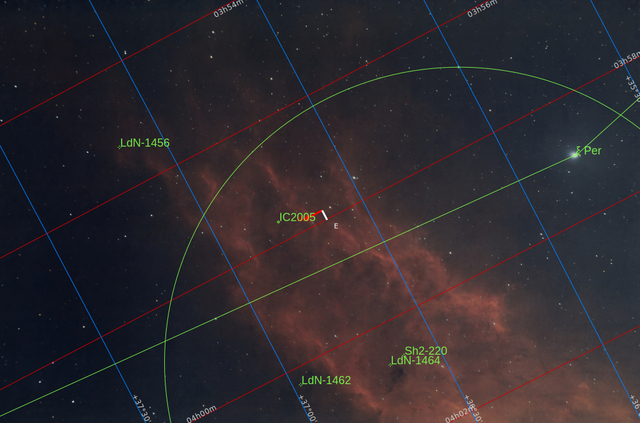
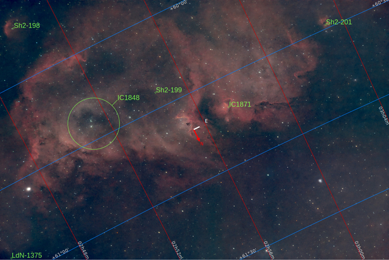
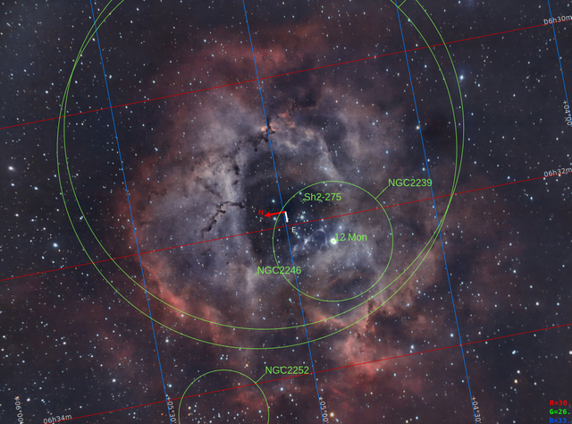

(Read in[English](./Star_Nurseries.md))

# Cunas estelares

Cuando nace una nueva estrella, produce una radiación ultravioleta muy intensa que ioniza la nube de gas que la rodea, haciendo que brille. Como la [Nebulosa de la Laguna](./Laggon_Nebula.md) o la [Nebulosa de la Roseta](./Rosette_Nebula.md). 

Estas regiones también contienen muchas estrellas recién nacidas que, en conjunto, producen una enorme ionización en la nube molecular que las rodea. Estas zonas se conocen como **regiones HII** y contienen incluso cientos de estrellas recién nacidas. Dado que la mayor parte del gas circundante es hidrógeno, los fotones tienen una longitud de onda muy precisa de 656,3 nm. Esto se conoce como radiación **H-alfa** y es la radiación más común de las nebulosas conocidas, lo que les da su típico color rojizo. 

Solo las estrellas con una temperatura  de entre 25 000 y 30 000 ºK de termperatura en superficie, son lo suficientemente potentes como para emitir tal cantidad de radiación ultravioleta. Esto equivale a 300 millones de bombas de Hiroshima cada segundo. Es decir, una cantidad de energía enorme. Para ponerlo en perspectiva, la temperatura de nuestro sol es ligeramente inferior a 6000 ºK, por lo que es «demasiado frío» para ionizar el gas que lo rodea, es entre 4 y 8 veces «más frío».

Estas nebulosas de emisión también pueden brillar en otros colores dependiendo de la composición química y la potencia de la radiación ultravioleta emitida. Cuanto mayor sea esta radiación, se podrán encontrar otros colores: 

|Color | Elemento | Longitud de onda|
| :-:   | :-:   | :-:   |
|Rojo intenso | Hidrógeno | 656,3 nm|
|Rojo oscuro| Azufre | 671,7 nm y 673,1 nm|
|Azul verdoso| Oxígeno | 495,9 y 500,7|
|Azul intenso| Polvo (no ionizado) | - |

## Rojo intenso H-alfa

[Nebulosa California](./California_Nebula.md)

En este caso, la estrella superenergética de la derecha, Menkib, en la constelación de Perseo, con 30 veces la masa de nuestro sol y 35 000 ºK en su corteza exterior, ioniza una nube de hidrógeno puro y la curva debido a sus fuertes vientos estelares.

[Nebulosa Laguna](./Lagoon_Nebula.md)

La magnífica estructura de esta nebulosa es producida tanto por un fuerte cúmulo estelar joven (NGC6530) como, principalmente, por una estrella binaria masiva (9-Sagitarii) con 32 veces la masa de nuestro sol y una temperatura estimada de 46 000 ºK.

## Azufre rojo oscuro

[Nebulosa del Alma](./Soul_Nebula.md)

En este caso, toda la nebulosa está esculpida por los fuertes vientos estelares de un cúmulo de estrellas llamado IC1848, un cúmulo de estrellas muy jóvenes, de solo un millón de años, literalmente estrellas bebés, con una temperatura que oscila entre los 30 000 ºK y los 50 000 ºK, cuyo enorme poder ioniza no solo el hidrógeno, sino también el azufre y el oxígeno.

## Oxígeno azul

[Nebulosa Roseta](./Rosette_Nebula.md)

Esta nebulosidad masiva, situada en la constelación de Monoceros, visualmente muy tenue y casi imposible de ver a simple vista, pero tan grande como 2,5 veces la superficie visual de la luna llena, está esculpida por el cúmulo estelar NGC 2244, un joven cúmulo de estrellas supercalientes, entre 30 000 ºK y 50 000 ºK.

Traducción realizada con la versión gratuita del traductor DeepL.com