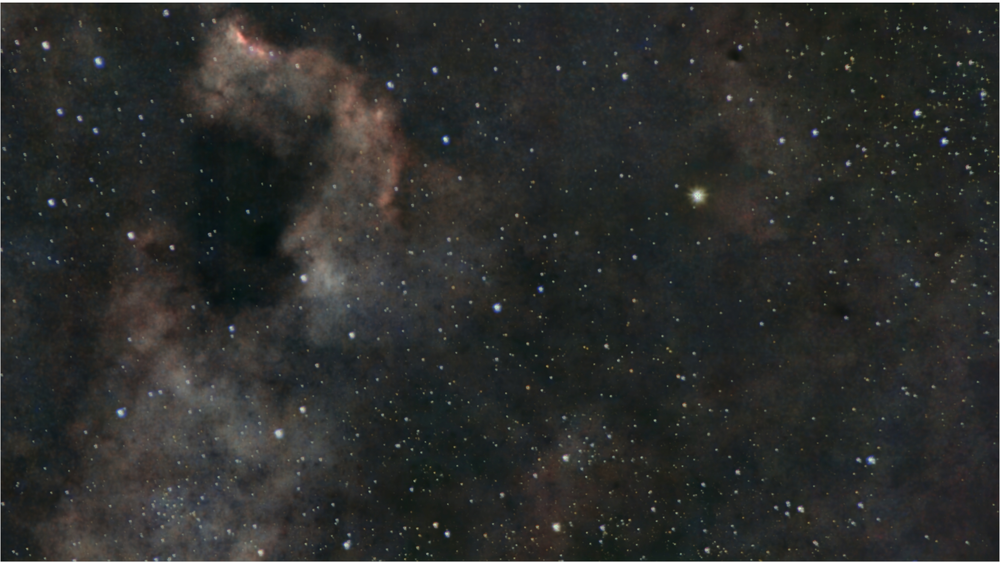
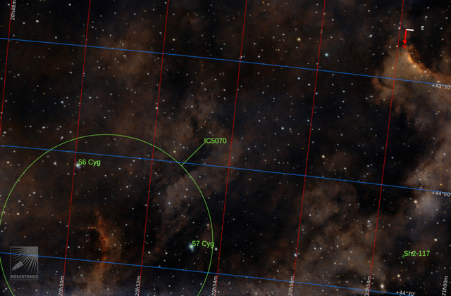
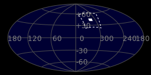
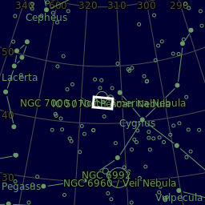
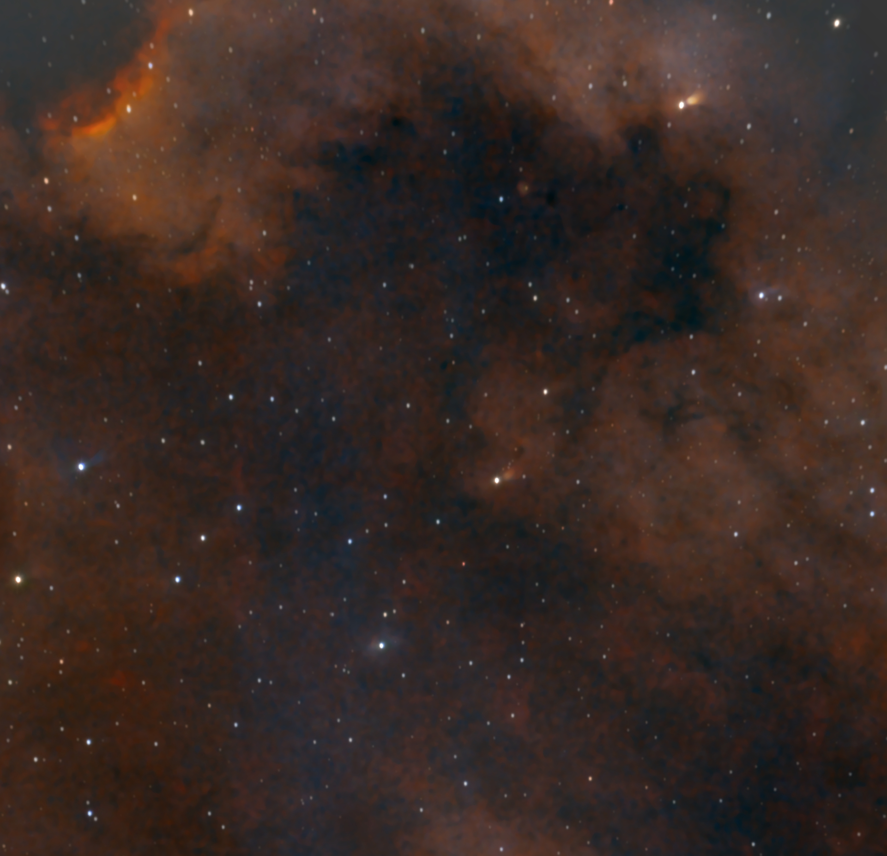
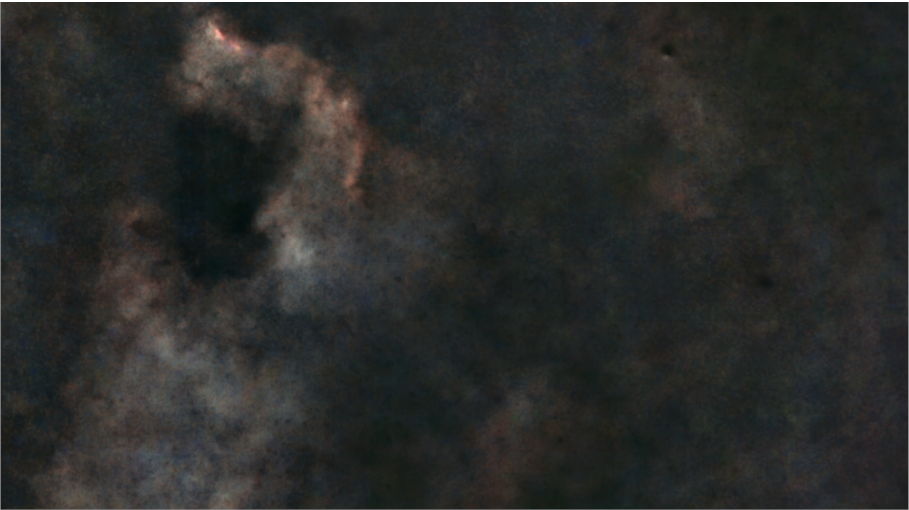
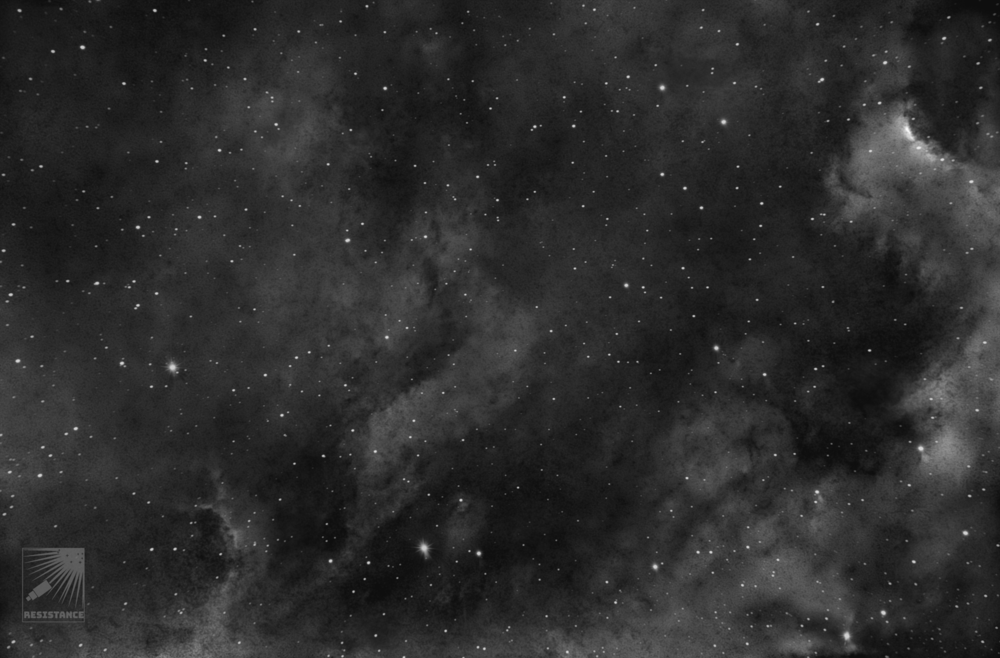

#  Northamerica Nebula

The North America Nebula (NGC 7000 or Caldwell 20) is an emission nebula in the constellation Cygnus, close to Deneb (the tail of the swan and its brightest star) in the night sky. It is named because its shape resembles North America.

[ Read more](https://en.wikipedia.org/wiki/North_America_Nebula)
## Plate solving 

| Globe | Close | Very close |
| ----- | ----- | ----- |
| | 

## Details

| | | |
| :---: | :---: | :---:|
| | | 42 ly |
| |45 ly | |

## Gallery
 

