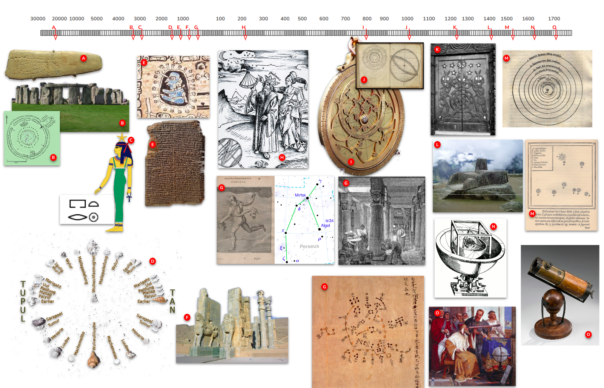
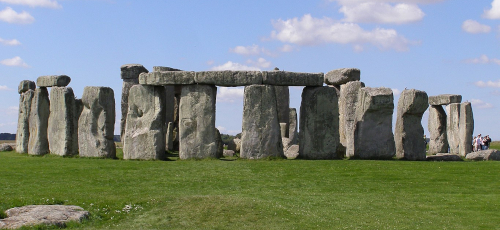
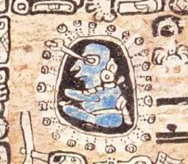
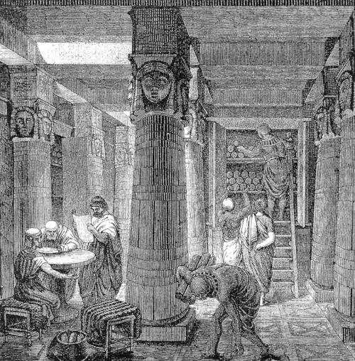
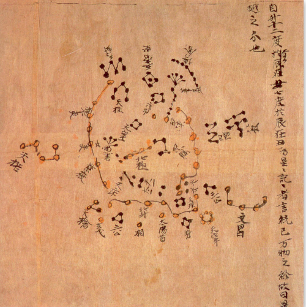
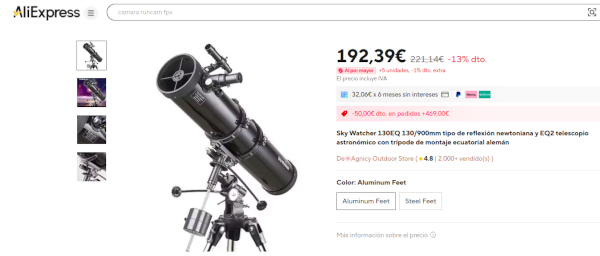

(Read in [English](./PaleoAstronomy.md)) 

## Paleoastronomía

 
*Noche estrellada. Vincent van Gogh. Fuente [Wikipedia](https://en.wikipedia.org/wiki/The_Starry_Night)*

Las noches estrelladas siempre han captado nuestra atención, ya sea por romanticismo, ciencia, religión, superstición, como indicador de las estaciones o simplemente por curiosidad. Se cree que incluso muchas especies animales que migran de una parte del planeta a otra en busca de mejores condiciones de vida utilizan mapas estelares como referencia durante sus largos viajes. Esta historia trata sobre cómo la humanidad siempre se ha preocupado por comprender y explicar el misterio de las estrellas que se encuentran sobre la bóveda celeste. A continuación se presenta un cronograma que comienza hace 25 000 años, en la Edad Paleolítica, hasta llegar a la época más reciente, en el siglo XVIII, cuando la astronomía moderna comenzó a tomar forma.

*Todas las imágenes han sido extraídas de Wikipedia*

## Hace 25 000 años: Paleolítico, Europa

Fuente [Wikipedia](https://en.m.wikipedia.org/wiki/File:Blanchard_plaque.jpg)

Esta es la placa de Blanchard, una piedra plana y sencilla con algunos grabados, encontrada en la [Cueva de Aurignac](https://en.m.wikipedia.org/wiki/Aurignacian). Data del Paleolítico superior. Aunque no hay consenso sobre el significado de esta piedra, recuerda mucho a un [analema solar](https://en.wikipedia.org/wiki/Analemma), que es un dibujo de la posición del sol durante todo un año, tomado exactamente a la misma hora y en el mismo lugar:

Fuente [Wikipedia](https://en.wikipedia.org/wiki/Analemma)

Es muy probable que se trate de un intento de analema solar o lunar. Esto significaría que hace 25 000 años ya había miembros de una tribu humanoide cromañón que observaban el cielo nocturno durante largos periodos de tiempo, tal vez años, con el único propósito de comprender lo que veían, buscando patrones repetitivos, y que intentaban transmitir este conocimiento descubierto a otras personas tallando sus observaciones en una piedra plana. Simplemente maravilloso.

## 3100 a. C., finales del Neolítico, Reino Unido

Fuente [Wikipedia](https://en.m.wikipedia.org/wiki/Stonehenge)

Si estás leyendo esto, estoy casi seguro de que también reconoces esta imagen. Se trata de una estructura megalítica conocida como el monumento de Stonehenge, que se construyó inicialmente como cementerio.    Pero es más que eso.

- El círculo central principal está alineado exactamente con el solsticio de verano.
- El solsticio de invierno está alineado exactamente con algunas de las rocas. 
- Otras rocas están colocadas exactamente en los puntos de salida y puesta de la luna durante el año. 
- Otras cuatro rocas, situadas en los puntos extremos de salida y puesta de la luna, marcan la llegada de cada una de las estaciones.

## 3000 a. C., Egipto, África

El antiguo [calendario egipcio](https://en.wikipedia.org/wiki/Egyptian_calendar) es un calendario solar que describe un año compuesto por exactamente 365 días, dividido en tres estaciones, con referencias al sol, la luna y varias estrellas conocidas. Aunque no se sabe que crearan mapas estelares específicos, se pueden encontrar muchas referencias en los jeroglíficos. 

Fuente de la imagen [Wikipedia](https://en.wikipedia.org/wiki/Sopdet)

- Llamaron a nuestra estrella Polar, «la estrella que no puede perecer», la estrella que está fija en su lugar celestial y no desaparece bajo el horizonte
- La [diosa Sopdet](https://en.wikipedia.org/wiki/Sopdet)
 hace referencia a la estrella [Sirio](./Sirius_Star.md), representada en los jeroglíficos como un círculo con un punto en el centro. La salida de esta estrella por el horizonte siempre precede a la crecida del río Nilo y su influencia en la temporada agrícola.
 
## 1500 a. C., Polinesia, océano Pacífico

 Fuente de la imagen [Wikipedia](https://en.wikipedia.org/wiki/Polynesian_navigation)

Polinesia es una zona del océano Pacífico compuesta por más de 1000 islas habitadas por muchas tribus diferentes, pero que comparten el mismo idioma y cultura. Para conectar estas miríadas de islas, los polinesios eran grandes marineros y, sin duda alguna, utilizaban las estrellas y muchos otros signos de la naturaleza para orientarse a lo largo de las enormes extensiones oceánicas. 	En concreto, la imagen de arriba es una brújula estelar con referencias a la Estrella Polar (Wuliwulifasmughet), [Vega](./Vega_Star.md) (Murn) o las [Pléyades](./Pleiades_Star_Cluster.md) (Marigaht).

## 1000 a. C., los mayas, América Central

 Fuente de la imagen [Wikipedia](https://en.wikipedia.org/wiki/Maya_civilization#Astronomy)

Los mayas fueron una floreciente civilización precolombina y grandes astrónomos. Incluso tenían personas dedicadas específicamente a observar las estrellas, como la que aparece en la imagen de arriba. Midieron el ciclo de 584 días de Venus con un error de solo dos horas. Este era su equivalente a un año. Puede parecer un recuento un poco extraño, pero 5 años mayas equivalen exactamente a 8 años occidentales.

## 1000 a. C., Mesopotamia, Irak, Asia

  Fuente de la imagen [Wikipedia](https://en.wikipedia.org/wiki/Maya_civilization#Astronomy)

La civilización mesopotámica también fue muy relevante y tuvo una gran influencia en Europa occidental. Estaba situada entre los ríos Tigris y Éufrates, en lo que hoy es Irak, y sus habitantes eran grandes astrónomos y matemáticos. La imagen de arriba a la izquierda es la tabla de Venus de Ammisaduqa, una escritura cuneiforme en arcilla que describe sus conocimientos sobre Venus **como planeta** y, en general, sobre otros planetas. Este conocimiento requiere una comprensión muy profunda del cielo para poder distinguir los planetas de las estrellas de fondo. La imagen de la derecha es el Mul.Apin, un compendio de astronomía y astrología con referencias a [Arcturus](./Arcturus_Star.md), [Sirio](./Sirius_Star.md) o las [Pléyades](./Pleiades_Cluster.md) y muchas de las constelaciones conocidas, como Tauro, Orión, Perseo o Leo, entre muchas otras, y aún más, también desarrollaron un modelo heliocéntrico del universo, mucho antes que Galileo.

## 550 a. C., Imperio persa, Irán, Asia

 Fuente de la imagen [Wikipedia](https://en.wikipedia.org/wiki/Maya_civilization#Astronomy)

La civilización y la cultura persas son uno de los hitos más importantes de la historia de la humanidad, con asentamientos **urbanos** que se remontan al año 5000 a. C. Destacan en matemáticas, lógica, medicina, ciencia y filosofía y, por supuesto, también fueron grandes astrónomos, con un conocimiento muy preciso sobre [Aldebarán](./Aldebaran_Star.md) (conocida como Tascheter), [Regulus](./Regulus_Star.md) (conocida como Venant), [Antares](./Antares_Star.md) (conocida como Satevis) y Fomahault (conocida como Haftorang). Estas cuatro estrellas eran conocidas como las *Estrellas Reales* o guardianas de los cuatro puntos cardinales.

## 300 a. C., Antigua Grecia, Europa

 Fuente de la imagen: Wikipedia

¿Qué decir sobre el avance de la cultura durante el periodo clásico griego? Muchas de las ramas actuales del conocimiento se formaron en ese periodo. En cuanto a la astronomía, el resultado más significativo fue el tratado *Fenómenos* (Φαινόμενα), que se centraba principalmente en un profundo conocimiento de todas las constelaciones que conocemos hoy en día, con sus nombres originales forjados en griego, lo que tuvo una influencia considerable más tarde en el gran matemático, astrónomo y geógrafo Hiparco, que acabó sentando las bases de lo que hoy es la trigonometría. La imagen de arriba muestra un dibujo de Perseo, muy parecido a lo que se considera hoy en día. Estos avances griegos, con fuertes raíces en la ciencia mesopotámica, serían la piedra angular de uno de los hitos más brillantes y magníficos de toda la historia de la humanidad: la biblioteca de Alejandría.

## 270 a. C., Alejandría, Egipto, África

No hay espacio suficiente en un millón de libros para describir el avance sin precedentes del conocimiento almacenado y producido en Alejandría. Es inútil intentar citarlos aquí. Pero destaquemos dos de ellos. Uno de ellos fue [Eratóstenes](https://en.wikipedia.org/wiki/Eratosthenes), matemático, geógrafo, astrónomo y poeta, que estaba a cargo de la Biblioteca de Alejandría. Fue la primera persona conocida, alrededor del año 200 a. C., en medir la circunferencia de la Tierra, utilizando únicamente un palo y midiendo la longitud del palo y la longitud de la sombra que proyectaba el palo exactamente el mismo día, pero en diferentes posiciones de la Tierra. Llegó a la conclusión de que era de 40 000 km. En realidad es de 40 075 km, increíble. La historia completa se puede leer en [Cosmos](https://www.google.es/books/edition/Cosmos/cDKODQAAQBAJ?hl=es) de Sagan. Este lugar, unos siglos más tarde, enmarcó los tratados de astronomía de Ptolomeo, como [Almagesto](https://en.wikipedia.org/wiki/Almagest), probablemente el primer mapa estelar de la historia. Otro tratado, Planisphaerium (https://en.wikipedia.org/wiki/Planisphaerium), literalmente, «mapa estelar», trata sobre la relación matemática entre un mapa esférico tridimensional, como el de las estrellas, y su proyección circular en un mapa bidimensional. Ambos tratados fueron, quizás, las publicaciones más influyentes en la historia de las matemáticas y la astronomía.

## 200 a. C., China, Asia

 Fuente de la imagen: Wikipedia

La observación de las estrellas en China se remonta al año 1200 a. C., donde se encontraron símbolos de estrellas grabados en huesos utilizados por un oráculo, pero la primera referencia escrita data del año 200 a. C. Se trata del [mapa de Dunhuang](https://en.wikipedia.org/wiki/Dunhuang_Star_Chart), con más de 1300 estrellas registradas y 257 constelaciones, muy diferentes a las del mundo occidental, más influenciadas por Mesopotamia y Persia. La astronomía china divide el cielo en 28 mansiones, según la trayectoria de la luna. Aunque se reconoce su uso en la navegación, es bastante residual con respecto a otras culturas. Las civilizaciones chinas utilizaban las estrellas para medir el tiempo, especialmente en la agricultura.

## 800 a. C., Al Ándalus, España, Europa

Tras la destrucción de la Biblioteca de Alejandría, la mayor parte del conocimiento previo sobre astronomía simplemente desapareció. Sin embargo, la edad de oro del Islam y la evolución de Al-Ándalus en España, con grandes avances en matemáticas y ciencias, permitieron recuperar parte de este conocimiento sobre astronomía, principalmente de Ptolomeo,  como el instrumento denominado [astrolabio](https://en.wikipedia.org/wiki/Astrolabe), una calculadora analógica de astronomía, inicialmente relacionada con Hiparco y Ptolomeo, que se reintrodujo en Europa a través de Al-Ándalus. Luego, hacia el año 1000 d. C., justo antes de que los Reyes Católicos recuperaran Toledo, varios matemáticos y astrónomos crearon las [Tablas Toledanas](https://en.wikipedia.org/wiki/Toledan_Tables), un compendio de conocimientos sobre el sol, la luna y los planetas. Mientras Europa entraba en la Edad Media, el mundo islámico florecía en muchos aspectos de la ciencia y la filosofía, y existían escuelas de astronomía muy influyentes en Damasco, Bagdad, El Cairo y Córdoba. De hecho, la mayoría de los nombres de las estrellas actuales, como [Aldebarán](./Aldebaran_Star.md), [Vega](./Vega_Star.md) o [Betelgeuse](./Betelgeuse_Star.md), tienen raíces árabes y sus nombres actuales son simplemente transcripciones de sus nombres árabes originales.

## 1250 a. C., tribu maorí, Nueva Zelanda

 Fuente de la imagen: Wikipedia

La [cultura maorí](https://en.wikipedia.org/wiki/M%C4%81ori_culture) siempre ha estado vinculada a la astronomía, no solo para navegar por el océano, sino también para la agricultura y la religión. Incluso las [Pléyades](./Pleiades_Cluster.md), conocidas como [Matariki](https://en.wikipedia.org/wiki/Matariki), son un evento astronómico que marca el año nuevo de los maoríes. La imagen de arriba muestra Matariki en una obra de arte aborigen.

## 1400 a. C., cultura inca, Perú, Sudamérica

 Fuente de la imagen: Wikipedia

La cultura inca se construyó sobre los hitos más importantes de la civilización humana y uno de los yacimientos astroarqueológicos más importantes del mundo: el [Machu-Pichu](https://en.wikipedia.org/wiki/Machu_Picchu). Uno de los objetos más intrigantes de esta cultura es el [Intihuatana](https://en.wikipedia.org/wiki/Intihuatana,_Urubamba), la imagen de arriba, posiblemente un reloj de sol, alineado con el solsticio de invierno, construido en 1450.

## Siglos XVI y XVII, Europa

En pleno apogeo científico, filosófico, artístico y cultural en Europa, el siglo XVI es un hito clave para la creación de lo que hoy es la astronomía, con figuras muy relevantes como [Nicolás Copérnico](https://en.wikipedia.org/wiki/Nicolaus_Copernicus), que influyó en el brillante astrónomo danés [Tycho Brahe](https://en.wikipedia.org/wiki/Tycho_Brahe), quien a su vez influyó en el trabajo de seminario de [Johannes Kepler](https://en.wikipedia.org/wiki/ Johannes_Kepler), uno de los astrónomos más influyentes de todos los tiempos, junto con [Isaac Newton](https://en.wikipedia.org/wiki/Isaac_Newton) o, anteriormente, pero no menos importante, [Galileo Galilei](https://en.wikipedia.org/wiki/Galileo_Galilei). Este cuarteto de científicos definió de forma sencilla lo que es la astronomía hoy en día,  mientras esperaban a que [Albert Einstein](https://en.wikipedia.org/wiki/Albert_Einstein) le añadiera un nuevo y picante sabor.

Incluso en el momento de escribir esto (julio de 2025), hay instrumentos inventados por ellos que aún llevan sus nombres, como este telescopio reflector newtoniano, que se pueden encontrar en AliExpress.

## Observaciones finales

Después de leer todo esto, cada vez que mires las estrellas y busques aquellas extremadamente hermosas como [Antares](./Antares_Star.md) o [Vega](./Vega_Star.md), te sentirás conectado con aquellos antiguos persas que ya las utilizaban para navegar por el desierto durante la noche. Si lo deseas, esto es como una nueva Ruta de la Seda, pero en lugar de viajar por el espacio desde Europa hasta las maravillas del Imperio chino, viaja a través del tiempo, desde hace miles de años, hasta ti y luego hasta las maravillas de un futuro aún por nacer, todos nosotros mirando el mismo pequeño punto de luz del cielo nocturno.
