(Leer en [Español](./PaleoAstronomia.md))

## Paleo-Astronomy

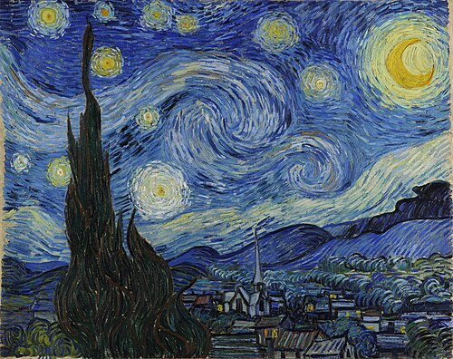
 
*Starry Night. Vincent van Gogh. Source [Wikipedia](https://en.wikipedia.org/wiki/The_Starry_Night)*

Starry nights have always captured our attention either by romanticysm, science, religion, superstition, as a counter of seassons, or merely as curiosity. Even for many animal species who migrate from one part of the earth to another seeking better life conditions are thought to have star maps as a reference during their long travels. This story is about how concerned human kind has always been in understanding and explaining the mistery of the stars above the celestial dome. The following is a chronogram starting 25,000 years ago, back in the Paleolitic age, until very recently in the eighteen century where modern astronomy started to take shape.

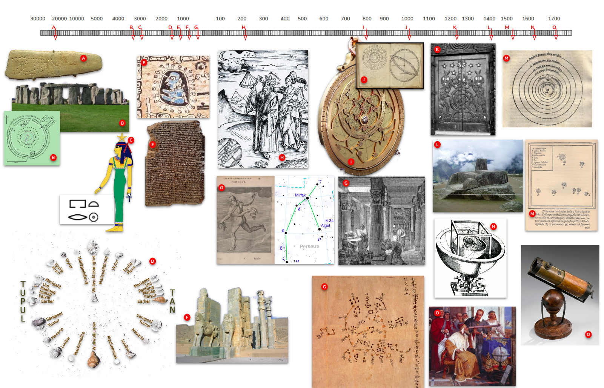
*All the images have beem extracted from Wikipedia*

## 25,000 years ago: Paleolitic age, Europe

Source [Wikipedia](https://en.m.wikipedia.org/wiki/File:Blanchard_plaque.jpg)

This is the Blanchard plaque, a simple, flat stone, with some carvings on it, found in the [Cave of Aurignac](https://en.m.wikipedia.org/wiki/Aurignacian). It dates back to upper Paleolithic age. Although there is no consensus about the meaning of this stone, it strongly remembers of a [solar analema](https://en.wikipedia.org/wiki/Analemma) which is a drawing of the position of the sun, during a whole year, taken exactly at the same time and in the same place:

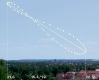
Source [Wikipedia](https://en.wikipedia.org/wiki/Analemma)

It might be, very likely, a trial of solar analema o a lunar analema. This would mean that 25,000 years ago, there were already members of a cromagnon humanoid tribe looking at the night sky, during very long periods of time, may be years, with the sole purpose of understanding what they see, looking for repetitive patterns, and they tried to transmit this knowledge discovered to further individuals by carving their observations on a flat stone. Simply wonderful.

## 3,100 years B.C., late Neolitic age, United Kingdom

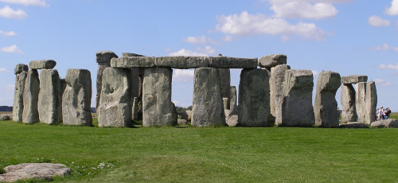
Source [Wikipedia](https://en.m.wikipedia.org/wiki/Stonehenge)

If you are reading this, I am almost certain that you also recognize this picture. This is a megalithic structure known as Stonehenge monument was initiially built as a cemetry.	But it is more than that.

- The main central circle is exactly aligned with the summer solstice
- The winter solstice is exactly alligned with some of the rocks. 
- Other rocks are placed exactly at the moon rising and setting points during the year. 
- Other four rocks, situated in the extreme rising and setting points of the moon, mark the arrival of each of the seassons.

## 3,000 years B.C., Egypt, Africa

The ancient [Egyptian Calendar](https://en.wikipedia.org/wiki/Egyptian_calendar) is a solar calendar whihc describes a year made up of exactly 365 days, divided into three seassons, with references to the sun, the moon and several known stars. Although they are not known to have created specific star maps, many references may be found in the hieroglyphs. 

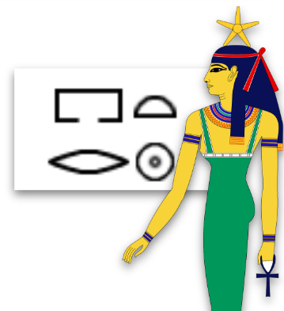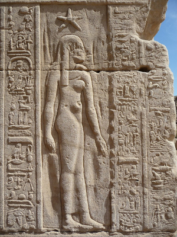
Image source [Wikipedia](https://en.wikipedia.org/wiki/Sopdet)

- They named our Polaris star, as "the star that cannot perish", the star that is fixed in its celestial place and do not dissapear under the horizon
- The [Godess Sopdet](https://en.wikipedia.org/wiki/Sopdet)
 makes reference to the star [Sirius](./Sirius_Star.md) represented in hieroglyphs as a circle with a point in its center. The rising of this star over their horizon always precedes the flooding of the river Nile and its influence in agricultural seasson.
 
## 1,500 B.C., Polynesia, Pacific Ocean

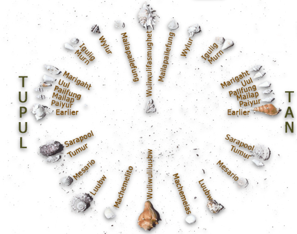 Image Source [Wikipedia](https://en.wikipedia.org/wiki/Polynesian_navigation)

Polynesia is an area of the Pacific Ocean composed of +1,000 islands inhabited by many different tribes, but sharing the same language and culture. In order to connect these miriads of islands, Polynesians were great sailors, and without any doubt, they used the stars, and many other signs of nature, to find their way along massive oceanic areas. 	In particular, the picture above is a star compass with references to Polaris (Wuliwulifasmughet), [Vega](./Vega_Star.md) (Murn) or the [Pleiades](./Pleiades_Star_Cluster.md) (Marigaht)

## 1,000 B.C., The Maya, Central America

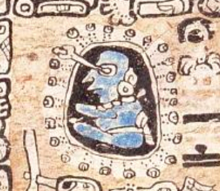 Image Source [Wikipedia](https://en.wikipedia.org/wiki/Maya_civilization#Astronomy)

The Mayas were a precolombian flourishing civilizacion	 and great astronomers. They even had people specifically devoted to observe the stars, like the one in the picture above. They measured the 584 days cycle of Venus with an error of just two hours. This was their equivalent to a year. It could seem a little odd count, but 5 Maya years are exactly the length of 8 western years.		

## 1,000 B.C., Mesopotamia, Iraq, Asia

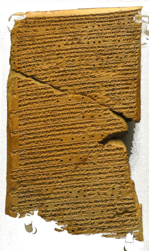 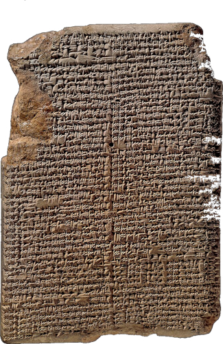 Image Source [Wikipedia](https://en.wikipedia.org/wiki/Maya_civilization#Astronomy)

Mesopotamic civilizacion was also a very relevant one, with high influence in western Europe. It was located between the rives Tigris and Eufrates, the actual Iraq, and they were great astronomers and matematicians. The picture above to the left, is the Venus table of Ammisaduqa, a cuneiform writting into clay that describe their knowledge of Venus **as a planet** and, in general of other planets. This knowledge requires a very deep understanding of the skies to be able to distinguish planet from background stars. The picture to the right is the Mul.Apin, a compendium of astronomy and astrology with references to [Arcturus](./Arcturus_Star.md), [Sirius](./Sirius_Star.md) or the [Pleiades](./Pleiades_Cluster.md) and many of the known constellations like Taurus, Orion, Perseus or Leo, among many others, and even more, they also developed an heliocentrical model of the Universe, way before Galileo's.

## 550 B.C., Persian Empire, Iran, Asia

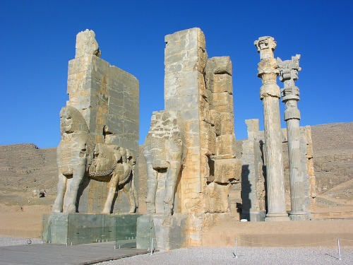 Image Source [Wikipedia](https://en.wikipedia.org/wiki/Maya_civilization#Astronomy)

Persian civilization and culture is one of the major milestones in human history, with **urban** settlements dating back to 5,000 B.C. They excel in mathematics, logics, medicine, science and philosophy and, of course they were also great astronomers, and they have very accurate knowledge about [Aldebaran](./Aldebaran_Star.md) (known as Tascheter), [Regulus](./Regulus_Star.md) (known as Venant), [Antares](./Antares_Star.md) (known as Satevis) and Fomahault (known as Haftorang). These four stars where known as the *Royal Stars* or watcher of the four cardinal directions.

## 300 B.C., Ancient Greece, Europe

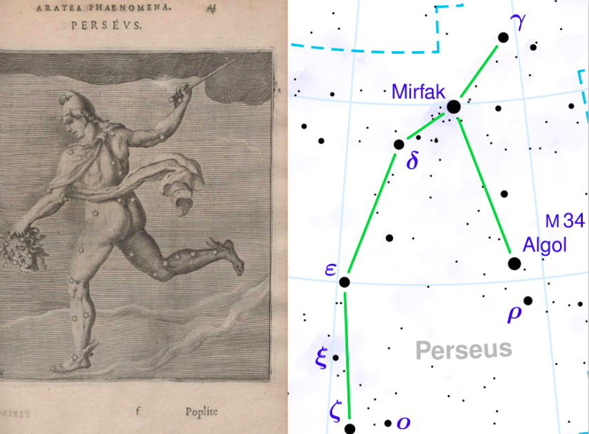 Image source Wikipedia

What to say about the advancement of the culture during the classic Greek period. Many of the current branches of knowledge where shaped in that period. Regarding astronomy, the most significant outcome was the treaty *Phenomena* (Φαινόμενα) which focused mainly of a deep knowledge about all the constellations that we know nowadays, with their original names forged in Greek, which had a considerable later influence on the great matematician, astronomer and geographer, Hipparcus, who ended up by setting the foundations of what is trigonometry today. The picture above shows a drawing of Perseus, really close to what is considered to be these days. These greek advancements, with strong roots in Mesopotamian science, would be a cornerstone for one of the brightest and magnificent milestones in all human history: the library of Alexandria

## 270 B.C., Alexandria, Egypt, Africa

There is not enough space in a million books to describe the never seen before advancement of knowledge stored and produced in Alexandria. It is in vane, trying to cite these here. But let us higlight two of them. One of them was [Eratostenes](https://en.wikipedia.org/wiki/Eratosthenes),  a matematician, geographer, astronomer and poet, who was in charge of the Library of Alexandria. He was the first person kown, right about 200 B.C., to measure the circunference of the Earth, just by using a stick and measuring the length of trhe stick and the length of shadow cast by the stick exactly the same day, but in different positions of the earth. He concluded that this is 40,000km. It actuwally is 40,075km, amazing. The full story can be read in Sagan's [Cosmos](https://www.google.es/books/edition/Cosmos/cDKODQAAQBAJ?hl=es). This place, a few centuries later, framed Ptolemy's treatises about astronomy like [Almagest](https://en.wikipedia.org/wiki/Almagest), probably the first star map in history. Other traty, [Planisphaerium](https://en.wikipedia.org/wiki/Planisphaerium), literally, "star chart" about the mathematic  relation betwwen a tridimensional spheric map like that of the stars, and its circular proyection in a bidimensional map. Both traties were, perhaps, the most influential publications in the histoy of mathematics and astronomy.

## 200 B.C., China, Asia

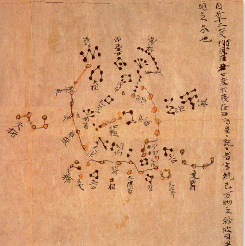 Image Source Wikipedia

The observation of stars in China dates back to 1,200 B.C., where simbol of stars where found engraved in bones used by an oracle, but the first written reference dates about 200 B.C. It is the [Dunhuang map](https://en.wikipedia.org/wiki/Dunhuang_Star_Chart) with +1,300 stars recorded and 257 constellations, very different than those of the western world, more influenced by Mesopotamia and Persia. Chinese astronomy divides the sky into 28 mansions, according to the path of the moon. Although it is recognized its use in navigation, it is rather residual with respect to other cultures. Chinese civilizations used the stars to measure time, specially in agriculture.

## 800 A.C.,  Al Andalus, Spain, Europe

After the destruction of the Library of Alexandria, most of the precedent knowledge about astronomy was simply gone. However, the golden age of Islam, and the evolution of Al-Andalus in Spain, with great advancements in mathematics and science, allowed the recuperation of part of this knowledge about astronomy, mainly Ptolemy,  like the instrument named [astrolabe](https://en.wikipedia.org/wiki/Astrolabe), an analog calculator of astronomy, initially related with Hipparcus and Ptolemy, was reintroduced in Europe through Al-Andalus. Then, by the 1,000 A.C., right before the Catholic Kings recovered Toledo, several matematicians and astronomers created the [Toledan Tables](https://en.wikipedia.org/wiki/Toledan_Tables), a compendium of knwoledge about the sun, the moon, and planets. While Europe was walking into dark ages, the islamic world flourished in many aspect of science and philosophy, and there were very influential astronomy schools in Damascus, Bagdad, El Cairo and Córdoba. Indeed, most of the names of star nowadays, like [Aldebaran](./Aldebaran_Star.md), [Vega](./Vega_Star.md), [Betelgeuse](./Betelgeuse_Star.md) have arabic roots and their current names are just trasliteratoins of their original arabic names.

## 1,250 A.C., Maori tribe, New Zealand

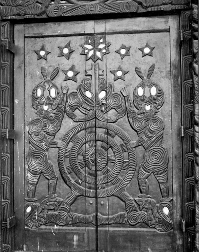 Image source Wikipedia

The [Maori Culture](https://en.wikipedia.org/wiki/M%C4%81ori_culture) has always been linked to astronomy, not only for sailing the ocean, but also to agriculture and religion. Even the [Pleiades](./Pleiades_Cluster.md) known as [Matariki](https://en.wikipedia.org/wiki/Matariki) is an astronomy event which marks the Maori's new year. The picture above shows Matariki in a piece of aborigen artwork.

## 1,400 A.C., Inca culture, Perú, Southamerica

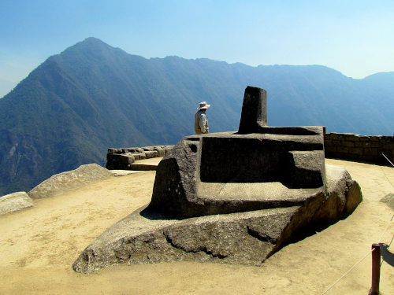 Image source Wikipedia

The Inca culture build ont the most important milestones of human civilization and one of the most important astroarcheaology sits in the world: the [Machu-Pichu](https://en.wikipedia.org/wiki/Machu_Picchu). One onf the most intriguing objects of this culture is [Intihuatana](https://en.wikipedia.org/wiki/Intihuatana,_Urubamba), the picture above, posibly a sundial, aligned with the winter solstice was built in 1450 

## 16th and 17th Century, Europe

Back in the apogeum of scientific, philosophic, artistic and culutural in Europe, the 16th century is a key milestone to the creation of what astronomy is today, with very relevant figures as [Nicolaus Copernicus](https://en.wikipedia.org/wiki/Nicolaus_Copernicus), who influenced the briliant Danish astronomer [Tycho Brae](https://en.wikipedia.org/wiki/Tycho_Brahe) who also influenced the seminar work of [Johannes Kepler](https://en.wikipedia.org/wiki/Johannes_Kepler) one of the most influencial astronomer of all ages, together with [Isaac Newton](https://en.wikipedia.org/wiki/Isaac_Newton) or, formerly, but not least [Galileo Galilei](https://en.wikipedia.org/wiki/Galileo_Galilei). This poker of scientist simple defined what astronomy is today,  while they waited for [Albert Einstein](https://en.wikipedia.org/wiki/Albert_Einstein) to add a new and spicy taste.

Even as of the time of writing this (July 2025), there are even in AliExpress, instruments invented by them which still bear their names, like this Newtonian Reflector Telescope.

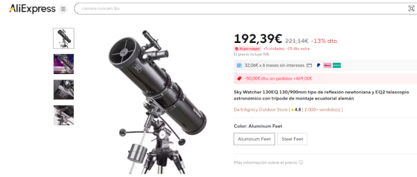 

## Concluding remarks

After reading all this, each time that you look to the stars up above and seek those extremely beautiful stars like [Antares](./Antares_Star.md) or [Vega](./Vega_Star.md) you will be connected to those ancient persas who already used them to navigate the desert overnight. If you want, this is like a new Silk Route, but instead of traveling the space from Europe to the wonders of the Chinese Empire, it travels through time, from thousand of years before, to you and then to the wonders of a future still to be born, all of us looking at the same tiny point of light of the night sky.

	

 

   

