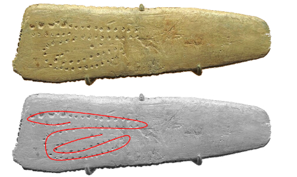

## Paleo-Astronomy

 
*Starry Night. Vincent van Gogh. Source [Wikipedia](https://en.wikipedia.org/wiki/The_Starry_Night)*

Starry nights have always captured our attention either by romanticysm, science, religion, superstition, as a counter of seassons, or merely as curiosity. Even for many animal species who migrate from one part of the earth to another seeking better life conditions are thought to have star maps as a reference during their long travels. This story is about how concerned human kind has always been in understanding and explaining the mistery of the stars above the celestial dome. The following is a chronogram starting 25,000 years ago, back in the Paleolitic age, until very recently in the eighteen century where modern astronomy started to take shape.

*All the images have beem extracted from Wikipedia*

## (A) 25,000 years ago: Paleolitic age

Source [Wikipedia](https://en.m.wikipedia.org/wiki/File:Blanchard_plaque.jpg)

This is the Blanchard plaque, a simple, flat stone, with some carvings on it, found in the [Cave of Aurignac](https://en.m.wikipedia.org/wiki/Aurignacian). Although there is no consensus about the meaning of this stone, it strongly remembers of a [solar analema](https://en.wikipedia.org/wiki/Analemma) which is a drawing of the position of the sun, during a whole year, taken exactly at the same time and in the same place:

Source [Wikipedia](https://en.wikipedia.org/wiki/Analemma)

It might be, very likely, a trial of solar analema o a lunar analema. This would mean that 25,000 years ago, there were already members of a cromagnon humanoid tribe looking at the night sky, during very long periods of time, may be years, with the sole purpose of understanding what they see, looking for repetitive patterns, and they tried to transmit this knowledge discovered to further individuals by carving their observations on a flat stone. Simply wonderful.

## 3,100 years B.C. (late Neolitic age)

Source [Wikipedia](https://en.m.wikipedia.org/wiki/Stonehenge)

If you are reading this, I am almost certain that you also recognize this picture. This is a megalithic structure known as Stonehenge was initiially built as a cemetry.	But it is more than that.

- The main central circle is exactly aligned with the summer solstice
- The winter solstice is exactly alligned with some of the rocks. 
- Other rocks are placed exactly at the moon rising a setting points during the year. 
- Other four rocks, situated in the extreme rising and setting points of the moon, mark the arrival of each of the seassons.

## 3,000 years B.C (Egypt)

The ancient [Egyptian Calendar](https://en.wikipedia.org/wiki/Egyptian_calendar) is a solar calendar whihc describes a year made up of exactly 365 days, divided into three seassons, with references to the sun, the moon and several known stars. Although they are not known to have created specific star maps, many references may be found in the hieroglyphs. 

Image source [Wikipedia]()

- They named our Polaris star, as "the star that cannot perish", the star that is fixed in its celestial place and do not dissapear under the horizon
- The Godess Sopdet makes reference to the star [Sirius](./Sirius_Star.md). The rising of this star over their horizon always precedes the flooding of the river Nile and its influence i

   

