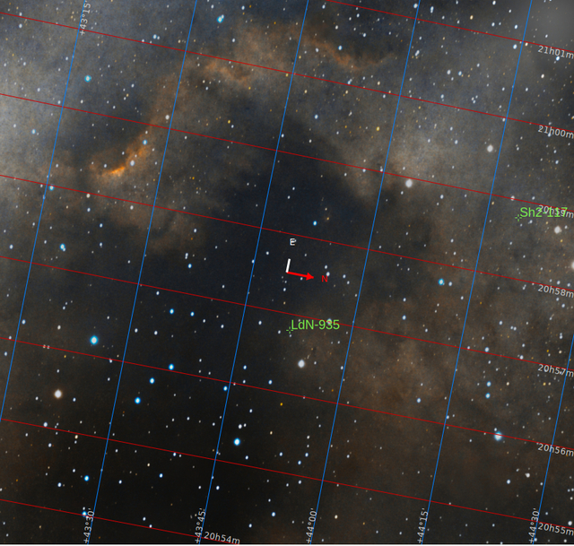
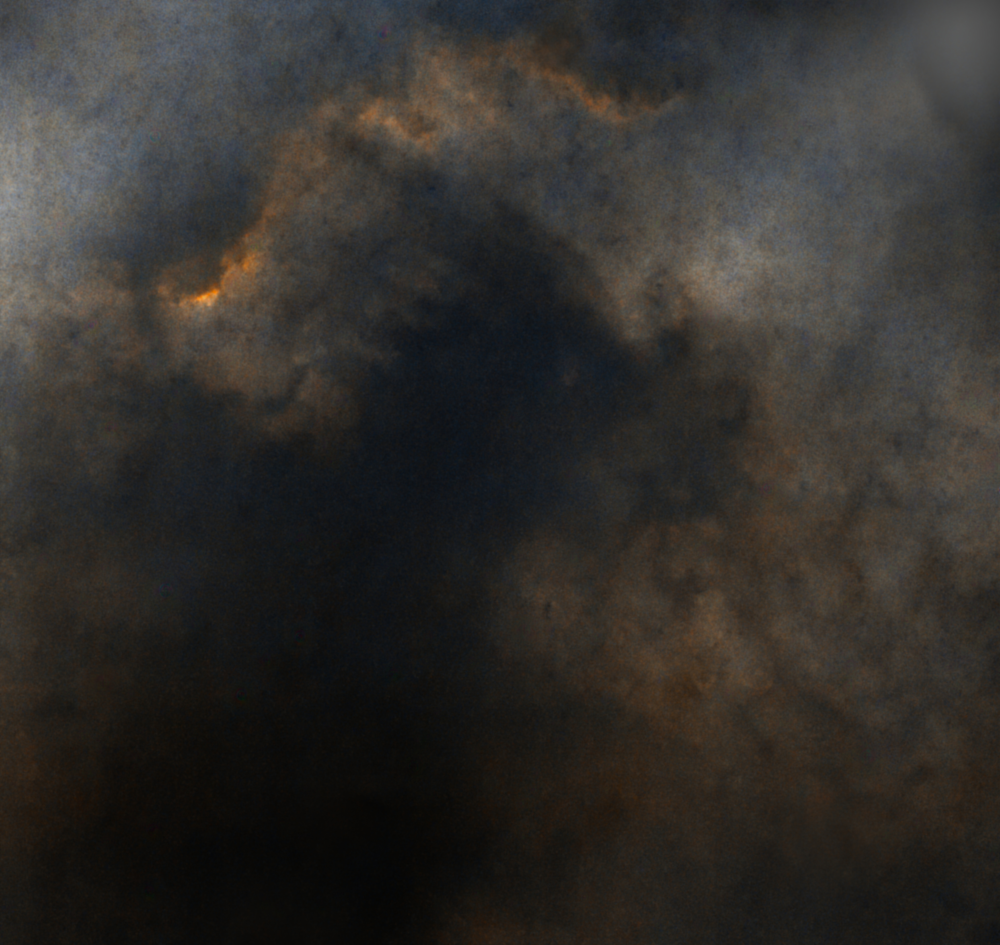
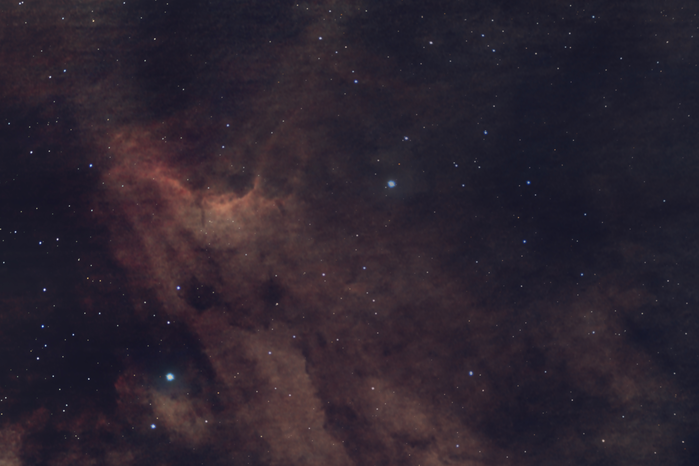

#  Pelikan Nebula

The Pelican Nebula (also known as IC 5070[1]) is an H II region associated with the North America Nebula in the constellation of Cygnus. The gaseous contortions of this emission nebula bear a resemblance to a pelican, giving rise to its name.[1] The Pelican Nebula is located nearby first magnitude star Deneb, and is divided from its more prominent neighbour, the North America Nebula, by a foreground molecular cloud filled with dark dust.[2] Both are part of the larger H II region of Westerhout 40.[2] The Pelican is much studied because it has a particularly active mix of star formation and evolving gas clouds. The light from young energetic stars is slowly transforming cold gas to hot and causing an ionization front gradually to advance outward. Particularly dense filaments of cold gas are seen to still remain, and among these are found two jets emitted from the Herbig–Haro object 555.[1] Millions of years from now this nebula might no longer be known as the Pelican, as the balance and placement of stars and gas will leave something that appears completely different.

[ Read more](https://en.wikipedia.org/wiki/Pelican_Nebula)
## Plate solving 

| Globe | Close | Very close |
| ----- | ----- | ----- |
| | | |

## Gallery
 

 

 

 

