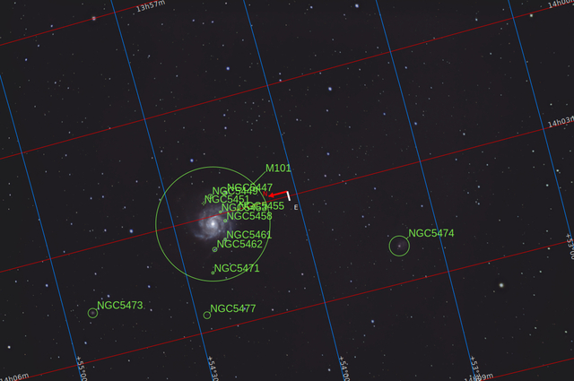
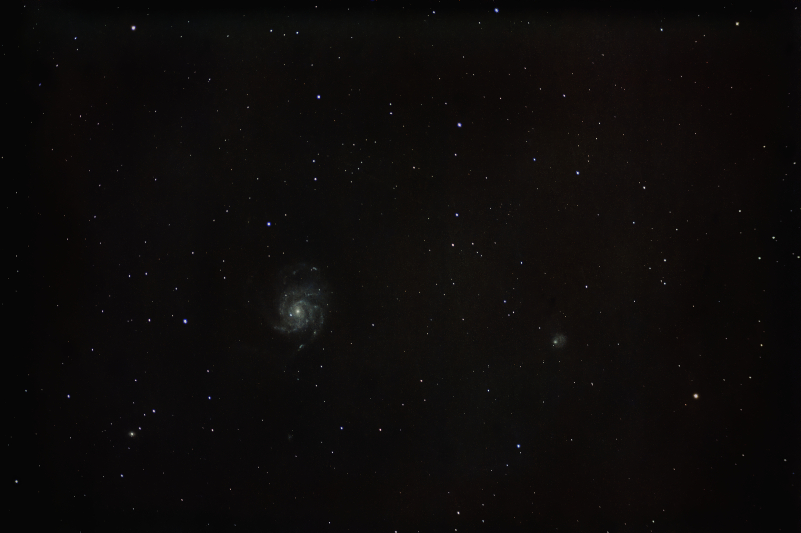
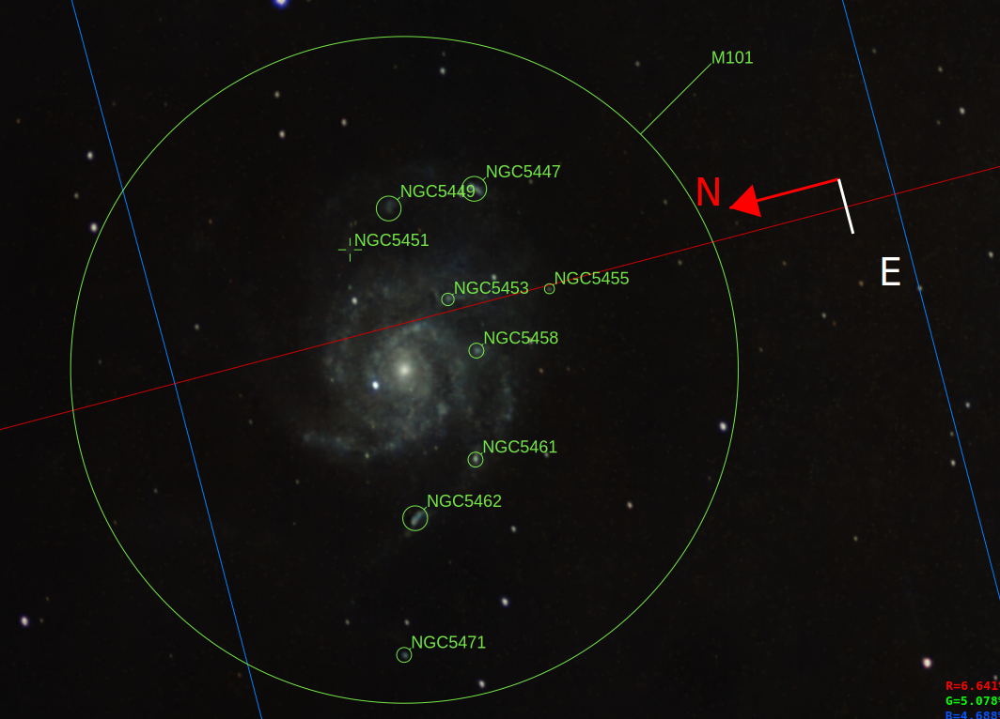
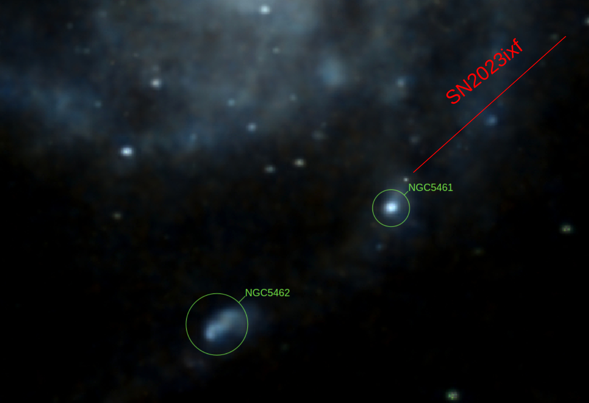

#  Pinwheel Galaxy

The Pinwheel Galaxy (also known as Messier 101, M101 or NGC 5457) is a face-on, unbarred, and counterclockwise spiral galaxy located 21 million light-years (6.4 megaparsecs)[5] from Earth in the constellation Ursa Major. It was discovered by Pierre Méchain in 1781[a] and was communicated that year to Charles Messier, who verified its position for inclusion in the Messier Catalogue as one of its final entries. On February 28, 2006, NASA and the European Space Agency released a very detailed image of the Pinwheel Galaxy, which was the largest and most detailed image of a galaxy by Hubble Space Telescope at the time.[10] The image was composed of 51 individual exposures, plus some extra ground-based photos.

[ Read more](https://en.wikipedia.org/wiki/Pinwheel_Galaxy)
## Plate solving 

| Globe | Close | Very close |
| ----- | ----- | ----- |
| | | |

## Gallery
 

 

 

 

 

 

