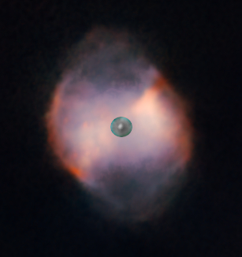
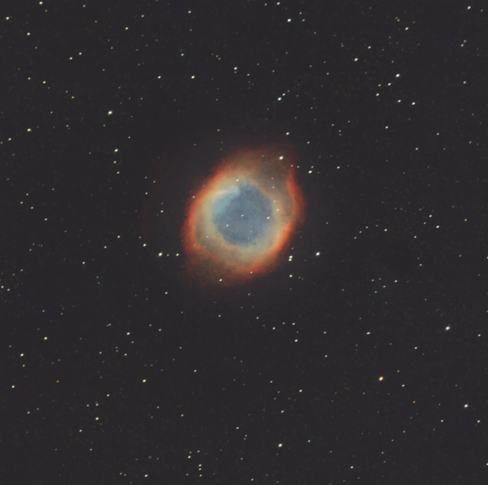

(Leer en [Español](./Nebulosas_Planetarias.md))

## Planetary nebulae

When a [small star dies](./Stories/The_Death_of_Stars.md), between 1 and 8 times the mass of our sun, it produces a dwarf star and an ejection ring of ionized material, gas rich in metals, Oxygen, Nytrogen and Sulfur, producing many different wavelengths. This is the case of [Dumbell Nebula](./Dumbell_Nebula.md) or the [Helix Nebula](./Helix_Nebula.md)

Of course, they have nothing to do with planets, but at the early years of astronomy observation, their rounded shape made them appear like planets. Though nowadays the obsertvations of these bodies is much more accurate and they are known not to be planets, its original nomination has been kept.

These nebulae are very small, around 1 lightyear in diameter, they are a very short event, in the tens of thousand years, and the dwarf stars at the center of these nebulae are very hot, between 16.000ºK and 25.000ºK in their surface.

The first Planetary Nebula was discovered  around the middle of the 18th century and it was the [Dumbbell Nebula](./Dumbbell_Nebula.md)

whose central dwarf star is clearly visible

In my modest opinion, these nebulae are of great beauty and very colorful and produce some of the most beautiful and enigmatic images of skies, like the [Helix Nebula](./Helix_Nebula.md)

