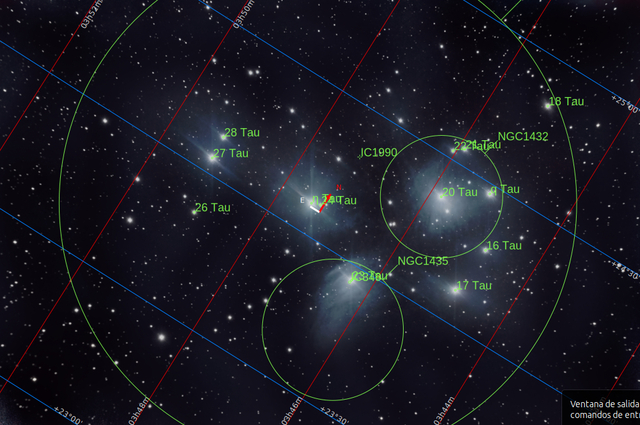
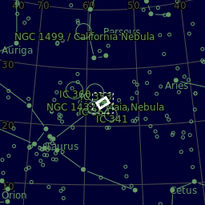
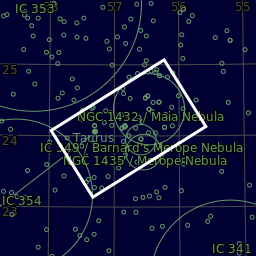
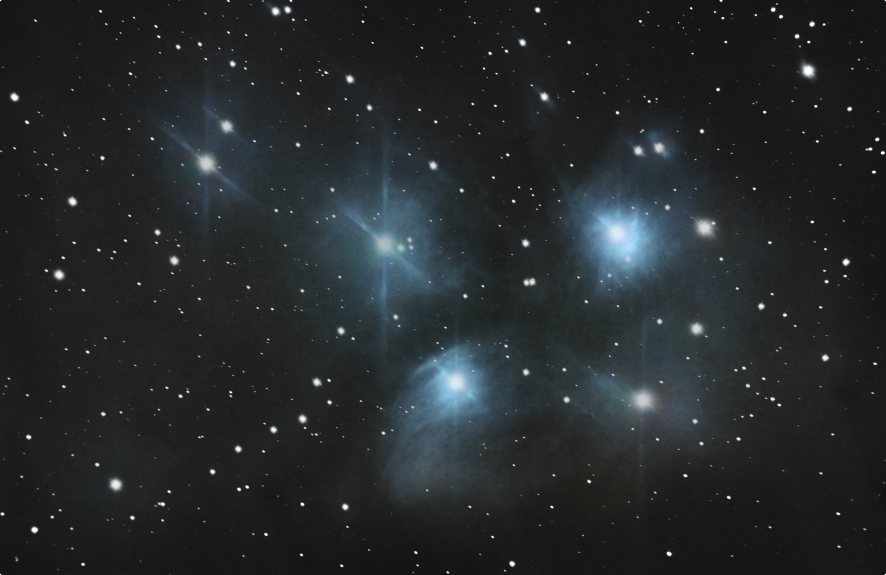

#  Pleiades Cluster

The Pleiades (/ˈpliː.ədiːz, ˈpleɪ-, ˈplaɪ-/),[8][9] also known as Seven Sisters and Messier 45, is an asterism of an open star cluster containing young B-type stars in the northwest of the constellation Taurus. At a distance of about 444 light-years, it is among the nearest star clusters to Earth and the nearest Messier object to Earth, being the most obvious star cluster to the naked eye in the night sky. It is also observed to house the reflection nebula NGC 1432, an HII region.[10] The cluster is dominated by hot blue luminous stars that have formed within the last 100 million years. Reflection nebulae around the brightest stars were once thought to be leftover material from their formation, but are now considered likely to be an unrelated dust cloud in the interstellar medium through which the stars are currently passing.[11] This dust cloud is estimated to be moving at a speed of approximately 18 km/s relative to the stars in the cluster.[12]

[ Read more](https://en.wikipedia.org/wiki/Pleiades)
## Plate solving 

| Globe | Close | Very close |
| ----- | ----- | ----- |
| | | |

## Gallery
 

 

