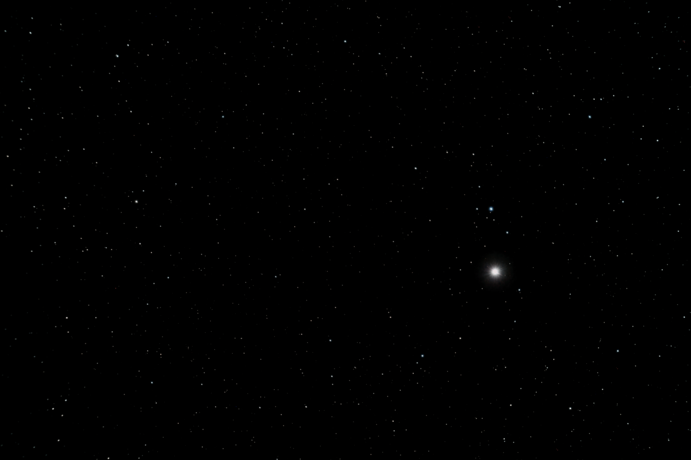
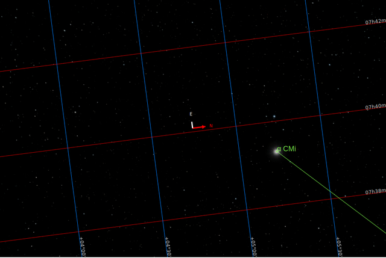
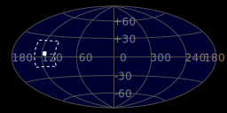
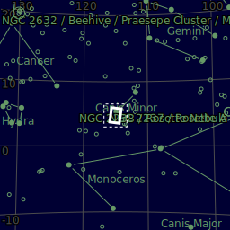
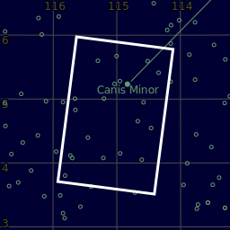

#  Procyon Star

Procyon (/ˈproʊsi.ɒn/)[17] is the brightest star in the constellation of Canis Minor and usually the eighth-brightest star in the night sky, with an apparent visual magnitude of 0.34.[3] It has the Bayer designation α Canis Minoris, which is Latinized to Alpha Canis Minoris, and abbreviated α CMi or Alpha CMi, respectively. As determined by the European Space Agency Hipparcos astrometry satellite,[18] this system lies at a distance of just 11.46 light-years (3.51 parsecs),[2] and is therefore one of Earth's nearest stellar neighbors.

[ Read more](https://en.wikipedia.org/wiki/Procyon)
## Plate solving 

| Globe | Close | Very close |
| ----- | ----- | ----- |
| | | |

## Gallery
 

