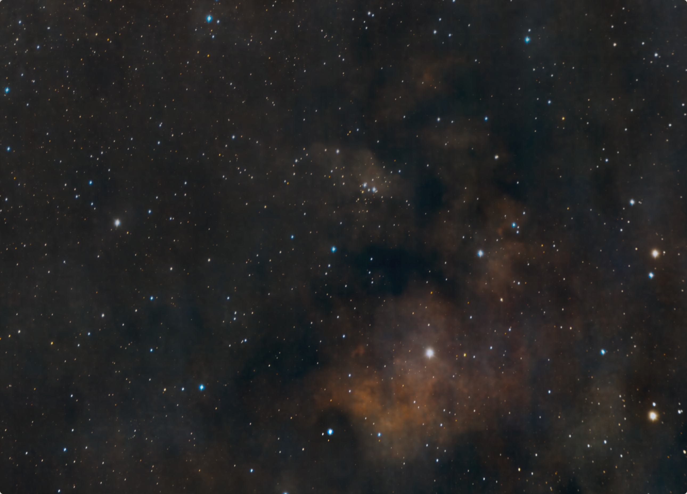
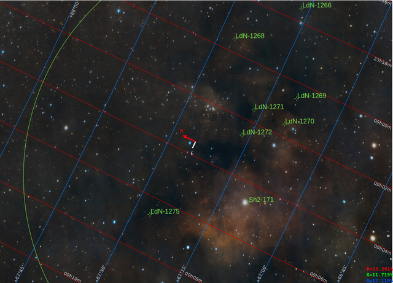

#  Question Mark Nebula

NGC 7822 is a young star forming complex in the constellation of Cepheus. The complex encompasses the emission region designated Sharpless 171, and the young cluster of stars named Berkeley 59. The complex is believed to be some 800–1000 pc distant,[5][6] with the younger components aged no more than a few million years.[5][6] The complex also includes one of the hottest stars discovered within 1 kpc of the Sun, namely BD+66 1673, which is an eclipsing binary system consisting of an O5V that exhibits a surface temperature of nearly 45,000 K and a luminosity about 100,000 times that of the Sun.[5] The star is one of the primary sources illuminating the nebula and shaping the complex's famed pillars of creation-type formations, the elephant trunks.[5][7][8] Also known as the Question Mark Nebula

[ Read more](https://en.wikipedia.org/wiki/NGC_7822)
## Plate solving 

| Globe | Close | Very close |
| ----- | ----- | ----- |

## Gallery
 

 

 

