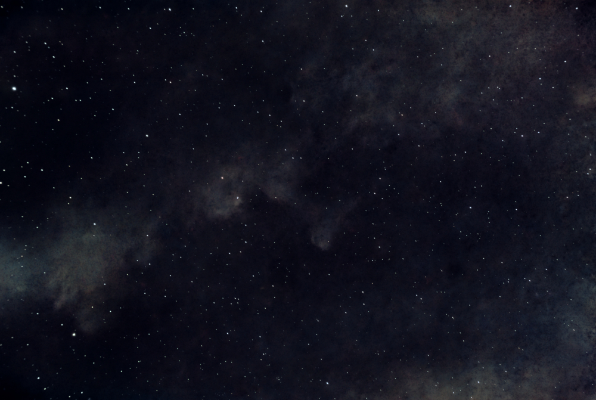
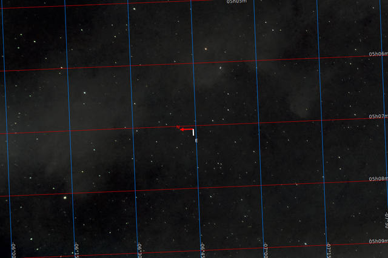
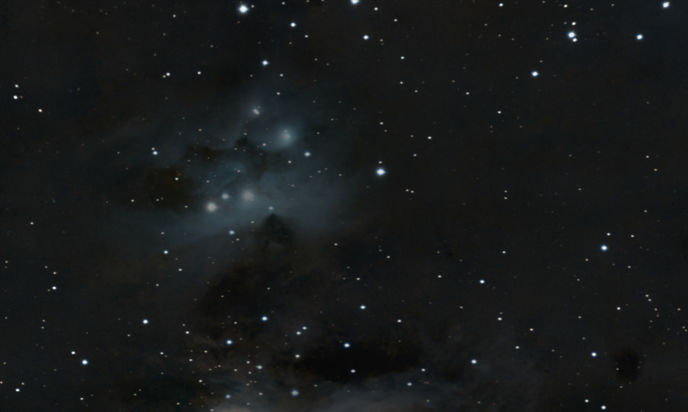
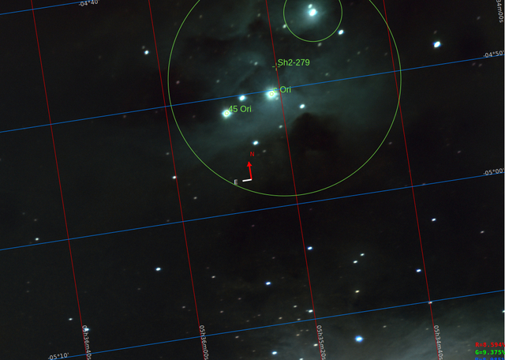
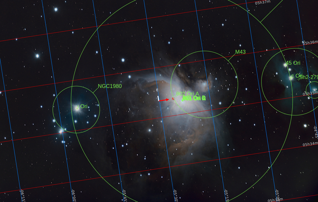

# Reflection nebulae

This is the simplest form of glowing. These molecular clouds, which sourrounds stars, glow because they simply reflect the light coming from stars in the neighborhood.

[Witch Head Nebula](./Witch_Head_Nebula.md)

It an extremely faint cloud at the southwest of constellation Orion, which is illuminated by the giant star [Rigel](./Rigel_Star.md)

[Runing Man Nebula](./Running_Man_Nebula.md)

It is one of my favorite corners of the night sky and it starres my own story [About chaos](./About_Chaos.md)

