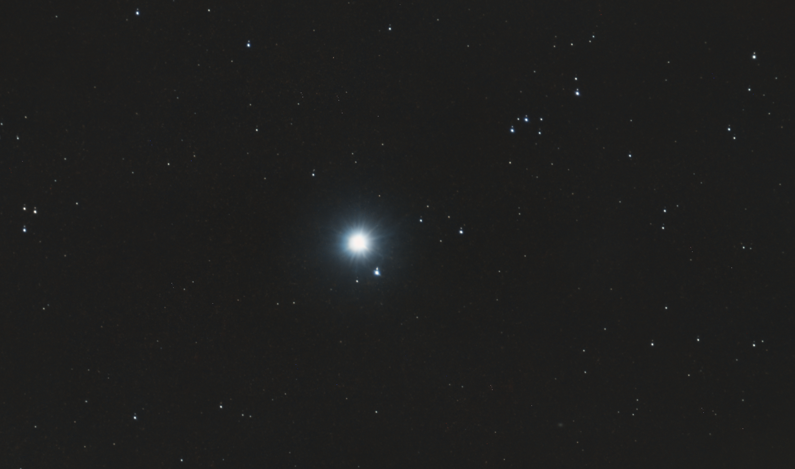
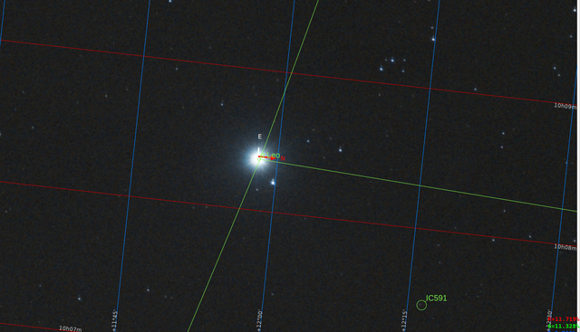
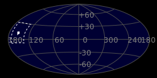
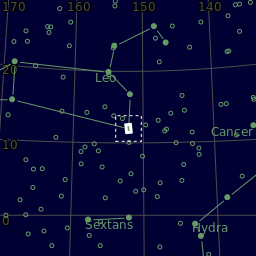
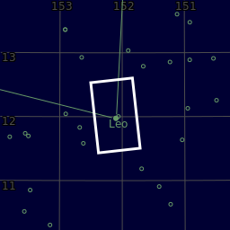

#  Regulus Star

Regulus is the brightest object in the constellation Leo and one of the brightest stars in the night sky. It has the Bayer designation designated α Leonis, which is Latinized to Alpha Leonis, and abbreviated Alpha Leo or α Leo. Regulus appears singular, but is actually a quadruple star system composed of four stars that are organized into two pairs. The spectroscopic binary Regulus A consists of a blue-white main-sequence star and its companion, a pre-white dwarf. The system lies approximately 79 light years from the Solar System. HD 87884 is separated from Regulus by 176″ and is itself a close pair. Regulus, along with five slightly dimmer stars (Zeta Leonis, Mu Leonis, Gamma Leonis, Epsilon Leonis, and Eta Leonis) have collectively been called 'the Sickle', which is an asterism that marks the head of Leo.

[ Read more](https://en.wikipedia.org/wiki/Regulus)
## Plate solving 

| Globe | Close | Very close |
| ----- | ----- | ----- |
| | | |

## Gallery
 

