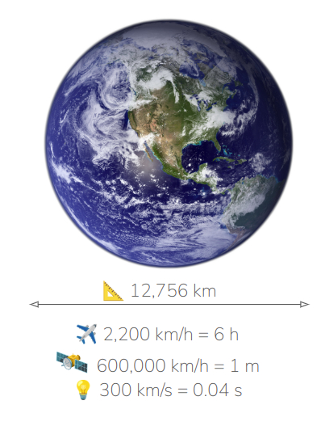
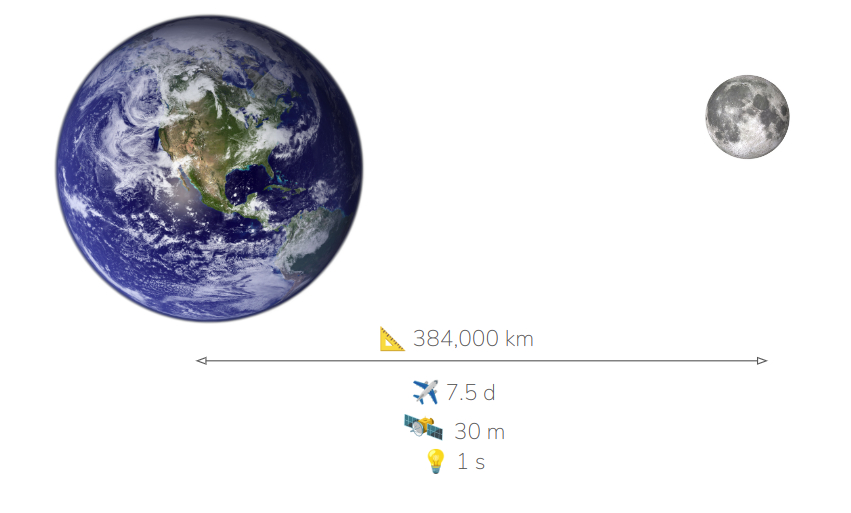
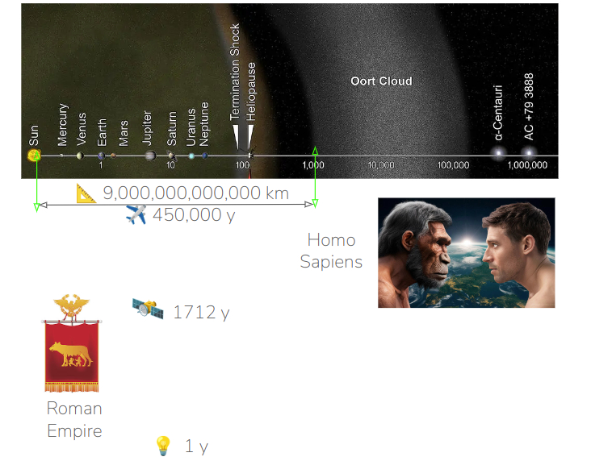
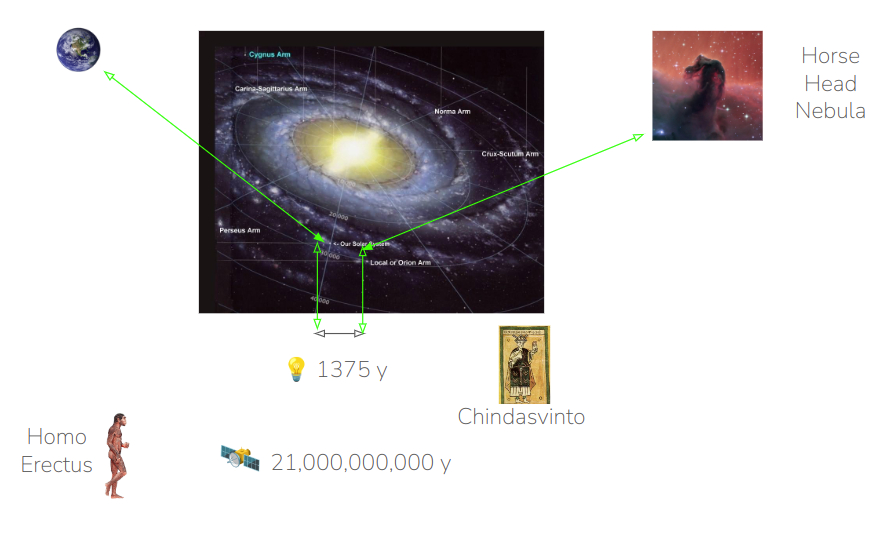
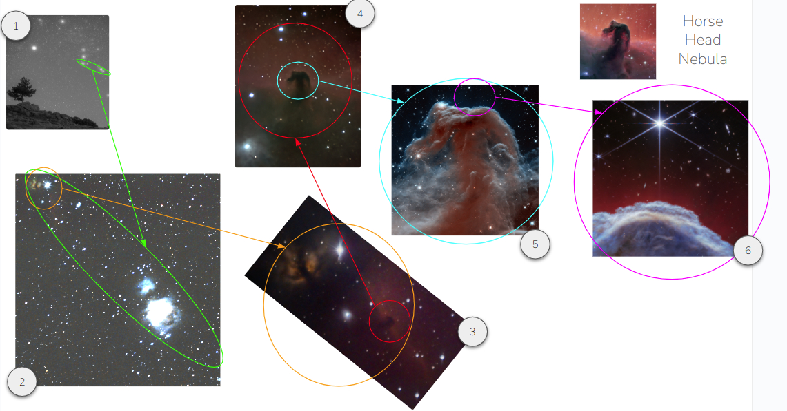
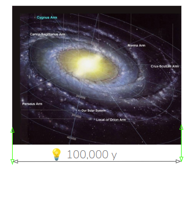
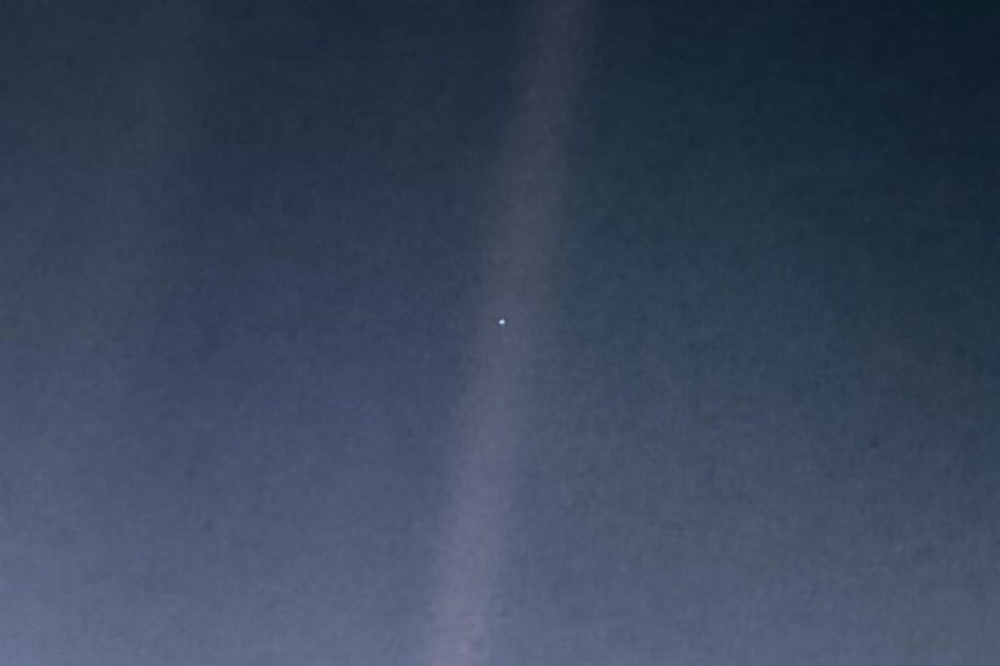

[read in English](./Relativity.md)

*Allá muevan feroz guerra ciegos reyes por un palmo más de tierra, que yo tengo aquí por mío cuanto abarca el mar bravío, a quien nadie impuso leyes.*

José de Espronceda. Canción del pirata

Sólo quería señalar algo ya esbozado por la célebre narración de Carl Sagan sobre el [punto azul pálido](https://en.wikipedia.org/wiki/Pale_Blue_Dot) y aportar alguna experiencia en la observación de los cielos, propia o ajena, y las nociones relativas de espacio y tiempo que, como humanos, tenemos en comparación con la verdadera dimensión del espacio y el tiempo en el universo.

# Escala planetaria

Este es nuestro planeta Tierra, donde vivimos. Su diámetro es algo inferior a 13.000 km, algo aparentemente grande. 

Si pudiéramos coger el vehículo de transporte humano más rápido hasta la fecha, el avión Concorde, que vuela a casi 2.200 km/h, tardaríamos unas 6 horas en completar esta distancia. En cambio, si pudiéramos utilizar, de hecho no podríamos, uno de los artefactos más rápidos fabricados por el ser humano, como la nave espacial Parker, que se desplaza a unos 600.000 km/h, este viaje sólo nos llevaría 1 minuto. Por último, la «cosa» más rápida que conocemos, que es la luz, moviéndose a 300.000 km/s, esta distancia será recorrida en menos de 0,04 segs. 

# Nuestro Sistema Solar

Bien. Consideremos el viaje tripulado más largo hasta la fecha, que es el aterrizaje y la luna, es decir, a 384.000 km de distancia, el Concorde tardará 7,5 días, el avión Parker durará 30 minutos y la luz 1 segundo.

No está mal, pero consideremos un viaje a la estrella más cercana, nuestro Sol, que está a 150.000.000 km de nosotros. Yo tardaré unos 8 años en llegar al Sol, vía Concorde, mientras que el avión Parker tardará unos 11 días y la luz 8,3 minutos. Las distancias y los tiempos empiezan a ser duros a pesar de que estamos hablando de un punto insignificante en medio de nuestra Galaxia, la Vía Láctea.  

# Un poco más allá del Sistema Solar

Ahora vamos a calcular hasta dónde llegaría la luz de nuestro Sol durante todo un año. Esta distancia se denomina un año luz y equivale a 9x10^{12}$km. Es impensable que el Concorde llegue hasta allí y tardaría unos 450.000 años en llegar. Es decir, si llegara hoy, debería haber iniciado este viaje hace 450.000 años, lo que significa, desde la era del Homo-Sapiens hasta nuestros días.

Aunque pudiéramos viajar a la velocidad de Parker, cosa que no es posible, tardaríamos 1.712 años en llegar. Es decir, el tiempo transcurrido desde el Imperio Romano hasta nuestros días. Sin embargo, la luz sólo tardará un año.

# Moviéndose dentro de la Vía Láctea

Saltando de un brazo de nuestra galaxia a otro, muy cercano, aún dentro de los límites de la Vía Láctea. Supongamos que nos dirigimos hacia la [nebulosa Cabeza de Caballo](./Horse_Head_nebula.md), situada en las proximidades del cinturón de Orión

Esta pintoresca imagen, muy común en la mayoría de los programas divulgativos sobre astronomía, se encuentra a 1375 años luz de la Tierra, es decir, si «pudiéramos viajar a la velocidad de la luz», ahora mismo ni siquiera imaginable, el tiempo empleado en saltar desde la Tierra hasta este lugar, realmente cercano, llevaría el tiempo transcurrido desde los reyes godos en España, antes de la invasión musulmana, hasta nuestros días. 

No digamos si pudiéramos viajar en naves Parker. Entonces, si pensábamos llegar hoy, tendríamos que haber iniciado el viaje cuando el Homo Erectus apareció por primera vez de la Tierra.

Sólo por un pequeño, muy pequeño, salto dentro de los límites de nuestra galaxia

# ¿De qué estamos hablando?

La nebulosa Cabeza de Caballo, una muy, muy cercana, se encuentra en el cinturón de Orión. Vamos a encontrarla.

#A simple vista

Se encuentra debajo del cinturón de Orión, junto a la más baja de estas tres estrellas de la imagen (1). Esta estrella es conocida como Alnitak, una de las más brillantes del cielo invernal. 

En las imágenes (1) y (2) aparece resaltada como una elipse verde.

## Imagen con equipo de 58 mm de distancia focal

La imagen (2) ha sido tomada con un objetivo Canon normal de 58 mm y muestra, abajo a la derecha, la Gran Nebulosa de Orión, y arriba a la izquierda, la estrella Alnitak y una especie de llama, que es, efectivamente, la conocida Nebulosa de la Llama, junto a la que se sitúa la Nebulosa Cabeza de Caballo, casi invisible a esta distancia focal, ambas resaltadas gan un círculo naranja.

## Imágenes con un telelente de 300mm

La imagen (3) ha sido tomada con un telelente Tamron de 300mm y la Nebulosa de la Llama y la Nebulosa de la Cabeza de Caballo (circulo rojo) son claramente visibles.

## Imágenes con un telescopio refractor APO de 560 mm

Haciendo zoom en el círculo rojo de la imagen (3) llegaremos a la imagen (4) en la que la Cabeza de Caballo es totalmente visible.

## Imagen con el telescopio Hubble

El telescopio Hubble se encuentra más allá de la atmósfera terrestre y, ahora, muestra en la imagen (5) la estructura interna de la Cabeza de Caballo en el espectro infrarrojo cercano. Centrémonos ahora en la diminuta y brillante estrella situada en la parte superior de la cabeza.

## Imágenes con el telescopio James Webb

El telescopio James Webb, convenientemente situado un poco más allá de la órbita de la Tierra, es capaz de mostrar, en la imagen (6) lo que podría verse por encima del hombro de Cabeza de Caballo, como una ventana mucho más allá de los límites de la Vía Láctea, es un grupo de galaxias muy, muy lejano. ¿Qué significa esto?

## El tamaño de las galaxias

Si tenemos en cuenta que el diámetro de la Vía Láctea es de unos 100.000 años luz, significa que, si pudiéramos viajar a la velocidad de la luz, tardaríamos el tiempo que media entre el Homo Neandertalis y nuestros días. Sólo para llegar a la frontera exterior de nuestra galaxia a la velocidad de la luz.

## La distancia entre galaxias

Esta es la [galaxia de Andrómeda](./Andromeda_Galaxy.md)

Nuestro «vecino más cercano», situado a sólo 150.000 años-luz de la Tierra y es casi visible a simple vista. Estas diminutas galaxias que se ven sobre el hombro de la nebulosa Cabeza de Caballo se encuentran, muy probablemente, a millones de años luz de la Tierra y la luz que nos llega desde allí, fue emitida, la Tierra estaba en la Era del pleistoceno, donde mamuts y rinocerontes y grandes felinos dominaban la superficie de la Tierra, muy al estilo de la película de animación «Ice Age».

Y en el interior de este vasto espacio, casi imposible de representar, apenas un diminuto [punto azul pálido](https://en.wikipedia.org/wiki/Pale_Blue_Dot) si pudiéramos verlo desde nuestro cercano planeta Marte, se encuentra la Tierra.

No hay más palabras. Dejemos que la narración de Carl Sagan ponga las cosas en su sitio:

«...
El conjunto de nuestras alegrías y sufrimientos, miles de religiones, ideologías y doctrinas económicas seguras de sí mismas, cada cazador y recolector, cada héroe y cobarde, cada creador y destructor de la civilización, cada rey y campesino, cada joven pareja de enamorados, cada madre y padre, niño esperanzado, inventor y explorador, cada maestro de moral, cada político corrupto, cada «superestrella», cada «líder supremo», cada santo y pecador en la historia de nuestra especie vivieron allí - en una mota de polvo suspendida en un rayo de sol.
...
Se ha dicho que la astronomía es una experiencia que forja el carácter y la humildad. Quizá no haya mejor demostración de la locura de las presunciones humanas que esta imagen distante de nuestro pequeño mundo. Para mí, subraya nuestra responsabilidad de ser más amables los unos con los otros, y de preservar y apreciar el pálido punto azul, el único hogar que hemos conocido».

- Carl Sagan

Traducción realizada con la versión gratuita del traductor DeepL.com
