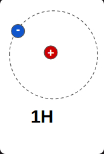
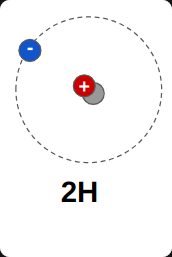
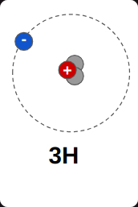
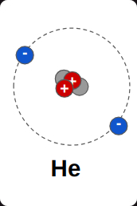
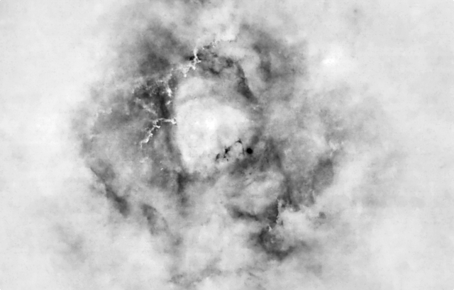
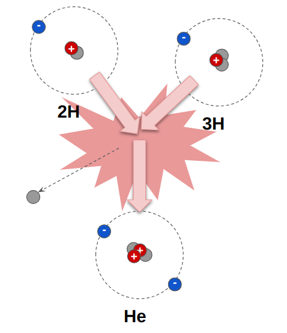
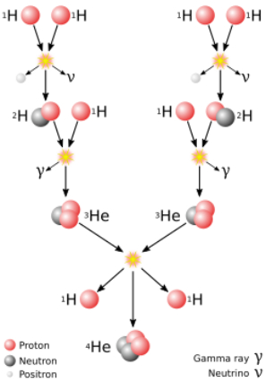

# La energía en nuestro universo

En [Relativity](./Relativity.md) me preguntaba sobre las distancias extremadamente grandes y los tiempos de viaje en todo nuestro universo. Aquí me voy a centrar en la energía contenida en él, así que vamos a empezar sobre la materia visible.

Este es un átomo de Hidrógeno. El hidrógeno representa el 75% de toda la materia visible del universo y es el átomo más simple que se conoce, con un solo protón (positivo +) y un electrón (negativo -). También puede parecer algo diferente, con un neutrón extra

Esto sigue siendo Hidrógeno, pero un poco más pesado debido al neutrón extra en el núcleo. Se le suele llamar *deuterio*. 

Y éste es *tritio*, el átomo más pesado del Hidrógeno debido a un neutrón adicional en el núcleo. Aparte del Hidrógeno también está el Helio, que supone el 23% de la materia visible, por lo que el Hidrógeno y el Helio son, con diferencia, la materia más común del universo. Están por todas partes.
 

Normalmente, debido a los protones de sus núcleos, estos elementos se repelen evitando acercarse "demasiado", por lo que cada uno de ellos se abre camino por su cuenta a través del universo. Debido a su abundancia, cantidades masivas de estos elementos forman nubes moleculares en las que la materia fluye como una especie de estructura filamentosa, como pequeños ríos de materia.

Sin embargo, con suficiente tiempo por delante, estas nubes, también conocidas como nebulosas, adquieren cantidades masivas de materia, como 1,2x10³⁷ kilogramos, es decir

120.000.000.000.000.000.000.000.000.000.000.000.000.000 kg

estas nubes empiezan a colapsar, a concentrarse, debido a la gravedad, y se hacen cada vez más densas, y por tanto con una mayor temperatura y una mayor velocidad entre átomos. Con más tiempo, los átomos de hidrógeno empiezan a acercarse demasiado entre sí, de modo que la fuerza interior que une a protones y neutrones es mayor que su fuerza de repulsión natural. Se rinden y los núcleos empiezan a chocar entre sí. Normalmente, un átomo de deuterio choca con un átomo de tritio, lo que se conoce como fusión, y, como resultado, se recombinan como un átomo de Helio y una pérdida de un protón.

 

O, debido a la alta densidad de materia en este colapso gravitacional, también pueden ocurrir otras cadenas de reacciones nucleares, como la cadena protón-protón

 

fuente [Wikipedia](https://en.wikipedia.org/wiki/Nuclear_fusion)

En todos los casos, este choque es un evento exotérmico. Por un lado debido a la energía cinética de las colisiones, pero por otro, y más importante, porque parte de la materia se desintegra en energía pura, siguiendo la conocida fórmula de Einstein $E=mC²$. Esta energía se libera en forma de radiación, es decir, algunas partículas, calor y luz. Pero esta pequeña reacción es sólo, y nada menos, que el nacimiento de una nueva estrella, como nuestro sol. 

En estos ejemplos de arriba, la energía liberada es sólo un millón de parte de la energía obtenida al encender una sola cerilla, porque la masa (m) es sólo de unos pocos átomos de Hidrógeno. 

fuente [Wikipedia](https://en.wikipedia.org/wiki/Match)

Demasiado poco, ¿no? Pero dentro del núcleo de nuestro sol, y como en otras estrellas similares, a una temperatura de 14.000.000 ºC, estas reacciones nucleares involucran 600.000.0000 toneladas de Hidrógeno en Helio ** cada segundo**, es decir, el equivalente a 6x10¹⁵ bombas de Hiroshima

6.000.000.000.000.000 bombas de Hiroshima

cada segundo

y nuestro sol es sólo una pequeña estrella de las

400.000.000.000 estrellas

sólo en nuestra Galaxia Vía Láctea. De las

2.000.000.000.000 galaxias

estimadas en nuestro universo. Aunque el 90% de estas galaxias contienen cada una el 1% de las estrellas de la Vía Láctea, de nuevo estas cifras superan, por mucho, nuestra capacidad de pensar en ello, y por lo tanto, nuestra humildad cada vez que miramos fijamente las estrellas en una clara noche de verano.

Traducción realizada con la versión gratuita del traductor DeepL.com
