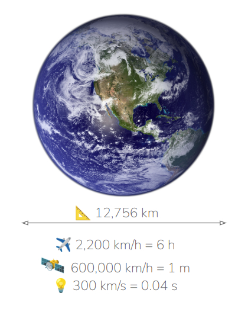
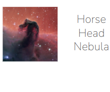

[Leer en español](./Relatividad.md)

*There, blind kings wage fierce war for an extra inch of land, but here I consider as mine all that the raging sea encompasses, to whom no one has imposed laws.*
José de Espronceda. A pirate's song

I just wanted to point out something already outlined by the famous Carl Sagan's narration about the [pale blue dot](https://en.wikipedia.org/wiki/Pale_Blue_Dot) and provide some experience in the observation of the skies, either by my own or by others, and the relative notions of space and time that we, as humans, have in comparison with the true dimension of space and time in the universe.

# Planetary scale

Well this is our planet Earth, were we live. Its diameter is a little below 13,000 km, something apparently big. 

I we could take the fastest human transport vehicle to date, the Concorde plane, which flies at nearly at 2,200 km/h, it will take like 6 hours to complete this distance. On the other hand, if we could use, indeed we could not, one of the fastest artifacts made by humans, like the Parker spacecraft, which moves at around 600,000 km/h, this travel will only take 1 minute. Finally, the fastest "thing" know, which is the light, moving at 300,000 km/s, this distance will be covered in less than 0.04 secs. 

# Our Solar System

Good. Let us consider the longest manned trip to date, which is landing at the moon, i.e. 384,000 km away, the Concorde will take 7.5 days, the Parker aircraft will last 30 minutes and the light 1 second.

Not bad, but let us consider a trip to the closest star, our Sun, which is 150,000,000 km away from us. I will take about 8 years to reach the Sun, via Concorde, while the Parker aircraft will take about 11 days and the light 8.3 minutes. Distances and times start to be tough despite we are talking about a meaningless dot in the middle of our Galaxy, the Milky Way.  

# Slightly beyond the Solar System

Now let us figure out where would the light from our Sun get during a whole year. This distance is named one lightyear and it amounts to $9x10^{12}$km. That is unthinkable for the Concorde to get there and would take about 450,000 years to arrive. That is, if it was arrived todat, it should have started this journey 450,000 years ago, what means, from the Homo-Sapiens era to our days.

Even if we could travel at Parker's speed, which we could not, it will take 1,712 years to arrive. That is, the time from the Roman Empire to our days. However, the light will only take one single year.

# Moving within the Milky way

Jumping from one arm of our galaxy to another, very close arm, still within the limits of thee Milky Way. Let us suppose that we head towards the [Horse Head Nebula](./Horse_Head_nebula.md), located in the near Orion's belt

This pintoresque image, very common in most divulgative programs about astronomy, lies 1375 lightyears from earth, that is, if we "could travel at the speed of light", not even imaginable right now, the time taken to jump from Earth to this, really nearby place would take the time passed since Gothic kings in Spain, prior to muslim's invasion, up to our days. 

Not to say if we could travel on Parker spacecraft. Then, if we planned to arrive today, we should have started the journey when the Homo Erectus appeared first of Earth.

Just for a tiny, very tiny, jump within the limits of our galaxy

# What are we talking about?

Horse Head Nebula, a very, very close one, lies in Orion's belt. Le us find it.

## To the naked eye

This is located underneath the Orion's belt, next to the lowest of these three stars in picture (1). This star is known as Alnitak, one of the brightest stars in the winter sky. 

This is highlighted as the green ellipse in pictures (1) and (2)

## Imaging with 58 mm focal length gear

Picture (2) has been taken with a regular Canon 58mm lens and shows, at the bottom right, the Great Orion Nebula, and at the top left, it is the star Alnitak and a kind of flame, which is, indeed, the known Flame Nebula, next to which is placed the Horse Head Nebula, almost invisible at this focal length, both highlighted win an orange circle.

## Imaging with a 300mm telelens

Picture (3) has been taken with a Tamron 300mm telelens and Flame Nebula and Horse Head Nebula (red circle) are clearly visible.

## Imaging with a 560 mm APO refractor telescope

Zooming into the red circle of picture (3) will lead us to picture (4) in which the Horse Head is totally visible.

## Imaging with the Hubble Telescope

The Hubble Telescope is beyond the Earth's atmosphere and, now, shows in picture (5) the inner structure of the Horse Head in the near infrarred spectrum. Now let us focus on the tiny, bright star on top of the head.

## Imaging with James Webb Telescope

James Webb Telescope, conveniently located slightly beyond Earth's orbit, is able to show, in picture (6) what could be seen over the shoulder of Horse Head, as a window much beyond the limits of the Milky Way, is a very, very far group of galaxies. What does that mean?

## The size of galaxies

If we take into account that the diameter of the Milky Way is about 100,000 lightyears, which means that, if we could travel at the speed of light, it would take us the time between the Homo Neandertalis and our days. Just to reach the external border of our galaxy at the speed of light.

## The distance between galaxies

This is the [Andromeda galaxy](./Andromeda_Galaxy.md)

Our "closest neighbor", located at only 150,000 lightyears from Earth and it is almost visible to the naked eye. These tiny galaxies seen over the shoulder of Horse Head Nebula lie, very likely, millions of lightyears from earth and the light that hits us from there, was emmited, the Earth was in the pleistocenus Age, where mammuts and rhinoceros and large felines dominated the surface of the Earth, much like the animation film "Ice Age".

And in the interior of this vast space, almost impossible to depict, just a tiny [pale blue dot](https://en.wikipedia.org/wiki/Pale_Blue_Dot) if we could see it from our close planet Mars, lies the Earth.

No more words. Just let the narration of Carl Sagan put things on their place:

"...
The aggregate of our joy and suffering, thousands of confident religions, ideologies, and economic doctrines, every hunter and forager, every hero and coward, every creator and destroyer of civilization, every king and peasant, every young couple in love, every mother and father, hopeful child, inventor and explorer, every teacher of morals, every corrupt politician, every "superstar," every "supreme leader," every saint and sinner in the history of our species lived there – on a mote of dust suspended in a sunbeam.
...
It has been said that astronomy is a humbling and character-building experience. There is perhaps no better demonstration of the folly of human conceits than this distant image of our tiny world. To me, it underscores our responsibility to deal more kindly with one another, and to preserve and cherish the pale blue dot, the only home we've ever known."

— Carl Sagan

