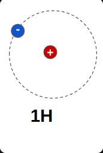
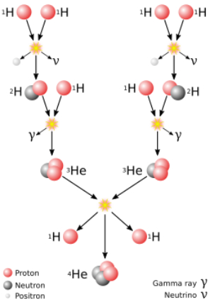

# The energy in our universe

In [Relativity](./Relativity.md) I was wondering of the extremely vast distances and travel times all aorund our universe. Here I am going to focus on the energy contained in it, so lets start about the visible matter.

This is an atom of Hidrogen. Hidrogen amounts to 75% of the whole visible matter in the universe and it is the simplest atom known with just one proton (positive +) and one electron (negative -). It may also appear somehow different, with an extra neutron

This is still Hydrogen, but a little heavier due to the extra neutron in the core. It is usully referred to as *deuterium*. 

And this is *tritium* the haviest atom of Hydrogen due to a further neutron in the core. Apart of Hydrogen there is also Helium, which amounts to 23% of visible matter, thus Hydrogen and Helium are, by far, the most common matter in the universe. They are everywhere.
 

Usually, due to the protons in their cores, these elements repel each other avoiding to get "too close", so each of them makes its own way through the universe. Due to its abundance, massive amounts of these elements form molecular clouds in which matter flows as a kind of filament structure, like little rivers of matter.

However, with enough time ahead, these clouds, also known as nebulae, acquire massive amounts of matter, like 1.2x10³⁷ kilograms, that is

120,000,000,000,000,000,000,000,000,000,000,000 kg

these clouds start to collapse, to concentrate, due to gravity, and get more and more dense, and therefore with a higher temperature and a higer speed between atoms. With more time, Hydrogen atoms start to get too close to each other so that the inner force that ties together protons and neutrons is greater than their natural repulsion force. They surrender, and nuclei start to crash to each other. Usually, an atom of deuterium crashes into an atom of tritium, which is known as fusion, and, as a result, they recombine as an atom of Helium and a loss of one proton.

 

Or, due to he high density of matter in this gravitational collapse, other chains of nuclear reactions might also happen, like the proton-proton-chain

 

source [Wikipedia](https://en.wikipedia.org/wiki/Nuclear_fusion)

In all cases, this crash is an exothermic event. On the one hand due to the kinetic energy of the collisions, but in the other hand, and most importantly, because part of the matter desintegrates into pure energy, following the known Einstein's formula $E=mC²$. This energy is liberated in the form of radiation, that is, some particles, heat and light. But this tiny reaction is just, and nothing less, than the birth of a new star, like our sun. 

In these examples above, the energy liberated is just a million part of the energy obtained by igniting just a single match because the mass (m) is just a few Hydrogen atoms. 

source [Wikipedia](https://en.wikipedia.org/wiki/Match)

Too little, isn't it? But inside the core of our sun, and like in other similar stars, at a temperature of 14,000,000 ºC, these nuclear reactions involve 600,000,0000 tons of Hydrogen into Helium ** every second**, that is, the equivalent to 6x10¹⁵ Hiroshima bombs

6,000,000,000,000,000 Hiroshima bombs

every second

and our sun is just a small star out of the

400,000,000,000 stars

just in our Milky Way Galaxy. Out of the

2,000,000,000,000 galaxies

estimated in our universe. Although 90% of these galaxies contains 1% of the stars of the Milky Way each, again these figures exceed, by very much, our capability to think  about it,  and therefore, our humbliness every time we stare at the stars in a clear summer night.

