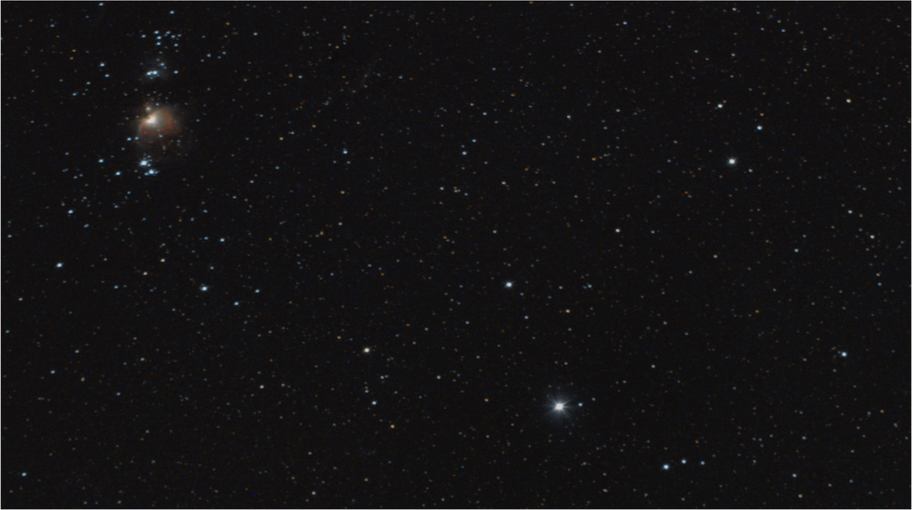
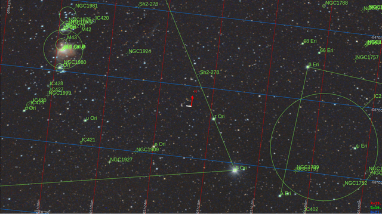
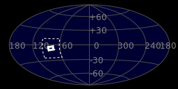
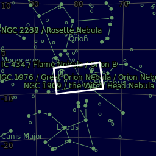

#  Rigel Star

Rigel is a blue supergiant star in the constellation of Orion. It has the Bayer designation β Orionis, which is Latinized to Beta Orionis and abbreviated Beta Ori or β Ori. Rigel is the brightest and most massive component – and the eponym – of a star system of at least four stars that appear as a single blue-white point of light to the naked eye. This system is located at a distance of approximately 850 light-years (260 pc). A star of spectral type B8Ia, Rigel is calculated to be anywhere from 61,500 to 363,000 times as luminous as the Sun, and 18 to 24 times as massive, depending on the method and assumptions used. Its radius is more than seventy times that of the Sun, and its surface temperature is 12,100 K. Due to its stellar wind, Rigel's mass-loss is estimated to be ten million times that of the Sun. With an estimated age of seven to nine million years, Rigel has exhausted its core hydrogen fuel, expanded, and cooled to become a supergiant. It is expected to end its life as a type II supernova, leaving a neutron star or a black hole as a final remnant, depending on the initial mass of the star.

[ Read more](https://en.wikipedia.org/wiki/Rigel)
## Plate solving 

| Globe | Close | Very close |
| ----- | ----- | ----- |
| | 

## Gallery
 

