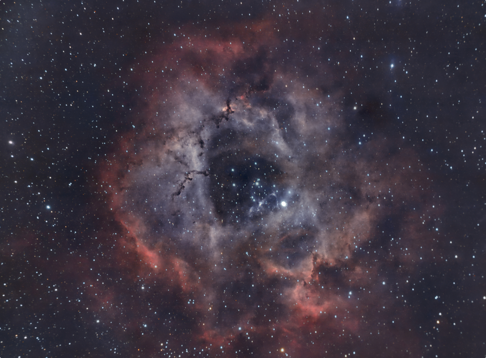

#  Rosette Nebula

The Rosette Nebula (also known as Caldwell 49) is an H II region located near one end of a giant molecular cloud in the Monoceros region of the Milky Way Galaxy. The open cluster NGC 2244 (Caldwell 50) is closely associated with the nebulosity, the stars of the cluster having been formed from the nebula's matter. The nebula has been noted to be having a shape reminiscent of a human skull, and is sometimes referred to as the "Skull Nebula". It is not to be confused with NGC 246, which is also nicknamed the "Skull Nebula".[3][4]

[ Read more](https://en.wikipedia.org/wiki/Rosette_Nebula)
## Plate solving 

| Globe | Close | Very close |
| ----- | ----- | ----- |
| | | |

## Gallery
 

 

 

 

 

