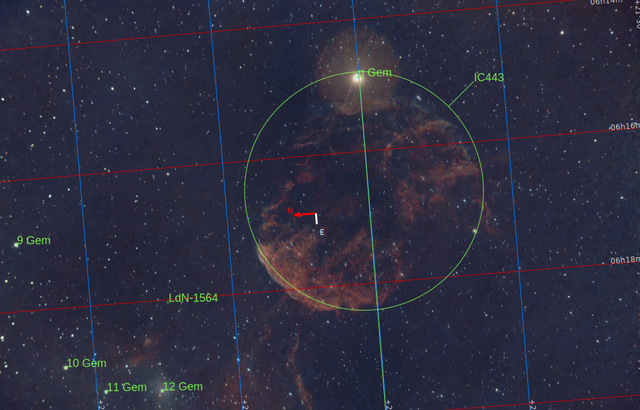

# Supernova remnants

When a [giant star dies](./Stories/The_Death_of_Stars.md) it produces a supernova, a huge explosion which wipes out the surrounding gas cloud and produces both thermal and inonized glowing in a giant shock wave moving as fast as 30.000 km/s, like in the [Veil Nebula](./Veil_Nebula.md). This huge liberation of energy heats the surrounding cloud in the order of **millions of Kelvin degrees**.

[Western Veil Nebula](./Veil_Nebula.md)

This is justone piece of the whole Veil Nebula, located in the constellation Cygnus, since the whole nebula spans over an area  326 times that of the full Moon. Once uppon a time it was a giant star which exploded about 10.000-20.000 years ago. In this case, the presence of the giant star 52 Cygni, right in the middle of the image, the nebula glow by the extreme temperatures and the ionization of its matter.

[Jellyfish Nebula](./Jellyfish_Nebula.md)

It is located in the constellatio Gemini, and the supernova occured 30.000-35.000 years ago

