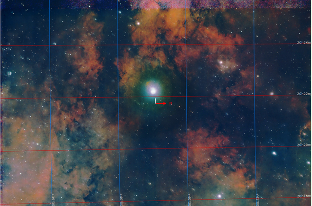
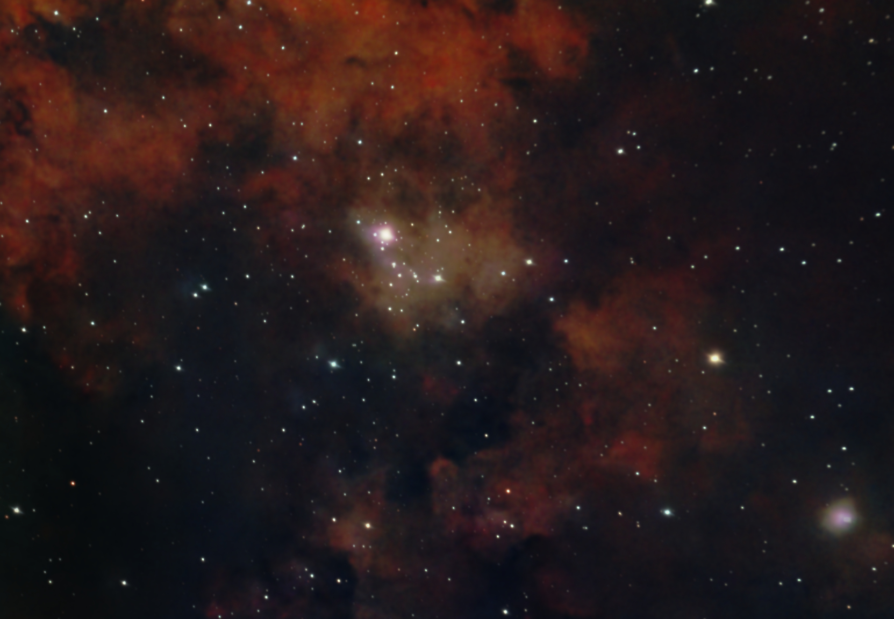

#  Sadr Star

Gamma Cygni is a star in the northern constellation of Cygnus, forming the intersection of an asterism of five stars called the Northern Cross. It is officially named Sadr /ˈsædər/,[11][12] gamma Cygni is its Bayer designation, which that is Latinized from γ Cygni, and abbreviated Gamma Cyg or γ Cyg. Based upon parallax measurements obtained during the Hipparcos mission, it is approximately 1,800 light-years (560 parsecs) from the Sun.[1] It forms the primary or 'A' component of a multiple star system designated WDS J20222+4015 (the secondary or 'BCD' component is WDS J20222+4015BCD, a close triplet of stars 41" away from γ Cygni[13]).

[ Read more](https://en.wikipedia.org/wiki/Gamma_Cygni)
## Plate solving 

| Globe | Close | Very close |
| ----- | ----- | ----- |
| | | |

## Gallery
 

 

 

 

 

 

 

