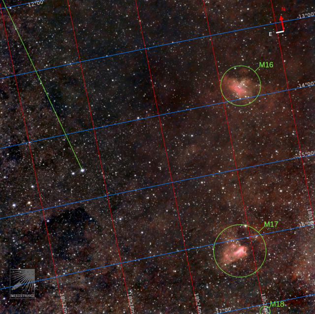
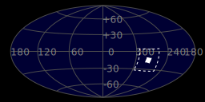
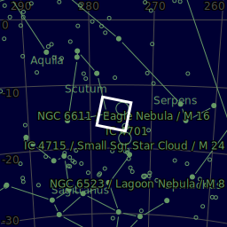
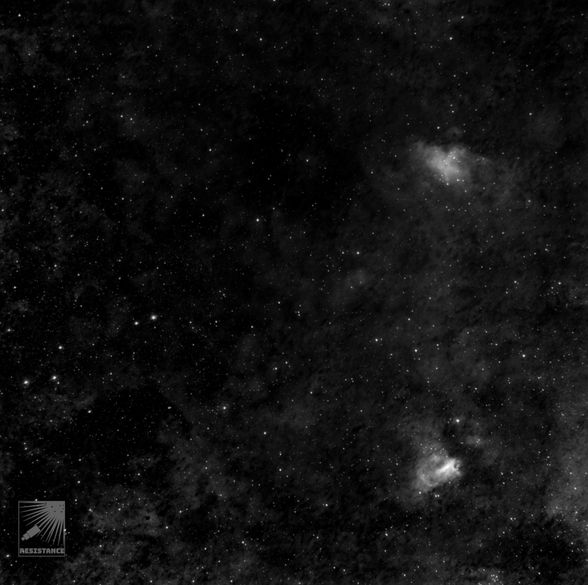
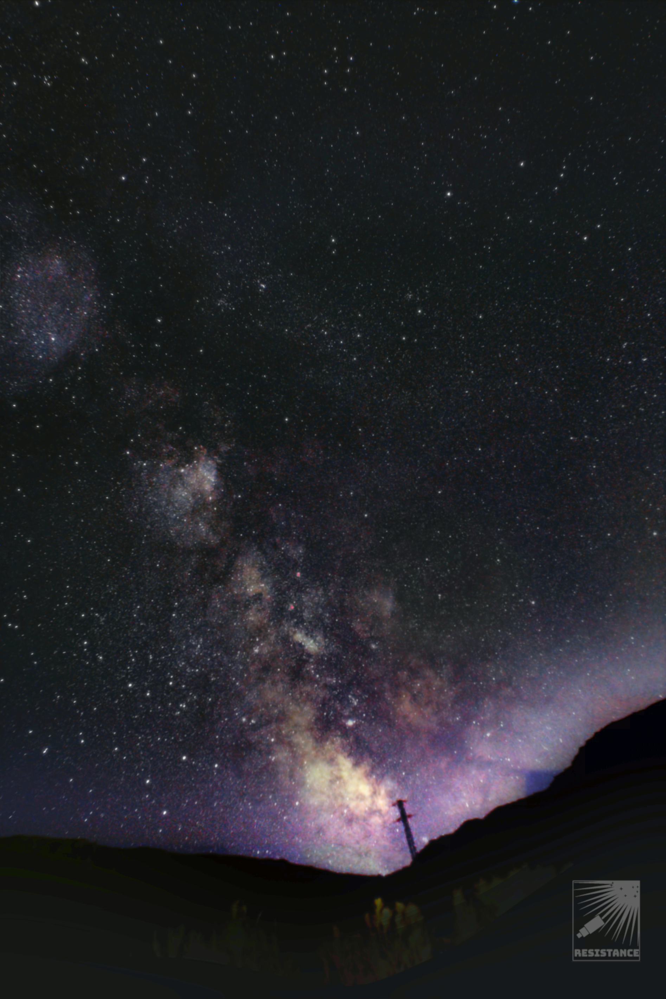
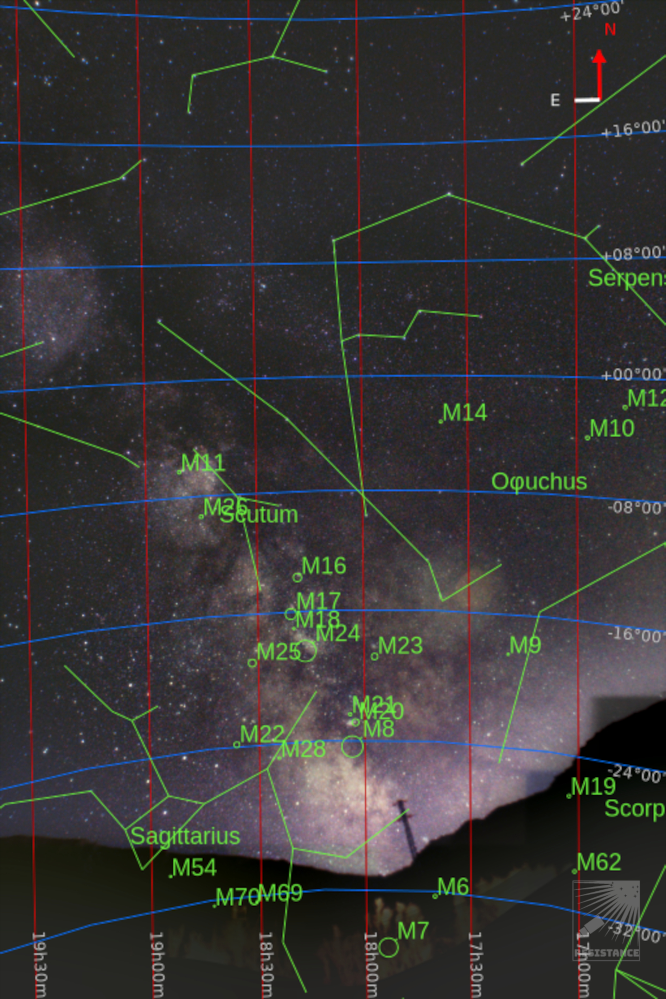
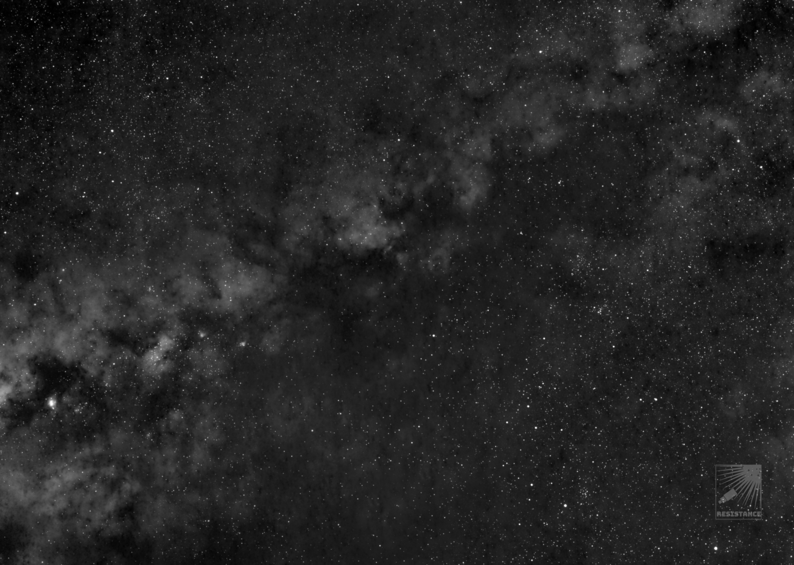
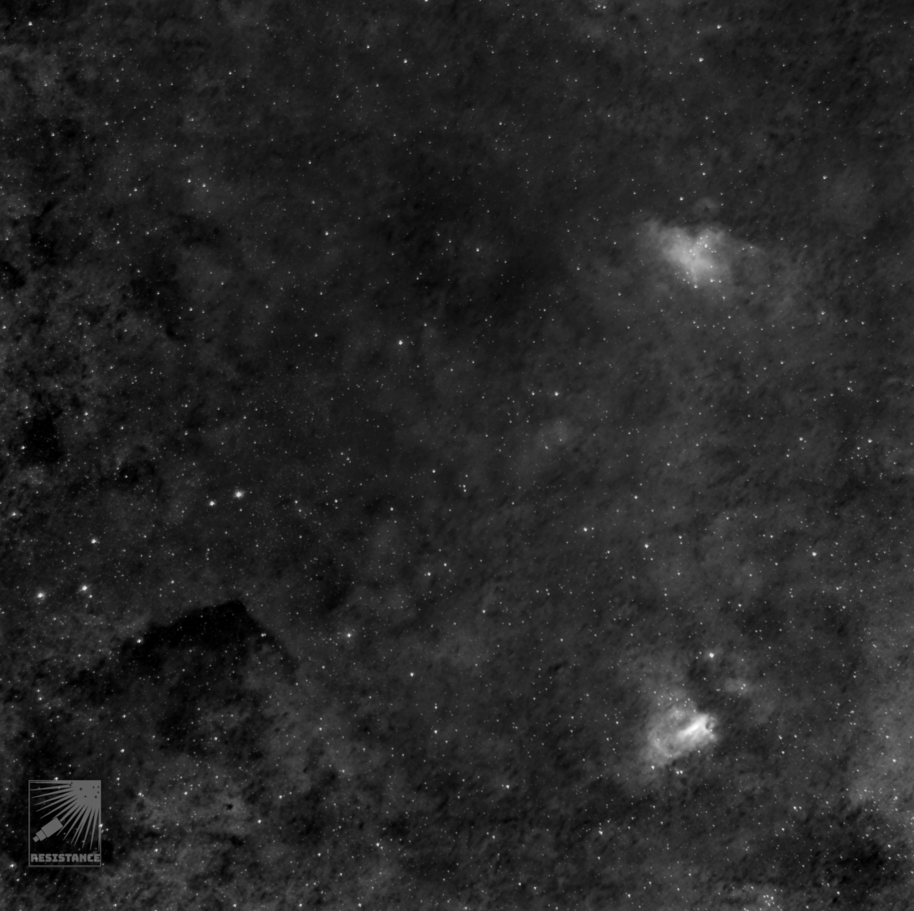

#  Sagittarius Arm

The Carina–Sagittarius Arm (also known as the Sagittarius Arm or Sagittarius–Carina Arm, labeled -I[clarification needed]) is generally thought to be a minor spiral arm of the Milky Way galaxy.[1] Each spiral arm is a long, diffuse curving streamer of stars that radiates from the Galactic Center. These gigantic structures are often composed of billions of stars and thousands of gas clouds. The Carina–Sagittarius Arm is one of the most pronounced arms in our galaxy as many HII regions, young stars and giant molecular clouds are concentrated in it.[2]

[ Read more](https://en.wikipedia.org/wiki/Carina-Sagittarius_Arm)
## Plate solving 

| Globe | Close | Very close |
| ----- | ----- | ----- |
| | 

## Details

| | | |
| :---: | :---: | :---:|
| | | 000 ly |
| |000 ly | |

| | | |
| :---: | :---: | :---:|
| | | 000 ly |
| |000 ly | |

## Gallery
 

 

 

 

 

 

 

 

 

