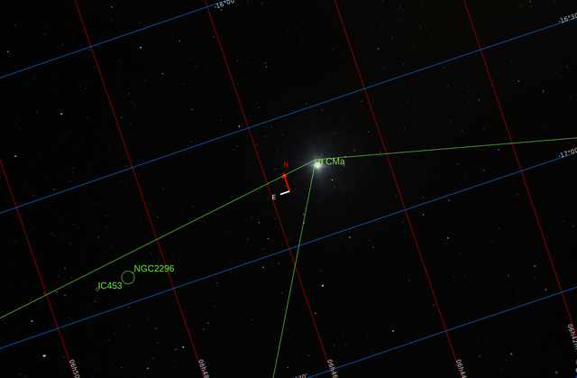
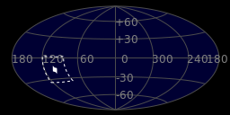
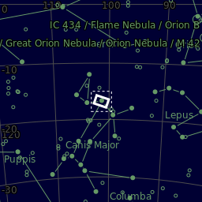
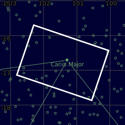
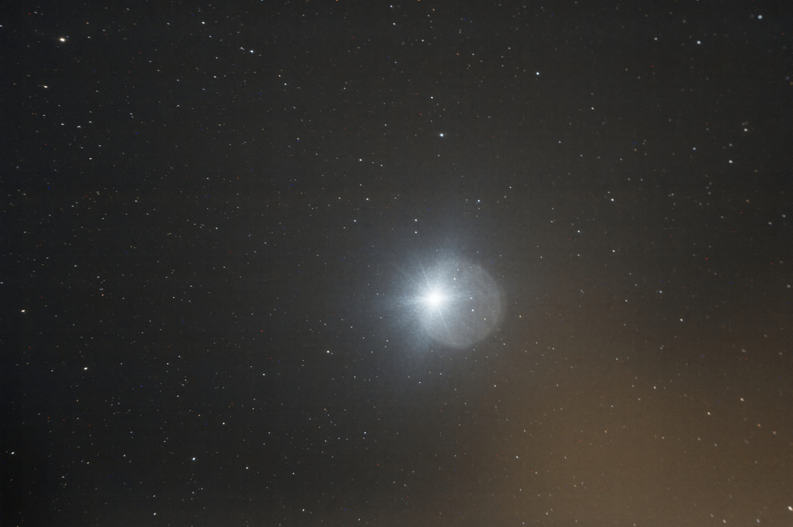

#  Sirius Star

Sirius is the brightest star in the night sky. Its name is derived from the Greek word Σείριος (Latin script: Seirios), meaning lit. 'glowing' or 'scorching'. The star is designated α Canis Majoris, Latinized to Alpha Canis Majoris, and abbreviated α CMa or Alpha CMa. With a visual apparent magnitude of −1.46, Sirius is almost twice as bright as Canopus, the next brightest star. Sirius is a binary star consisting of a main-sequence star of spectral type A0 or A1, termed Sirius A, and a faint white dwarf companion of spectral type DA2, termed Sirius B. The distance between the two varies between 8.2 and 31.5 astronomical units as they orbit every 50 years.[25]

[ Read more](https://en.wikipedia.org/wiki/Sirius)
## Plate solving 

| Globe | Close | Very close |
| ----- | ----- | ----- |
| | | |

## Gallery
 

 

