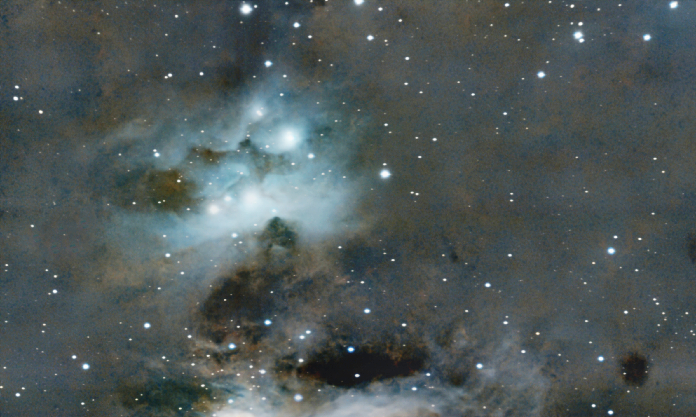
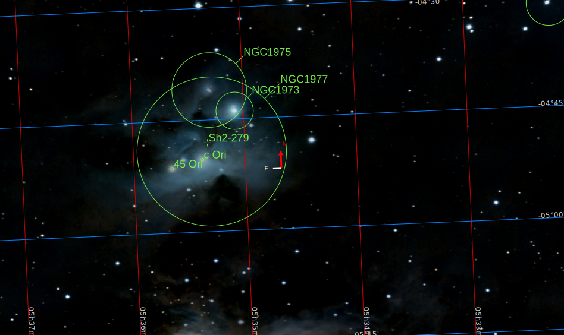

[Read in English](./About_Chaos.md)

(A mi querido amigo Antonio Sánchez Millán, un «filósofo práctico», según sus propias palabras, cuya amistad no está limitada ni por el tiempo ni por el espacio)

# Sobre el caos

Antes de entrar en detalles sobre el caos, disfrutemos de esta imagen.

Allí, como en una suave nube de algodón soplada suavemente por una brisa tranquila, un conjunto de seis hermosas estrellas brillan con elegancia, permaneciendo entre rizos de crema y café, mientras un coro de estrellas más pequeñas baila a su alrededor, gobernadas por el mandato invisible, determinista, pero armónico, de las leyes de la física.

De hecho, esto es lo que siento cuando contemplo esta imagen, tomada desde mi patio trasero el pasado noviembre, casi visible a simple vista. ¡Tan cerca! Sé que puede parecer un pensamiento cursi, pero, sin duda, transmite esa «suavidad».

## Cómo son las cosas

Bueno, en realidad, se trata de un objetivo muy común entre los astrofotógrafos aficionados, conocido como la «Nebulosa del Hombre Corriendo» o, en su referencia técnica desnuda y fría, «Sh 2-279», y se puede encontrar en estas coordenadas astronómicas

Descansa con elegancia en un rincón muy cercano de nuestra querida Vía Láctea, situada a solo 1.500 años luz de distancia, casi al lado, podríamos decir, ya que nuestra galaxia madre tiene 2.000.000 de años luz de diámetro. Es curioso, porque aunque parece tan cerca, si pudiéramos viajar con el transporte civil más rápido creado por el ser humano, el Concorde, a más de 2.170 km/h, tardaríamos más de 740.000.000 años en llegar. Es decir, si quisiéramos estar allí *hoy mismo*, tendríamos que haber embarcado en el Concorde, con nuestro costoso equipaje de mano Louis Vuitton, hace 740 000 000 años, durante el período criogénico, en plena glaciación, cuando solo sobrevivían las cianobacterias. Bueno, no tan cerca, ¿verdad?

Además, si nosotros, los humanos, observáramos más de cerca este lugar, descubriríamos que antiguamente era una enorme nube fría de átomos de hidrógeno y que, debido a alguna catástrofe cosmológica (véase [Relatividad II](./Relativity_II.md)), estos átomos de hidrógeno comenzaron a colapsar, chocando entre sí a gran velocidad y alta temperatura (como 10 000 000 grados Celsius), agrupándose entre sí debido a la gravedad, formando una reacción de fusión y creando cada una de las estrellas de la imagen. En particular, la estrella más potente de la imagen, en la parte superior derecha de la nebulosa blanca, conocida como 42-Orionis (y etiquetada como NGC-1973), es una joven estrella azul, de solo 5-10 millones de años, literalmente, una estrella bebé, 20. 000 veces más brillante que nuestro sol y 5 veces más caliente, que genera, cada segundo, una cantidad equivalente a (aproximadamente) 122x10^12 bombas de Hiroshima, es decir,

122 000 000 000 000 

bombas de Hiroshima cada segundo

cada segundo.

Esta joven estrella masiva también produce un fuerte viento estelar y partículas que son visibles en la deformación de las nubes blancas y marrones que rodean a las seis estrellas hermanas. Una cantidad alucinante de energía que, si la Tierra estuviera situada a la misma distancia que nuestro Sol, produciría un caos dramático. La temperatura en la superficie de la Tierra superaría, con creces, los 3000 grados centígrados y, en cuestión de minutos, todos los océanos se evaporarían, toda la corteza se derretiría y la vida, en cualquiera de las formas conocidas hasta ahora, sería completamente imposible. Un auténtico infierno. Un auténtico caos para la humanidad. Un escenario de exterminio de la vida.

Y eso me lleva al verdadero punto de esta historia. Ahora, que estoy luchando por atravesar el momento más devastador, doloroso y desgarrador de toda mi vida, es importante saber que, incluso en estos momentos, todavía hay espacio para la belleza y la calma. Es como ese viejo cuento zen de un hombre y un tigre:

«*Un hombre que cruzaba un campo se encontró con un tigre. Huyó, con el tigre tras él. Al llegar a un precipicio, se agarró a la raíz de una enredadera silvestre y se balanceó sobre el borde. El tigre lo olfateó desde arriba. Temblando, el hombre miró hacia abajo, donde, muy por debajo, otro tigre esperaba para devorarlo. Solo la enredadera lo sostenía. Dos ratones, uno blanco y otro negro, comenzaron poco a poco a roer la enredadera. El hombre vio una deliciosa fresa cerca de él. Agarrándose a la enredadera con una mano, cogió la fresa con la otra. ¡Qué dulce estaba!*»

Con cariño,

Luis.

Traducción realizada con la versión gratuita del traductor DeepL.com
