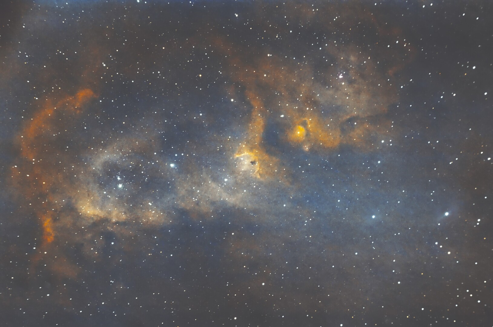

#  Soul Nebula

Westerhout 5 (Sharpless 2-199, LBN 667, Soul Nebula) is an emission nebula located in Cassiopeia. Several small open clusters are embedded in the nebula: CR 34, 632, and 634[citation needed] (in the head) and IC 1848 (in the body). The object is more commonly called by the cluster designation IC 1848.

[ Read more](https://en.wikipedia.org/wiki/Westerhout_5)
## Plate solving 

| Globe | Close | Very close |
| ----- | ----- | ----- |
| | | |

## Gallery
 

 

 

 

