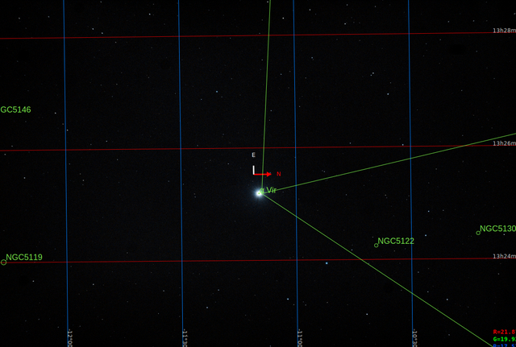

#  Spica Star

Spica is the brightest object in the constellation of Virgo and one of the 20 brightest stars in the night sky. It has the Bayer designation α Virginis, which is Latinised to Alpha Virginis and abbreviated Alpha Vir or α Vir. Analysis of its parallax shows that it is located 250±10 light-years from the Sun.[3] It is a spectroscopic binary star and rotating ellipsoidal variable; a system whose two stars are so close together they are egg-shaped rather than spherical, and can only be separated by their spectra. The primary is a blue giant and a variable star of the Beta Cephei type. Spica, along with Arcturus and Denebola—or Regulus, depending on the source—forms the Spring Triangle asterism, and, by extension, is also part of the Great Diamond together with the star Cor Caroli.

[ Read more](https://en.wikipedia.org/wiki/Spica)
## Plate solving 

| Globe | Close | Very close |
| ----- | ----- | ----- |
| | | |

## Gallery
 

