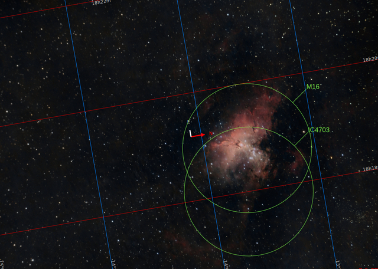

(Leer en [Español](./Nidos_Estelares.md))

# Star nurseries

Star nurseries are complex clouds of gas and dust within which there are many young, but very hot, baby stars are being born, and many others are preparing to be born. When a [new star is born](./The_Birth_of_Stars.md) it produces very strong ultraviolet radiation which ionizes the cloud of gas around the star, making it to glow. Like the [Lagoon Nebula](./Lagoon_Nebula.md) or the [Rosette Nebula](./Rosette_Nebula.md). 

These regions also contain many baby stars which, all together, produce a huge ionization in the molecular cloud around them. These zones are known as **HII regions** and contain even hundreds of baby stars. Since most of the sourrounding gas happens to be Hydrogen, then the photons have a very accurate wavelength of 656.3 nm., This is known as **H-alpha** radiation and it is the most common radiation of the known nebulae and gives them the typical reddish color. 

Only stars with a surface temperarure  of 25.000 - 30.000 ºK are powerful enough to emit such amount of ultraviolet radiation. This is equivalent to 300 millions Hiroshima bombs every second. That is, a very huge amount of energy. Just to put it into perspective, the temperature of our sun is a little below 6.000 ºK, thus "too cold" to ionize the gas around it, it is 4-8 times "colder".

These emision nebulae might also glow in some other colours depending on the chemical composition and the power of the emitted ultraviolet radiation. The greater this radiation, there may be found other colours: 

|Colour | Element | Wavelegth|
| :-:   | :-:   | :-:   |
|Intense red | Hydrogen | 656.3 nm|
|Dark red| Sulfur | 671.7 nm & 673.1 nm|
|Blue-greenish| Oxygen | 495.9 & 500.7|
|Intense blue| Dust (no ionized) | - |

## Intense red H-alpha

[Orion Nebula](./Orion_Nebula.md)

Orion Nebula is one of the largest, most complex and scrutinized region of the northern skies within  the Orion constelation. In particular, it has been found that around 700 young stars have been tracked in the whole nebula, particularly at its core. It is a very large patch of around 2 times the visual surface of the full moon, clearly visible to the naked eye.

[Lagoon Nebula](./Lagoon_Nebula.md)

The magnificent structure of this nebula is produced by both, a strong young star cluster (NGC6530) but mainly by a massive binary star (9-Sagitarii) with 32 times the mass of our sun and an estimated temperature of 46.000ºK

## Dark red sulfur

[Soul Nebula](./Soul_Nebula.md)

In this case, the whole nebula is carved by the strong stellar winds of a cluster of stars named IC1848, a cluster of very young stars, only 1 million years old, literally baby stars, with a temperature ranging between 30.000ºk and 50.000ºK, whose massive power ionizes not only hydrogen but also Sulfur and Oxygen.

[Eagle Nebula](./Eagle_Nebula.md)

Ths iconic nebula, is carved by a powerful cluster of youg stars named IC4703, composed of 8.000+ young stars  around a central star, named HD 168076, like a million times brighter than our sun, and an effective temperature of 40.000ºK. The Eagle Nebula, a.k.a. Messier 16, is the host of one of the most  popular images of the Hubble telescope: [The Pillars of Creation](https://en.wikipedia.org/wiki/Pillars_of_Creation)

Image source: [Wikipedia](https://en.wikipedia.org/wiki/Pillars_of_Creation)

Massive columns of gas and dust that are in the process of creating a new star, thus, they are known as protostars.

## Blue oxygen

[Rosette Nebula](./Rosette_Nebula.md)

This massive nebulosity, located in the constellation of Monoceros, visually very faint and almost impossible to see to the naked eye, but as large as 2.5 times the visual surface of the full moon, is carved by the star cluster NGC 2244, a young super hot cluster of stars, between 30.000ºk and 50.000ºK

