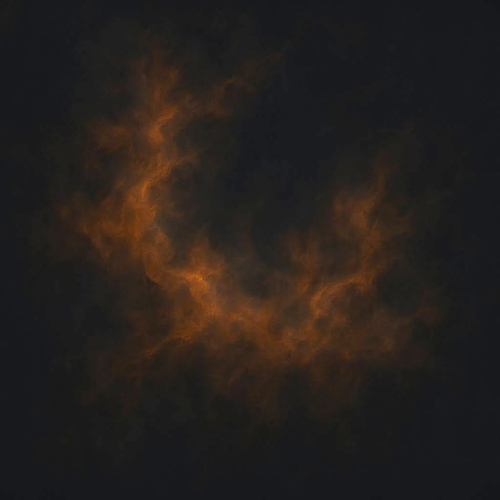
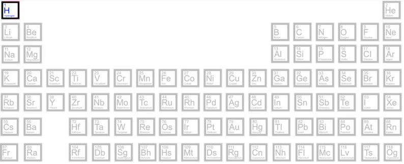
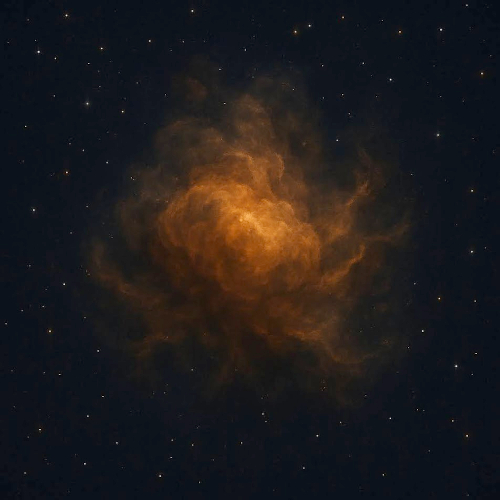
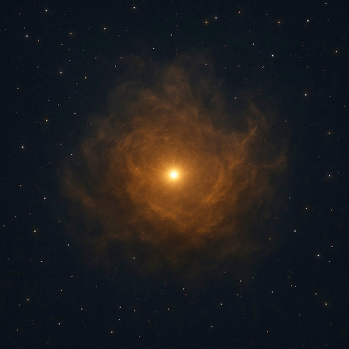
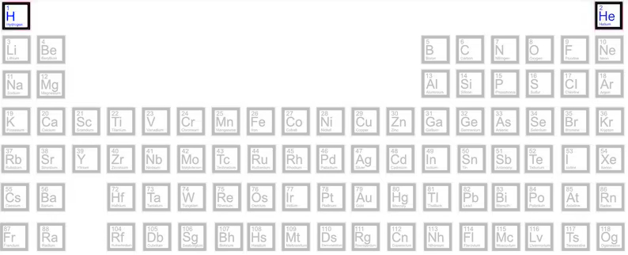
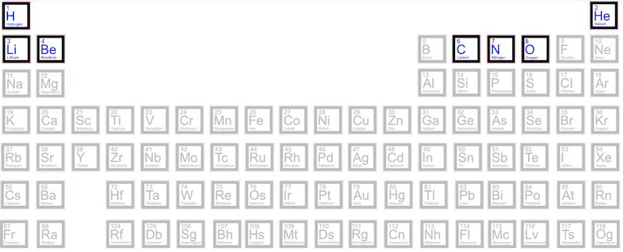
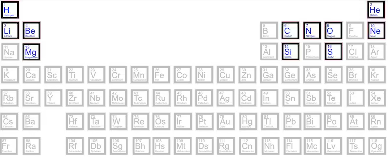
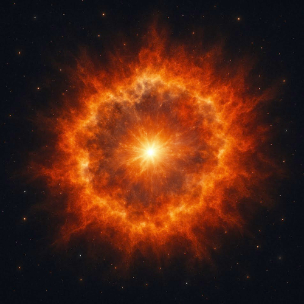
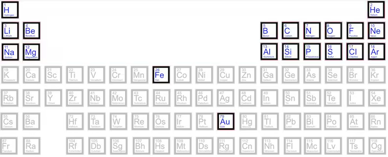
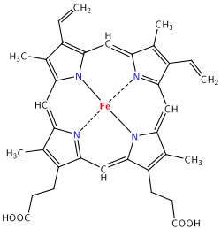

(leer en [Español](Estrellas.md))

# About stars

Stars have always played a sort of romantic role with human kind, between lovers, those who have dreams or reaching further, a peaceful starry scenario that embraces all kind of artist creation overnight ... you name it. And that seems to be all. Even for amateur astrophotographers, the most important targets are colorful nebulae, giant galaxies, but not single stars. Furthermore, there are many computer programs, either based on complex mathematical models or based on the hype of "AI-based" algorithms, that "remove" stars from the pictures to focus on the curls of colors of a nebula like [Starnet](https://www.starnetastro.com/) of which I, particularly, am a heavy user and it takes a necessary part of my usual workflow to postprocess my captures.

However, stars are *everything* in our universe, every atom known in nature has been forged in a star, in one way or another. They are the mothers of all matter. Carbon, Oxygen, Nytrogen, even Gold atoms were produced by stars, ejected into the empty space around stars and, with the slow pass of thousand of centuries, bound together to form our planets and further stars.

## The beginning

It all starts within a cloud of molecules of hydrogen (see [Relativity_II.md](./Relativity_II.md)) wandering the space forming massive clouds of molecules with some kind of philamental structure.

Out of all the known chemical elements, only hydrogen (H) exists. And nowadays, hydrogen still persistys as the 75% of visible matter.

Then, in a process of gravitational collapse (see [Relativity_II.md](./Relativity_II.md)) these atoms get closer and closer, move faster and faster, the temperature rises, and form a superhot core within the molecular cloud.

In this superhot core, these atoms start to smash to each other in a process known has fusion, in which hydrogen atoms crash, and recombine into helium atoms in a exothermic reaction which produces a massive amount of high-energy particles (protons and atomic nuclei), light and heat, tranforming the superhot core into a baby star

Hence, thanks to the fusion reaction produced within a star, we now have hydrogen (H) and helium (He) atoms in the molecular cloud

Due to the high temperatures and gravitational forces, with the coming of new thousand centuries, these hydrogen and helium atoms continue crashing to each other forming carbon (C), nitrogen (N) and oxygen (O) in a process known as nucleosynthesis.

When these new atoms are hit by high-energy particles coming from their own star, or another close stars, they transform into lithium (Li) and berilium (Be), these are not part of the nucleosynthesis process, but a side effect ot it.

Stars continue "burning" hydrogen, helium, carbon, nytrogen and oxygen producing mainly neon (Ne),  magnesium (Mg), silicium (Si) and sulfur (S) but also aluminum (Al)

## The end 

And right at the end of the life of a star, it has become a giant red star, and it produces iron (Fe) which cannot be further fused with other elements and accumlates as a residue of the activity of the star in its own stelar core. This core rapidly collapses and produces a really high energetic explosion, spreading all the abvove atoms all around, creating the seeds for further planets to come. 

This explosion is knwon as a *Supernova*, and it produces gold (Au) and uranium (U) and a shock wave which reaches all these elements transforming them into sodium (Na), Borum (B), phosphorus (P), chlorus (Cl)

This shock wave also reaches the whole molecular cloud and produces further gravitational collapses and the birth of new stars in an endless process that produces the remaining elements present in nature. This cycle of creation, death and re-creation of stars in what is known as a *star nursery* present in most of the nebulae like the [Running Man Nebula](Running_Man_Nebula.md) and [here](About_Chaos.md) 

## And the beginning again

So, our little planet, this [pale blue dot](https://en.wikipedia.org/wiki/Pale_Blue_Dot) with its nickel (Ni) and iron (Fe) melted core is the result of an uncountable sequence of supernovas, blended in a unique proportion of elements, collapsed into an sphere of matter, leveled by gravity and partially cooled, only in its crust, where we live on. And remember, we are able to breath because there is oxygen, produced in the core of active stars, and our red blod cells contain hemoglobin, 

(imamge source [Wikipedia](https://en.wikipedia.org/wiki/Hemoglobin))

a molecule in whose heart lies an atom of iron (Fe), which a very very long time ago, was produced in a remote giant red star (as [Betelgeuse](Betelgeuse_Star.md)), as red as our red blood cells.	

