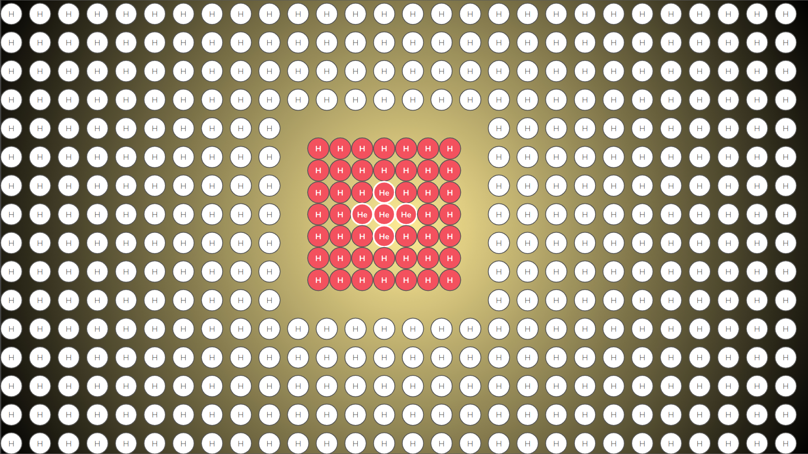
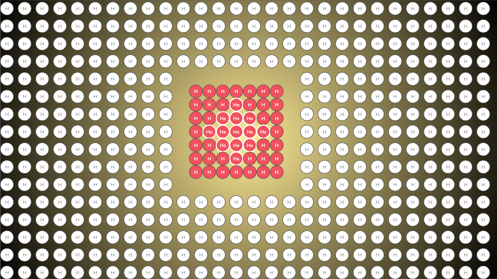
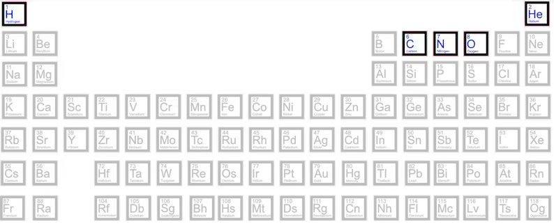
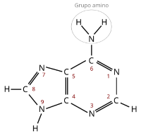
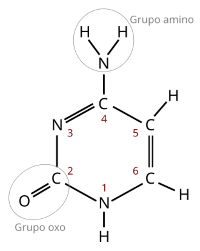
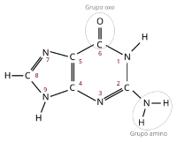
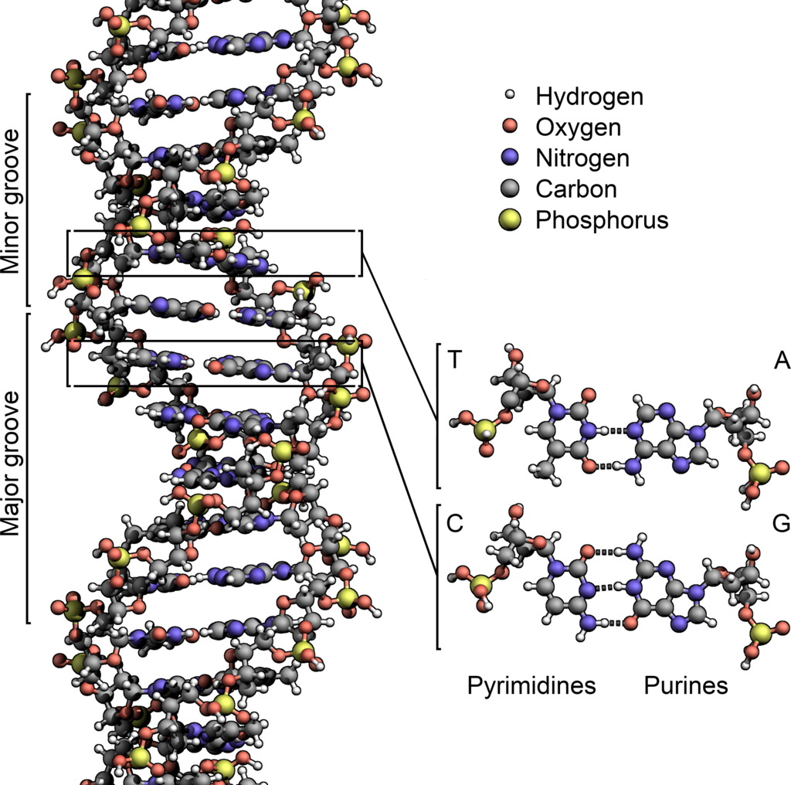

(leer en [Español](Estrellas.md))

# About stars

Stars have always played a sort of romantic role with human kind, between lovers, those who have dreams, a peaceful starry scenario that embraces all kind of artist creation overnight ... you name it. And that seems to be all. Even for amateur astrophotographers, the most important targets are colorful nebulae, giant galaxies, but not single stars. Furthermore, there are many computer programs, either based on complex mathematical models or based on the hype of "AI-based" algorithms, that "remove" stars from the pictures to focus on the curls of colors of a nebula like [Starnet](https://www.starnetastro.com/) of which I, particularly, am a heavy user and it takes a necessary part of my usual workflow to postprocess my captures.

However, stars are *everything* in our universe, every atom known in nature has been forged in a star, in one way or another. They are the mothers of all matter. Carbon, Oxygen, Nytrogen, even Gold atoms were produced by stars, ejected into the empty space around stars and, with the slow pass of thousand of centuries, bound together to form our planets and further stars.

## The beginning

It all starts within a cloud of molecules of hydrogen (see [Relativity_II.md](./Relativity_II.md)) 

wandering the space forming massive clouds of molecules with a sort of philamental structure.

Out of all the known chemical elements, only hydrogen (H) exists. And nowadays, hydrogen still persists as the 75% of visible matter.

## Collapse of molecular clouds

Then, in a process of gravitational collapse (see [Relativity_II.md](./Relativity_II.md)) these atoms get closer and closer, 

move faster and faster, 

get hotter and hotter, and form a superhot core within the molecular cloud. Superhot actually means tens millions of Kelvin degrees.

## The birth of a new star

In this superhot core, these atoms start to smash to each other in a process known has fusion, in which hydrogen atoms crash, and recombine into helium atoms in a exothermic reaction which produces a massive amount of high-energy particles (protons and atomic nuclei), light and heat, tranforming the superhot core into a baby star

Hence, thanks to the fusion reaction produced within a star, we now have hydrogen (H) and helium (He) atoms in the molecular cloud

Due to the high temperatures and gravitational forces, with the coming of new thousand centuries, these hydrogen and helium atoms continue crashing to each other 

forming carbon (C ), nitrogen (N) and oxygen (O) in a process known as nucleosynthesis.

From now on, the evolution of the star depends on its mass, in this case, for the sake of simplicity, will be named as "small stars" and "large stars".

## The end of a "small star"

The core of the star continue fusioning elements and increasing the temperature
But small stars do not have enough power to increase the temperature permanently and burn these atoms of carbon (C ), more Oxygen (O) and and, eventually, more Nitrogen (N), so the star starts to accumulate these "ashes" within its core.

Then, when our "small star" runs out of fuel (H + He) it collapses into a white dwarf star, explodes and expels the remaining elements to the sourronding cloud

And this happens, again and again, enriching the sourrounding cloud with new clouds of brand new elements.

Eventually, these new atoms might be hit by high-energy particles coming from their own star, or another close stars, they transform into lithium (Li) and berilium (Be), these are not part of the nucleosynthesis process, but a side effect ot it.

## The end of a "large star"

Depending on the mass of the mother molecular cloud, larger stars may also form, by collapsing higher 	quantities of hydrogen

adding more and more matter to the core, increasing the temperature and producing the same fusion process than in "small stars" seen above.

	

Stars continue "burning" hydrogen, helium, carbon, nytrogen and oxygen and due to their much large matter, tehy also produce heavier elements mainly neon (Ne),  magnesium (Mg), silicium (Si) and sulfur (S) but also aluminum (Al) and the star becomes a [red giant star](https://en.wikipedia.org/wiki/Red_giant)

This process continues until it produces iron elements (Fe). So far, the fusion process is exothermic and generates more and more energy. However, fusion of iron elements (Fe) becomes and endothermic reaction, which require the addition of more energy. 

Therefore, although these large stars produce large amounts of iron and heavy elements, they cannot continue burning them and start accumulating them in the core. Therfore they end up runing out of burning elements and, as well as small stars  exploded, these large stars also explode, but in a different manner, in one of the most intense energy events known in the universe

This explosion is knwon as a *Supernova*, and it produces gold (Au) and uranium (U) and a shock wave which reaches all these elements transforming them into sodium (Na), Borum (B), phosphorus (P), chlorus (Cl). The old core of the star collapses into what is known as a black hole.

This shock wave also reaches the whole molecular cloud and produces further gravitational collapses and the birth of new stars in an endless process that produces the remaining elements present in nature. This cycle of creation, death and re-creation of stars in what is known as a *star nursery*.

## The ashes after the explosions of stars

Both small stars and large stars end their lifes soaking all the sourrounding cloud with brand new elements, both light and heavy. With the coming of more ages, these elements will also collapse in the form of planets, as we know in our own solar system.

Source [Wikipedia](https://en.wikipedia.org/wiki/Internal_structure_of_Earth#Core) 

So, our little planet, this [pale blue dot](https://en.wikipedia.org/wiki/Pale_Blue_Dot) with its nickel (Ni) and iron (Fe) melted core is the result of an uncountable sequence of supernovas, blended in a unique proportion of elements, collapsed into an sphere of matter, leveled by gravity and partially cooled, only in its crust. With more thousand centuries to come, these simple elements started to combine into more and more complex molecules like these

|Adenina| Timina | Guanina  | Citosina |
| :----: | :----: | :----: | :----: |
| | | | |

and they end up forming a very, very complex molecule, known as DNA, with a unique distinguishing feature: it can replicate itself and produce an exact copy of it.

Source [Wikipedia](https://en.wikipedia.org/wiki/DNA

Even the heavier elements, like iron (Fe), were able tro combine into some special molecules like this one,

(imamge source [Wikipedia](https://en.wikipedia.org/wiki/Hemoglobin))

a molecule whose constituents elements, hydrogen (H), carbon (C), oxygen (O), nytrogen (N) billions and billions of years ago, where tranasformed by the many subsequent ancient stars, and evenmore, in whose heart lies an atom of the heavy iron (Fe). This molecule is known as hemoglobine, its lies inside our red blood cells and it allows us to breath oxygen, specially thanks to its iron (Fe) core, which a very very long time ago, was produced in a remote giant red star (as [Betelgeuse](Betelgeuse_Star.md)), as red as our red blood cells.	As Carl Sagan said in his book Cosmos, "we, the human kind,  are what simple hydrogen elements can produce with the pass of 15800 millions years".

