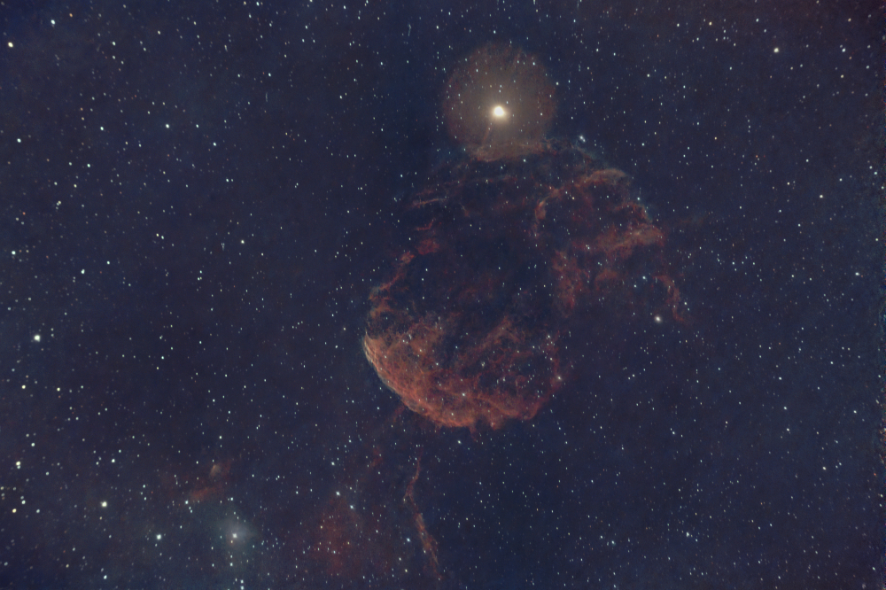

# Restos de supernova

Cuando una [estrella gigante muere](./Stories/The_Death_of_Stars.md), produce una supernova, una enorme explosión que arrasa la nube de gas circundante y produce un resplandor térmico e ionizado en una gigantesca onda de choque que se mueve a una velocidad de hasta 30 000 km/s, como en la [Nebulosa del Velo](./Veil_Nebula.md). Esta enorme liberación de energía calienta la nube circundante en el orden de **millones de grados Kelvin**.

[Nebulosa del Velo Occidental](./Veil_Nebula.md)

Esta es solo una parte de toda la Nebulosa del Velo, situada en la constelación del Cisne, ya que toda la nebulosa abarca un área  326 veces mayor que la de la Luna llena. Hubo un tiempo en que fue una estrella gigante que explotó hace unos 10 000-20 000 años. En este caso, la presencia de la estrella gigante 52 Cygni, justo en el centro de la imagen, hace que la nebulosa brille por las temperaturas extremas y la ionización de su materia.

[Nebulosa Medusa](./Jellyfish_Nebula.md)

Se encuentra en la constelación de Géminis, y la supernova ocurrió hace entre 30 000 y 35 000 años.

