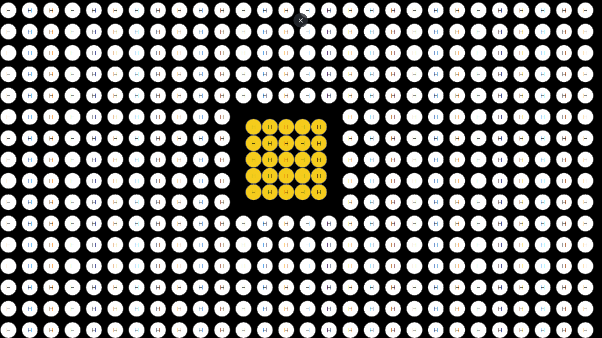
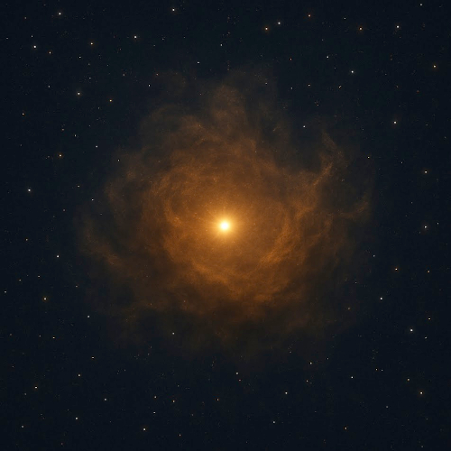

(leer en [Español](Nacimiento_de_Estrellas.md))

# About stars

Stars have always played a sort of romantic role with human kind, between lovers, those who have dreams, a peaceful starry scenario that embraces all kind of artist creation overnight ... you name it. And that seems to be all. Even for amateur astrophotographers, the most important targets are colorful nebulae, giant galaxies, but not single stars. Furthermore, there are many computer programs, either based on complex mathematical models or based on the hype of "AI-based" algorithms, that "remove" stars from the pictures to focus on the curls of colors of a nebula like [Starnet](https://www.starnetastro.com/) of which I, particularly, am a heavy user and it takes a necessary part of my usual workflow to postprocess my captures.

However, stars are *everything* in our universe, every atom known in nature has been forged in a star, in one way or another. They are the mothers of all matter. Carbon, Oxygen, Nytrogen, even Gold atoms were produced by stars, ejected into the empty space around stars and, with the slow pass of thousand of centuries, bound together to form our planets and further stars.

## The beginning

It all starts within a cloud of molecules of hydrogen (see [Relativity_II.md](./Relativity_II.md)) 

wandering the space forming massive clouds of molecules with a sort of philamental structure.

Out of all the known chemical elements, only hydrogen (H) exists. And nowadays, hydrogen still persists as the 75% of visible matter.

## Collapse of molecular clouds

Then, in a process of gravitational collapse (see [Relativity_II.md](./Relativity_II.md)) these atoms get closer and closer, 

move faster and faster, 

get hotter and hotter, and form a superhot core within the molecular cloud. Superhot actually means tens millions of Kelvin degrees.

## The birth of a new star

In this superhot core, these atoms start to smash to each other in a process known has fusion, in which hydrogen atoms crash, and recombine into helium atoms in a exothermic reaction which produces a massive amount of high-energy particles (protons and atomic nuclei), light and heat, tranforming the superhot core into a baby star

Hence, thanks to the fusion reaction produced within a star, we now have hydrogen (H) and helium (He) atoms in the molecular cloud

Due to the high temperatures and gravitational forces, with the coming of new thousand centuries, these hydrogen and helium atoms continue crashing to each other 

forming carbon (C ), nitrogen (N) and oxygen (O) in a process known as nucleosynthesis.

From now on, the evolution of the star will depend on its mass, in this case, for the sake of simplicity, will be named as "small stars" and "large stars".

[To be continued](./The_Death_of_Stars.md)

