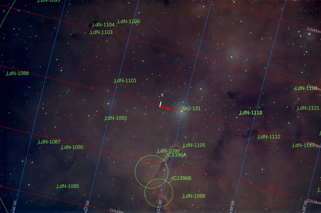

#  Trunk Nebula

The Elephant's Trunk Nebula (IC 1396A) is a concentration of interstellar gas and dust within the much larger ionized gas region IC 1396 located in the constellation Cepheus about 2,400 light years away from Earth.[1] The nebula is a dark, dense globule that gets its name from its appearance at visible light wavelengths, where there is a dark patch with a bright, sinuous rim. The bright rim is the surface of the dense cloud that is being illuminated and ionized by a very bright, massive multiple star (HD 206267) that is just to the east of the Elephant's Trunk Nebula . The entire IC 1396 region is ionized by the massive star, except for dense globules that can protect themselves from the star's harsh ultraviolet rays.

[ Read more](https://en.wikipedia.org/wiki/Elephant                           _Trunk_Nebula)
## Plate solving 

| Globe | Close | Very close |
| ----- | ----- | ----- |
| | | |

## Gallery
 

