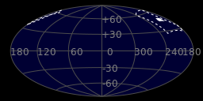
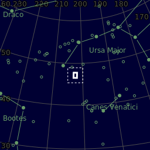
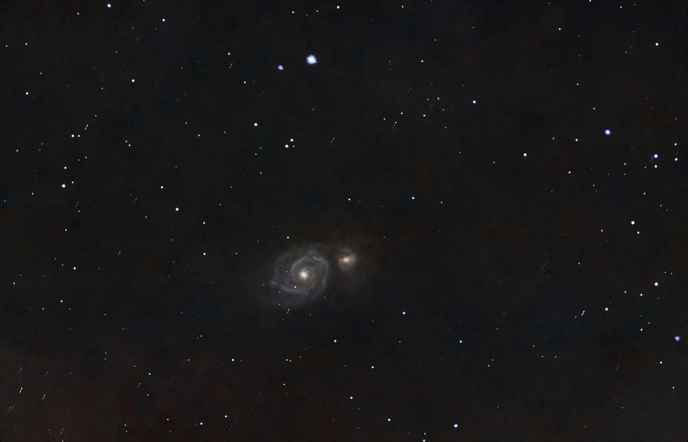
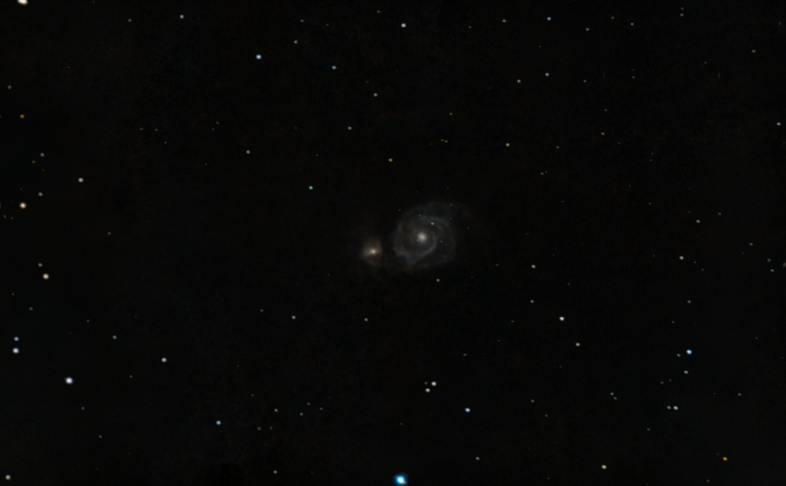

#  Whirlpool Galaxy

The Whirlpool Galaxy, also known as Messier 51a (M51a) or NGC 5194, is an interacting grand-design spiral galaxy with a Seyfert 2 active galactic nucleus.[6][7][8] It lies in the constellation Canes Venatici, and was the first galaxy to be classified as a spiral galaxy.[9] It is 31 million lightyears (9.5 megaparsecs/Mpc) away and 23.58 kiloparsecs (76,900 ly) in diameter.[2][10] The galaxy and its companion, NGC 5195,[11] are easily observed by amateur astronomers, and the two galaxies may be seen with binoculars.[12] The Whirlpool Galaxy has been extensively observed by professional astronomers, who study it and its pair with dwarf galaxy NGC 5195 to understand galaxy structure (particularly structure associated with the spiral arms) and galaxy interactions. Its pair with NGC 5195 is among the most famous and relatively close interacting systems, and thus is a favorite subject of galaxy interaction models.

[ Read more](https://en.wikipedia.org/wiki/Whirlpool_Galaxy)
## Plate solving 

| Globe | Close | Very close |
| ----- | ----- | ----- |
| | | |

## Gallery
 

 

 

