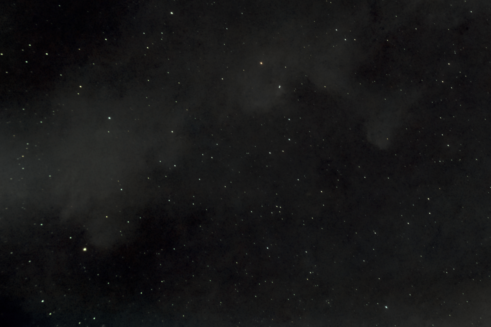
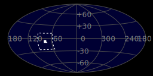
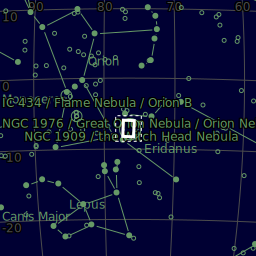
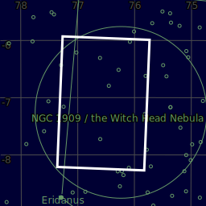
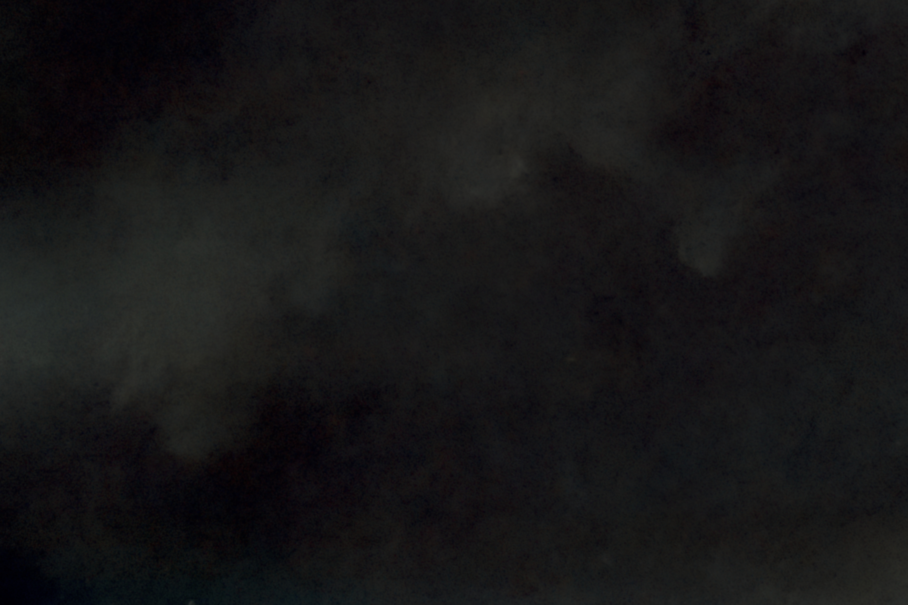

#  Witch Head Nebula

IC 2118 (also known as Witch Head Nebula due to its shape) is an extremely faint reflection nebula believed to be an ancient supernova remnant or gas cloud illuminated by nearby supergiant star Rigel in the constellation of Orion. The nebula lies in the Eridanus Constellation,[1] about 900 light-years from Earth. The nature of the dust particles, reflecting blue light better than red, is a factor in giving the Witch Head its blue color. Radio observations show substantial carbon monoxide emission throughout parts of IC 2118, an indicator of the presence of molecular clouds and star formation in the nebula. In fact candidates for pre-main sequence stars and some classic T Tauri stars have been found deep within the nebula

[ Read more](https://en.wikipedia.org/wiki/IC_2118)
## Plate solving 

| Globe | Close | Very close |
| ----- | ----- | ----- |
| | | |

## Gallery
 

 

 

